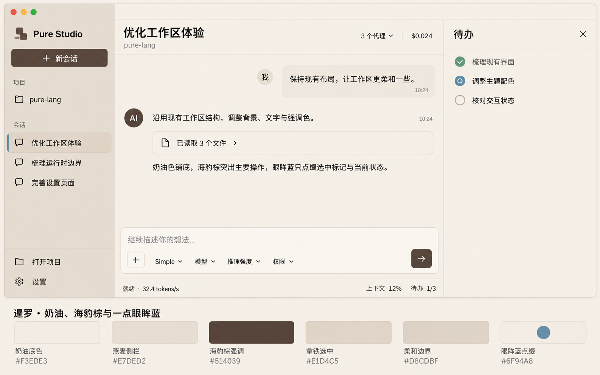

# 11 - Pure Studio UI

## 11.1 边界

Pure Studio 是 Flutter 桌面应用，使用 Material 3、Riverpod、`go_router` 与 typed FRB。UI 只能通过
bridge 访问 StudioRuntime，不读取 SQLite、Agent TOML 或 Skill 文件。Flutter Web 只用于 demo
integration 验收，不能伪造原生 provider、文件系统或进程能力。

data 层负责 FRB DTO 到 domain 的一次转换；reducer 只接收 canonical snapshot/notification；Widget
只负责展示与发命令。窗口关闭必须等待 typed shutdown 完成并回收 Flutter、DTD、MCP/LSP 和 child
process tree。

状态栏上下文悬浮窗展示 runtime 的已用 token 与模型总容量，容量来自模型调用时冻结的 binding，
不在前端按 provider 硬编码或查询当前目录回填历史。容量未知（包括现有 Dart 映射中的非正值）时，
总容量及百分比以 `—` 占位，可访问性值同样不报告虚假的 `0%`，圆环只显示底圈。
已知正容量且已用 token 为零时正常显示 `0%`；累计总 token 与上下文容量仍为不同统计。

## 11.2 动态模式

新 Thread 默认选择 `mode.simple`。composer 的模式 selector 读取 `ThreadModeCatalogSnapshot`，使用
稳定 `modeId` 作为值、`displayName` 作为文案，不写死 Simple/Task enum。模式切换命令只在 root idle、
无 pending interaction 时可用；旧活动 run 由 runtime 归档，拒绝结果由 canonical snapshot 恢复 UI。

Thread Mode 不出现在普通 Skills 设置和按需调用列表。两个内置模式不可删除或覆盖。

## 11.3 Workflow status

Thread runtime 只向 GUI 暴露状态栏需要的通用 workflow projection：mode、run、revision、lifecycle
与当前阶段。未开始的图模式显示“未开始”；Simple 只显示 Mode。

GUI 不提供完整 graph、history、展开详情或人工 transition，也不根据阶段 ID 推演动作。状态变更只来自
bridge snapshot，不执行本地乐观 transition。旧 recovery、WorkUnit、delivery review、merge 和
completion gate UI 全部不存在。

## 11.4 通用 Interaction

composer dock 只响应 `UserInput` 与 `ToolApproval`。任务计划由 `plan_submit` 通过固定 Plan 状态机发起，
协议上仍是通用 UserInput；GUI 从其中稳定 ID 为 `plan_confirmation` 的唯一问题派生 Plan 展示，不增加
Interaction kind、持久化状态或第二套 continuation。pending 计划在 Timeline 尾部显示摘要卡，点击后在
右侧独立滚动面板展示完整 Markdown；宽窗口并排，窄窗口覆盖，展开状态仅为 per-Thread 临时 UI 状态。

Plan confirmation 期间，普通 composer 被计划反馈栏替换。用户可直接输入非空修改意见并提交 `Revise`
resolution，或直接确认 `Approve`；右侧计划面板只读且不重复放置操作。Interaction resolved 后这些派生 UI
同时消失并恢复普通 composer。普通澄清仍由 `request_user_input` 发起并使用既有分步问题 dock。

## 11.5 Agents 设置

Agents 页是唯一 Agent 配置中心，不再保留重复 Roles 页。系统项名称、用途、指令和固定 workspace
mode 只读，无删除入口；可配置 enabled、provider/model 与模型声明驱动的 effort。用户项按单 TOML
文件原子创建、保存或删除，并可选择三种 workspace mode。无效文件以独立诊断展示，不阻断页面其余项。
preserved worktree 显示 revision、branch、base/head、dirty/changed-files preview 与显式 cleanup。运行中
Agent 目录与 Profile 设置目录明确分区；所有 mutation 使用 settings revision CAS 并以 canonical
snapshot 原子刷新。

Agents 导航、配置页、preserved worktree recovery 和用户 Profile 详情中的固定界面文案必须跟随
Studio locale，并由统一 l10n catalog 提供。Profile ID、provider/model、effort、workspace mode 的
持久化值，以及分支、路径、commit、worktree 状态和诊断数据保持 canonical 原值；本地化只影响
展示标签、说明、操作和校验反馈，不得改写配置或运行时数据。

## 11.6 联网搜索设置

General 页把 OpenAI Web Search 与 DeepSeek 原生联网搜索显示为两张独立卡片。OpenAI 卡片保留
mode、context size、域名和位置等配置，并明确文案只表示 OpenAI 搜索；DeepSeek 卡片只提供启用
开关，不展示官方未承诺的 cached/indexed、域名、位置或上下文选项。

两张卡片都消费 bridge 返回的 configured、effective、availability、selected provider/model。
当前 DeepSeek route 可用时其原生搜索优先，OpenAI 卡片仍可显示“可用但未选中”。保存必须携带
Settings CAS revision，并以返回的完整 canonical snapshot 原子更新 UI；不得本地推演 backend
仲裁、凭据或模型能力。

## 11.7 驱动验收

原生 GUI 必须通过 `cargo xtask run-gui --driver` 启动，Flutter Driver 使用稳定 key 操作项目、Thread、
模式 selector、composer、通用 Interaction、workflow status、Thread title 与 shutdown。workflow live
harness 从 provider wire、tool receipt 与 canonical runtime snapshot 验证完整历史，并在 terminal 后读取
canonical history，不依赖 GUI 详情或轮询瞬时阶段。

## 11.8 Thread title

新会话首条 prompt 提交后，侧栏和会话页眉立即显示 prompt 摘要；Explorer model 生成的最终 title
通过 `ThreadDirectoryChanged` 更新，两处始终从同一个 `StudioState` projection 渲染。UI 不显示独立
的“正在命名”状态，也不在本地维护第二份 title。

Thread tile 在悬停或键盘聚焦时提供 rename action，保存对话框提交 typed rename command；空标题和
超过 80 个字符的输入在 UI 与 runtime 两侧都拒绝。Driver 使用稳定 key 验证临时 title、自动 title、
手动 title 以及关闭重开后的恢复。

展开侧栏中的项目与 Thread 标题在鼠标悬停时显示 canonical name/title 的完整文本，紧凑侧栏也以
对应的完整 name/title 标识图标；截断只影响行内渲染，不改变提示内容。项目路径仍只作为展开布局的
辅助信息；项目或 Thread 存在 recovery issue 时，诊断详情优先于名称提示。

## 11.9 工作区视觉与功能完整性

主页、会话、详情与全部设置固定采用同一暹罗浅色主题：奶油底色、海豹棕主操作、少量眼眸蓝点缀。
不提供深色主题或跟随系统选项，操作系统切换外观不会改变 Studio。布局、字级、密度与响应式断点保持原约定。

效果图仅指导颜色与层次，不要求复制示例文字、改变功能或让待办常驻。侧栏选中项采用拿铁背景和
细蓝标记；新会话、发送、确认、保存为海豹棕。眼眸蓝只用于辅助选中标记和小型活动指示，不用于
按钮、大块容器、正文或链接。成功、警告、错误继续同时使用图标、文字与对应语义色。

| 主题角色 | 色值 |
| --- | --- |
| surface / surfaceContainerLowest | `#F3EDE3` / `#F6F0E7` |
| surfaceContainerLow / surfaceContainer | `#EFE6DA` / `#E7DED2` |
| surfaceContainerHigh / surfaceContainerHighest | `#E1D4C5` / `#D9CAB9` |
| primary / onPrimary | `#514039` / `#F6F0E7` |
| onSurface / onSurfaceVariant | `#40362F` / `#66584E` |
| outlineVariant / outline | `#D8CDBF` / `#8A7A6C` |
| 眼眸蓝装饰 / 活动指示 | `#6F94A8` / `#55798C` |
| 成功 / 成功容器 | `#42604C` / `#E5EBE2` |
| 警告 / 警告容器 | `#795625` / `#F0E3CD` |
| 错误 / 错误容器 | `#914447` / `#F3E0DD` |

颜色由 Flutter ColorScheme、组件主题与单一语义 ThemeExtension 拥有。页面只消费主题角色；
公共徽标按 neutral、brand、active、success、warning、error 语义展示。Markdown、代码、链接、弹层
与状态控件也必须继承主题，不保留独立静态色板或明暗分支。内容图片和品牌资源保留原色。
正常文字对比度至少 4.5:1，必要图形和焦点边界至少 3:1；装饰性眼眸蓝不能作为唯一状态提示。
验收包含系统外观切换、宽窄窗口、全部设置与弹层、Markdown 和交互状态，并保留实际 Driver 截图。

本地视觉巡检从 `cargo xtask run-gui --demo --driver` 启动，使用该进程的 VM Service URL 执行
`cargo dart run test_driver/theme_acceptance_driver.dart <vm-url> <output-directory>`。同一脚本在宽窄
窗口检查全部设置、编辑弹窗、审批与问题输入、待办、计划确认和持久化错误，保存截图、render tree
及完成清单。计划和待办场景只由专用 Driver demo 提供，不进入生产配置或 bridge 协议。

采用适中密度、细分隔和统一字级；模式、模型、推理强度、权限与代理切换使用无常驻边框的文字菜单，
悬停与键盘聚焦提供反馈。发送、确认和保存承担主要操作强调。概念图仅指导视觉，不定义功能删减。

首页保留打开项目、历史会话与完整输入能力。对话区聚焦正文，工具过程、推理与计划详情按需展开；
普通待办不主动打开抽屉打断阅读。计划确认仍显式展示反馈与确认操作。代理状态栏与输入区同属
当前选中 Thread 的对话列，不跨侧栏或详情面板；会话总费用保留在页眉。模型、模式和推理选择
移入输入区域，运行期状态、能力与 LSP 详情保留在代理状态栏及其更多菜单中。

宽窗口的详情与对话并排，空间不足时使用覆盖面板，输入与状态区域不被并排详情挤出可操作范围。
窄窗口可折叠或换行辅助控件，不能删除入口。长对话滚动恢复、历史分页、文本选择、流式阅读与
每 Thread 草稿继续遵守已有生命周期。设置保存继续以 canonical snapshot 为准。

### 功能保留清单

重构以源码和可观察操作为准，保留以下能力并用已有回归与 GUI 验收核对：

| 区域 | 必须保留的能力 |
| --- | --- |
| 主页与目录 | 项目打开/切换/恢复、目录分页、新会话、会话切换/重命名/归档、完整名称提示、更新提示 |
| 输入与代理 | 文本、本地/URL 附件、拖放、预览/移除、权限、动态模式、模型能力、推理强度、发送/停止、子代理切换/详情/运行期只读约束 |
| 会话展示 | Markdown/代码复制、图片查看与失败重试、工具完整详情、推理展开、技能、待办、历史加载、滚动恢复、上下文详情、吞吐量、workflow 状态、LSP 活动 |
| Interaction | 工具批准/拒绝、多步澄清/自由输入、计划详情/修改意见/确认、fallback、提交中与失败反馈 |
| 模型服务 | 搜索、新增/编辑/删除/默认选择、预设/连接方式/凭据、自定义模型/能力/价格、详情；供应商用量单独查询、批量刷新、完整结果、加载与错误反馈 |
| 指令与技能 | 三类指令自动保存、技能发现/搜索/启停/刷新与诊断 |
| Agents | 系统启停/路由/推理、用户 Profile 创建/编辑/删除/workspace mode、worktree recovery 与显式清理 |
| MCP/LSP | 配置/启停/刷新/重连/重置、探测/修复、活动与错误详情 |
| SSH | 新增/编辑/删除、认证、连接测试/重连、远程目录浏览与工作区打开 |

SSH 服务器行常驻“重新连接”入口，无需先测试连接。说明重连会加载最新远程环境并中断正在运行的
远程命令；不增加确认弹窗。操作状态按服务器隔离，重连按钮显示自己的进度，同一服务器的测试、
重连、打开、编辑和删除在操作期间禁用，处理函数同步拒绝重复进入。不同服务器可独立操作。
连接结果以 bridge 返回的 canonical snapshot 为准；失败清除旧成功展示、保留错误并允许重试。

| 统计/安全/通用 | 模型汇总与历史筛选、三类权限、跟随当前轮次/紧凑选项、两类联网搜索、更新检查/说明/安装/取消 |
| 全局反馈 | 配置恢复、持久化降级/重试、应用恢复、初始化错误、typed shutdown |

供应商用量与模型性能统计是不同信息，不能互相替代。列表保留用量摘要与刷新，详情保留全部
分组读数和原有状态。没有实时查询结果时显示 canonical 不可用/错误状态，不将配置完整伪装成在线。

## 11.10 设置页与 Dart 展示边界

所有设置页采用固定页头、局部可滚动正文、稳定操作区；资源页以名称、状态、主要操作和可展开
详情形成一致层级。模型服务用量保留独立查询，不能用模型统计替代。Agents 分开系统与用户
Profile；指令采用分区编辑；技能提供过滤与逐项启停；MCP/LSP 聚焦服务状态与恢复操作；SSH
分开连接管理、认证表单和目录浏览；统计区分模型汇总与历史；安全页逐项解释权限；通用页分开
界面偏好、联网搜索和更新。窄窗口采用纵向布局，字段和操作不得溢出或消失。

token 速度统计按 provider 实例 ID、实际 model、请求期思考强度组成的三元组分条展示。
汇总表、紧凑卡片、历史记录与历史筛选使用同一完整组合，并展示 provider、model 和思考强度；
显示名称不参与身份判定。同 provider/model 的不同强度不得混算或在筛选中串组。
强度值沿用模型声明的原始标识；空值统一显示“未指定/未记录”，与显式 `none` 独立。
筛选标识必须无歧义地区分三项及空值，旧数据不可根据当前设置补写强度。

Dart 设置页按领域单独组织，不再以 system_tabs/tabs 聚合无关业务。页面只编排状态与命令，
资源行、页头/分区、表单布局、详情展开和错误反馈由职责明确的共享组件提供。SSH 连接表单、
远程目录浏览、Agent Profile 编辑和 worktree 恢复各有独立模块。共享组件不持有业务状态，
不猜测 canonical 保存结果，也不把真实业务操作藏进通用字符串分发器。

自动化测试以功能结果为准：输入/选择/命令后实际展示的内容、后端确认结果、错误恢复与资源
生命周期属于保留范围。删除对私有 widget 类型、装饰参数、内部数组或中间调用顺序的约束；
有独立风险的 projection/协议测试改从可观察结果验证，不通过删除历史回归来适配新布局。

## 11.11 Timeline 工具过程与完整结果

工具组默认使用紧凑摘要；展开后逐项展示工具与目标，参数和完整输出按需再展开。长输出在
有界区域内滚动并支持选择，不以省略号替代唯一的结果入口。成功的普通工具仍保留完整结果；
workflow 成功 mutation 的内部 snapshot 继续隐藏。工具目标只从已有参数提取展示，不改变协议。

Turn 的失败、取消与预算限制从历史中持久化的 typed Turn item 派生，在该轮内容末尾显示终态
提示；不能因 activeTurn 清空而丢失，也不能依赖仅供 Driver 的最后状态缓存。

### 最近 Turn 与验收状态

活动 Turn 与最近 Turn 分别表达。活动 Turn 清空后仍保留 canonical 最近终态及原因；同一 Turn 的旧 revision 不得覆盖终态，新 Turn 不受旧 Turn 迟到事件覆盖。GUI 和 Driver 使用同一 typed Turn 数据源，不缓存最后看到的 running 状态来推测最近 Turn。验收必须区分等待计划确认、失败、取消、预算耗尽和成功完成。

计划摘要与活动块按内容高度参与滚动布局，短内容贴底的空白不压缩真实内容。不用固定高度或裁剪隐藏溢出。最终文本只解析一次，保留真实换行与代码中的字面反斜杠。

Linux CMake 的 bridge staging 在安装阶段读取当前 demo/native 环境；缓存 configure 结果不固定运行模式。两种方向切换均保持 demo 不要求 bridge、native 校验并复制当前 bridge 的约定。
