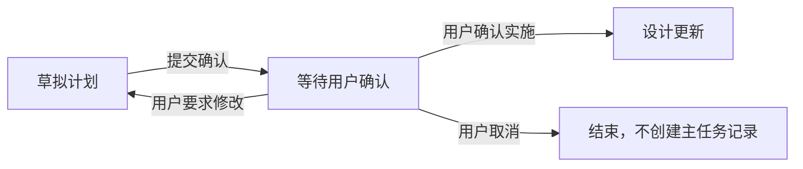
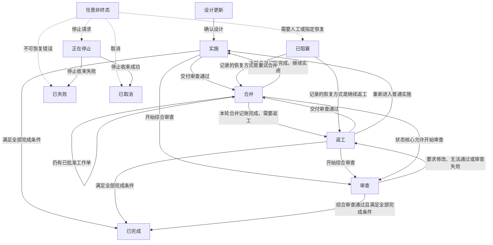
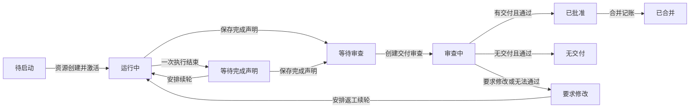

# 16 - Simple / Task 与 TaskService

## 16.1 模式

root Thread 模式只有 `simple | task`。

- Simple：root 使用 executor role，可直接实现；只允许派生只读 explorer。
- Task：root 使用 planner role。planner 负责计划、设计、executor、review、merge、冲突和完成。

root Thread 的 `mode` 是唯一事实源；root role 只是运行时派生投影，不再是独立不变量。agent
注册、Turn 构建时的 instructions、模型路由、workspace 与 execution policy 都按 mode 派生 root
角色（Simple → executor，Task → planner）。切换 mode 只允许 root Thread、没有活动 Task、actor
idle 且没有 pending input；StudioRuntime 持 lifecycle 临界区后单次原子持久化 mode/role 目录记录，
再尽力把进程内 actor 角色同步为新值，失败只告警不回滚——提交 prompt 时 reconcile 会自愈残余
漂移，Turn 构建也不因角色陈旧而拒绝。不存在启动修复步骤。Task root 永远不能进入 executor
WorkUnit 生命周期。

SQLite 只在存储列中保留 `simple | task` 和 Thread status 的稳定标签；repository 读边界必须严格
解析为 Rust enum，未知标签直接返回存储错误，不能降级成 Simple 或 Idle。`ThreadRecord`、mode
切换与 status 更新入口只接受 typed enum，字符串只存在于 SQLite 和既有 transport wire 边界。

每个 agent 固定对应一个 Thread。child 通过 `rootThreadId`、`parentThreadId`、`role` 和
`agentPath` 表达关系。TaskRun 只绑定 root Thread；executor 和 reviewer 直接由 WorkUnit、
ReviewRound 引用，不建立 AgentOutcome 镜像。Rust runtime 同样只使用 `ThreadId` 表达 actor 身份，
不提供同类型的 `AgentId` 改名别名。

## 16.2 所有权

`TaskService` 位于 `pl-studio-runtime`，管理：

- `TaskRun` 聚合根及其领域状态机；
- WorkUnit 与不可变 WorkCompletion；
- ReviewRound；
- MergeRecord 与 Planner Git 记账；
- ProjectLease、worktree ownership 与安全清理。

Thread/Turn 的执行状态只从 Thread repository 读取。Task 状态从产品表直接组成
`TaskSnapshot`，只进入 product stream。planner 执行的 Task 工具仍是 planner Thread 自己的
toolCall Item。

## 16.3 任务状态

任务模式同时保存三层状态。初次阅读时应先分清它们各自回答的问题：

| 层次 | 代码标识 | 回答的问题 |
| --- | --- | --- |
| 主任务 | `TaskRun` | 整个任务现在处于设计、实施、合并、审查，还是已经结束？ |
| 执行者工作单 | `WorkUnit` | 某一名执行者的这一次工作进行到哪里？ |
| 审查轮 | `ReviewRound` | 某一次交付审查或综合审查进行到哪里？ |

三层状态不能互相代替。例如，某个工作单正在接受交付审查，不代表主任务已经进入“审查”状态；
当前实现中，主任务的“审查”状态主要表示合并后的综合审查。

### 16.3.1 创建主任务之前

“草拟计划”和“等待用户确认”发生在主任务记录创建之前，不属于主任务状态。完整入口是：



用户确认实施时，只检查计划非空、对话归属、数据库状态和项目占用情况，然后创建初始状态为
“设计更新”的主任务记录。这里不检查项目目录、版本库状态、当前提交或未提交修改；项目不是版本库、
项目路径不存在等问题，也要等到真正创建执行者的独立工作目录时再明确报告。

### 16.3.2 十个主任务状态

正文统一使用中文状态名。下表中的代码标识只用于查找实现和持久化数据。

| 中文状态 | 代码标识 | 含义 | 是否终态 |
| --- | --- | --- | --- |
| 设计更新 | `DesignUpdating` | 用户已确认计划，计划者正在补充设计说明或准备实施边界 | 否 |
| 实施 | `Implementing` | 可以分派执行者、接收交付并发起交付审查 | 否 |
| 合并 | `Merging` | 计划者把已经通过审查的交付整合进主工作区，并登记合并结果 | 否 |
| 审查 | `Reviewing` | 已创建综合审查轮，等待其结论 | 否 |
| 返工 | `Reworking` | 审查指出需要修改，可以再次分派执行者 | 否 |
| 正在停止 | `Stopping` | 已接受停止请求，正在终止参与者并收束资源 | 否 |
| 已阻塞 | `Blocked` | 状态冲突或资源补偿失败，需要按记录的恢复方式处理 | 否 |
| 已完成 | `Completed` | 所有完成条件都已满足，任务成功结束 | 是 |
| 已失败 | `Failed` | 任务因不可继续的错误结束 | 是 |
| 已取消 | `Cancelled` | 用户停止或取消任务，任务结束 | 是 |

只有“已完成”“已失败”“已取消”是终态。终态记录不会再次恢复；后续模型执行找不到活动主任务时，
会重新进入“尚未创建主任务”的规划流程，因此可能再次要求调用 `plan_exit`。这不是原任务从审查退回
规划，而是原任务已经结束，新的模型执行正在走下一次任务的入口。

WorkUnit 状态收敛为 Pending、Running、WaitingReview、ReviewPassed、ChangesRequired、Paused、
Completed、Failed、Cancelled。每个 variant 使用独立 state struct；worktree disposition、execution
summary/error、budget、typed continuation、来源 Turn 与 continuation revision 只存在于适用状态。
旧 AwaitingCompletion/ReadyForReview/Reviewing/Approved/Merged/NoDelivery/NeedsAttention 语义分别由
WaitingReview、ReviewPassed、Completed、Paused 的 typed payload 表达，不再形成平行 execution status。

ReviewRound 状态为 PendingDispatch、Dispatched、Running、Passed、ChangesRequired、Blocked、Failed、
Cancelled，不再使用外层状态、reviewer status 和 verdict 三轴组合。Executor continuation 状态为
Idle、Compacting、PendingStart、PlannerWakePending、NeedsAttention；WorkCompletion 生命周期为
ReadyForReview、ChangesRequired、Approved，其内容是强类型 Delivery/NoDelivery union。TaskFailure
使用 OpenRecoverable、OpenFatal、Resolved；Merge cleanup 使用 Pending、Deferred、Attempting、
Discarded、AlreadyAbsent、Failed。所有变化分别由领域 command/decision 驱动。

### 16.3.3 完整主状态转换图

实线表示正常业务路径，虚线表示可从任意非终态触发的旁路。图中的“任意非终态”只是为了减少重复
连线，不是一个真实状态。



“合并”不能直接进入“已完成”。每次合并记账后，主任务先回到“实施”或“返工”，或者在仍有已批准
工作单时继续停留在“合并”；随后再决定是否需要综合审查以及是否满足完成条件。

### 16.3.4 各状态的能力与限制

下表描述计划者在主任务中的任务专用能力。路径边界、角色隔离和普通工具权限仍按其他章节执行。

| 当前状态 | 计划者可以做什么 | 计划者不能做什么 | 正常离开方式 |
| --- | --- | --- | --- |
| 设计更新 | 读取和修改主工作区、运行命令、补充设计摘要 | 创建执行者、登记合并、直接完成任务 | 调用 `task_finalize_design` 确认设计，进入实施 |
| 实施 | 创建执行者、接收完成声明、发起交付审查、在条件满足时发起综合审查或完成任务 | 直接修改主工作区；绕过交付审查登记合并 | 进入合并、审查或已完成 |
| 合并 | 读取和修改主工作区、运行命令、登记已批准交付的合并结果 | 创建执行者；直接完成任务；当前工具不会在这里发起综合审查 | 继续合并，或回到实施、返工 |
| 审查 | 等待综合审查结论；审查通过后尝试完成任务 | 修改主工作区、创建执行者、登记合并 | 进入返工或已完成 |
| 返工 | 创建执行者、接收新交付、重新发起交付审查，也可在条件满足时开始综合审查或完成 | 直接修改主工作区 | 进入实施、合并、审查或已完成 |
| 正在停止 | 等待参与者停止和资源收束 | 继续设计、实施、合并、审查或完成 | 进入已取消；收束失败时进入已失败 |
| 已阻塞 | 查看阻塞原因，执行记录中明确允许的恢复动作 | 继续普通任务流程；使用与记录不符的恢复动作 | 恢复到合并或返工；仅允许人工处理时没有自动恢复路径 |
| 已完成 | 查看历史记录 | 继续推进或恢复 | 无 |
| 已失败 | 查看失败原因和历史记录 | 继续推进或恢复 | 无 |
| 已取消 | 查看取消原因和历史记录 | 继续推进或恢复 | 无 |

“设计更新”和“合并”是计划者可以直接修改主工作区并运行命令的两个主状态。“实施”“审查”“返工”
通过执行者、审查者和任务工具推进，计划者不能在这些状态下直接改主工作区。执行者始终只能修改分配给
自己的独立工作目录。

### 16.3.5 正式转换与条件

状态核心只接受下表列出的转换。业务工具还会在调用转换前检查归属、版本号、关联记录和幂等标识。

| 来源状态 | 目标状态 | 触发动作 | 必要条件 |
| --- | --- | --- | --- |
| 设计更新 | 实施 | 确认设计 | 摘要非空，调用者属于主任务，主任务版本号未变化 |
| 合并、返工 | 实施 | 继续普通实施 | 已存在确认后的设计 |
| 实施、返工 | 合并 | 开始合并 | 有通过交付审查、等待合并的完成声明 |
| 实施、合并、返工 | 审查 | 开始审查 | 状态核心允许；当前综合审查工具另要求已有合并记录、所有工作单已合并或声明无交付，并且当前没有未结束审查 |
| 审查、合并 | 返工 | 开始返工 | 审查要求修改，或合并记账后仍有返工历史 |
| 已阻塞 | 合并 | 恢复阻塞 | 阻塞记录指定“重试合并”，调用的恢复方式必须完全一致 |
| 已阻塞 | 返工 | 恢复阻塞 | 阻塞记录指定“继续返工”，调用的恢复方式必须完全一致 |
| 实施、返工、审查 | 已完成 | 完成任务 | 满足第 16.3.10 节的全部完成条件 |
| 任意非终态 | 正在停止 | 请求停止 | 停止请求有效；同时要求终止仍在运行的参与者 |
| 任意非终态 | 已阻塞 | 记录阻塞 | 必须保存原因和允许的恢复方式 |
| 任意非终态 | 已失败 | 记录失败 | 必须保存失败原因；进入终态时释放项目占用 |
| 任意非终态 | 已取消 | 记录取消 | 必须保存取消原因；进入终态时释放项目占用 |

未列出的转换一律拒绝。特别是：设计更新不能跳过设计确认直接完成；合并不能直接完成；终态不能恢复；
“仅允许人工处理”的阻塞没有自动返回合并或返工的路径。

### 16.3.6 从设计更新进入实施

`task_finalize_design` 是“设计更新”阶段必须成功调用的结束工具。它只做以下检查：

1. 设计摘要非空；
2. 调用者属于当前主任务；
3. 当前状态仍是“设计更新”；
4. 调用时提供的版本号仍与数据库一致。

成功后发生“设计更新 → 实施”，并保存确认后的设计摘要。该工具不读取项目版本库，不计算文件指纹，
不暂存、不提交、也不重置文件。计划者可以自行决定如何处理主工作区已有修改；如果修改仍未提交，后续
执行者的独立工作目录只从当时的当前提交创建，不会自动复制这些未提交修改。

普通文字回复、运行命令或其他工具结果都不能代替设计确认。一次模型执行若没有成功调用
`task_finalize_design`，主任务仍停留在“设计更新”。

### 16.3.7 实施、交付与交付审查

只有“实施”和“返工”可以调用 `task_spawn_executor` 创建执行者。创建前先检查主状态、调用者归属、
工作说明、并发数量和幂等标识；这些检查失败时不创建工作单。检查通过后，系统先创建“待启动”工作单，
再创建独立工作目录、执行者子对话并激活执行者。

主工作区有未提交修改不构成拒绝条件。创建独立工作目录失败时，调用者必须收到失败阶段、具体原因、
是否可重试和资源补偿结果；如果可能已经创建资源但清理失败，工作单进入“需要处理”，主任务进入
“已阻塞”。其他已补偿的创建失败只把本次工作单记为“已失败”，主任务保持“实施”或“返工”，允许
用新的尝试重试。

执行者结束工作时提交完成声明：

- 有交付时，必须声明结果提交、改动文件、摘要和验证结果；
- 无交付时，不能声明结果提交或改动文件；
- 系统只检查字段组合、相对路径格式、归属、版本号和当前状态，不检查提交是否存在，也不比较真实文件差异。

完成声明进入交付审查后，主任务状态按审查结论处理：

| 交付审查结论 | 工作单变化 | 主任务变化 |
| --- | --- | --- |
| 有交付且通过 | 已批准 | 实施或返工 → 合并 |
| 无交付且通过 | 无交付 | 保持实施或返工 |
| 要求修改 | 要求修改 | 保持实施或返工，可安排续轮返工 |
| 无法通过 | 要求修改 | 保持实施或返工，可安排续轮返工 |

因此，交付审查开始或结束都不会先把主任务切到“审查”。“审查”主状态用于综合审查。

### 16.3.8 合并记账

`task_record_merge` 是纯记账工具，只能在“合并”状态使用。它要求：

1. 对应完成声明已经通过交付审查；
2. 执行者已经关闭；
3. 调用者属于当前主任务；
4. 同一调用不会重复记账；
5. 连续合并记录的输入结果字段前后相接。

提交标识在这里是调用者声明的审计值。工具不解析提交、不读取主工作区，也不检查祖先关系、工作区是否
干净或真实文件差异。记账成功后，该工作单进入“已合并”，然后按剩余记录决定主任务状态：

- 仍有已批准但未合并的工作单：保持“合并”；
- 已没有待合并工作单，并且存在要求修改的历史：进入“返工”；
- 已没有待合并工作单，也没有上述返工条件：进入“实施”。

从这里不会直接进入“已完成”。计划者必须在回到“实施”或“返工”后，继续发起必要的综合审查，或在
综合审查不需要时显式完成任务。

### 16.3.9 综合审查

综合审查检查多份交付合并后的整体结果。当前工具要求：已有合并记录；所有工作单都已“已合并”或
“无交付”；没有其他未结束的审查；本次声明的审查目标与最新合并记录一致。条件满足后，主任务从
“实施”或“返工”进入“审查”。状态核心也允许从“合并”开始审查，但当前综合审查工具不会走这条路径。

综合审查结论为：

- 通过：主任务保持“审查”，等待 `task_complete` 核对其余完成条件；
- 要求修改：主任务进入“返工”；
- 无法通过：主任务同样进入“返工”；
- 审查者执行失败：本轮审查记为失败，主任务进入“返工”，可以重新安排审查或修改。

每条审查问题都必须给出可直接执行的修改建议，写清改什么、为什么，必要时指出函数或行号。
`review_exit` 会拒绝没有修改建议的“要求修改”或“无法通过”结论。`task_status` 只显示审查概览；
完整问题和文件覆盖情况分别通过 `read_review_round` 与 `read_review_file_coverage` 分页读取，避免长结果被截断。

### 16.3.10 完成条件

`task_complete` 只允许从“实施”“返工”“审查”进入“已完成”，并且必须同时满足：

1. 设计已经确认；
2. 所有工作单都已“已合并”或“无交付”；
3. 所有完成声明、交付审查和合并记录已经闭合；
4. 需要综合审查时，最新且目标匹配的综合审查已经通过；不需要综合审查时，必须符合无交付或单执行者等价条件；
5. 任务主对话没有待处理的用户交互；
6. 待办清单没有未完成项；
7. 任务参与者均已结束；
8. 当前状态、代次、版本号和项目占用记录仍一致。

这些条件只读取持久化的任务声明和参与者状态，不读取项目版本库。工作区是否干净、当前提交是否漂移、
是否存在合并或变基标记、提交祖先关系和真实文件差异，都不是完成门槛。

### 16.3.11 停止、阻塞与失败

正常停止先进入“正在停止”，中断仍在运行的执行者和审查者，再收束工作单与资源。收束成功进入
“已取消”，收束过程自身失败则进入“已失败”。停止请求不会绕回实施路径。

“已阻塞”只用于需要明确恢复动作的问题。当前有三种恢复约束：

| 恢复约束 | 允许的后续动作 |
| --- | --- |
| 重试合并 `RetryMerge` | 只能恢复到“合并” |
| 继续返工 `ResumeRework` | 只能恢复到“返工” |
| 仅允许人工处理 `ManualOnly` | 没有自动状态转换，必须先由人工解决 |

普通版本库异常不会自动把主任务标为“已阻塞”。只有状态冲突，或者创建、回收独立工作目录时发生可能
遗留资源且补偿清理失败，才应进入阻塞。应用重启后的恢复也只依据数据库状态、代次、版本号和参与者
状态，不检查项目版本库。

### 16.3.12 常见完整路径

最短的无交付路径：

```text
草拟计划 → 等待用户确认 → 设计更新 → 实施 → 无交付审查通过 → 已完成
```

单个交付、不需要综合审查的路径：

```text
草拟计划 → 等待用户确认 → 设计更新 → 实施
→ 执行者交付 → 交付审查通过 → 合并 → 合并记账 → 实施 → 已完成
```

多个交付、需要综合审查的路径：

```text
草拟计划 → 等待用户确认 → 设计更新 → 实施
→ 多个执行者分别提交交付
→ 审查第一份交付并通过 → 合并 → 合并记账 → 实施
→ 审查下一份交付并通过 → 合并 → 合并记账 → 实施
→ 审查 → 综合审查通过 → 已完成
```

审查要求返工的路径：

```text
实施 → 合并 → 合并记账 → 实施 → 审查
→ 要求修改 → 返工 → 新执行者交付 → 交付审查通过
→ 合并 → 合并记账 → 返工或实施 → 重新综合审查 → 已完成
```

用户停止的路径：

```text
任意非终态 → 正在停止 → 已取消
```

资源补偿失败的恢复路径：

```text
实施或返工 → 创建执行者时遗留资源且清理失败 → 已阻塞
→ 人工处置遗留资源
```

这类阻塞通常记录为“仅允许人工处理”，因此图中没有自动返回实施、合并或返工的连线。人工处理完成后，
需要由专门的资源恢复流程根据实际处置结果决定如何继续，不能擅自改写主状态。

### 16.3.13 执行者工作单状态

工作单只描述一次执行者尝试，不代表整个任务。它有十二个状态：

| 中文状态 | 代码标识 | 含义 |
| --- | --- | --- |
| 待启动 | `Pending` | 已分配记录，执行者和独立工作目录仍在创建 |
| 运行中 | `Running` | 执行者正在工作 |
| 等待完成声明 | `AwaitingCompletion` | 一次执行已经停下，等待完成声明、续轮或错误收束 |
| 等待审查 | `ReadyForReview` | 完成声明已保存，可以创建交付审查轮 |
| 审查中 | `Reviewing` | 交付审查者正在检查本工作单 |
| 要求修改 | `ChangesRequested` | 交付审查未通过，需要续轮修改 |
| 已批准 | `Approved` | 有交付且审查通过，等待合并记账 |
| 已合并 | `Merged` | 交付已经完成合并记账 |
| 无交付 | `NoDelivery` | 已确认本次工作不产生交付 |
| 需要处理 | `NeedsAttention` | 资源或执行状态不明确，需要计划者或人工处理 |
| 已失败 | `Failed` | 本次尝试失败并已结束 |
| 已取消 | `Cancelled` | 本次尝试被取消并已结束 |

常见工作单路径如下。异常路径可能从尚未结束的任意步骤进入“需要处理”“已失败”或“已取消”。



“已合并”和“无交付”是正常完成任务时可接受的工作单结束状态。“已失败”和“已取消”保留本次尝试的
结果；继续任务时通常创建新的尝试，不改写旧记录。“需要处理”不是成功状态，必须先恢复、终止或完成
资源处置，否则主任务不能完成。

### 16.3.14 审查轮状态

交付审查和综合审查共用同一组审查轮状态：

| 中文状态 | 代码标识 | 含义 |
| --- | --- | --- |
| 等待结论 | `Pending` | 审查轮已创建，审查者尚未给出有效结论 |
| 通过 | `Pass` | 本轮审查通过 |
| 要求修改 | `ChangesRequired` | 发现必须修改的问题 |
| 无法通过 | `Blocked` | 当前材料或条件不足以通过，并附有可执行建议 |
| 审查失败 | `Failed` | 审查者执行失败，本轮没有形成业务结论 |

除“等待结论”外，其余状态都表示本轮已经关闭；若还需要审查，应创建新的一轮。这里的“无法通过”只是
审查结论，不等于主任务的“已阻塞”：交付审查的“无法通过”会把工作单变为“要求修改”，综合审查的
“无法通过”会把主任务变为“返工”。

### 16.3.15 状态保存与一致性

`task_runs`、`work_units`、`review_rounds` 三张表各自只保存一份完整状态 `state_json` 和单调递增的
版本号 `revision`。辅助列 `state_kind` 由完整状态自动生成，只用于数据库约束和查询，应用不能单独
写它。更新必须同时匹配记录编号和旧版本号；任何有效进度变化都会增加版本号，以拒绝迟到结果和并发覆盖。

每个任务主对话最多只有一个非终态主任务，“已阻塞”也计入这个限制。项目占用记录按 `projectId`
建立，与主任务状态在同一数据库事务中更新；进入终态时释放。任务服务不读取、校验或修改项目版本库，
只有独立工作目录资源层可以在创建、回收和防误删时调用版本库工具。

任务工具集合在一次模型执行开始时，根据当时的活动主任务和主状态确定；该次执行过程中不会动态增删。
创建主任务之前不提供 `task_status`、执行者、审查、合并和完成工具，只保留规划能力及 `plan_exit`。
`plan_exit` 只提供给任务主对话的计划者，探索者、执行者和审查者都不能调用。

当前数据库结构版本为 `v11`，属于不兼容升级。旧的项目版本指纹状态不迁移，直接重建运行时数据库。

## 16.4 Planner 与等待

Task root 只允许 planner 创建 explorer；executor 通过 `task_spawn_executor` 创建，reviewer
通过 delivery/integrated review 工具创建。executor/reviewer depth 固定为 1。只有 root Thread 中
role、agent identity 与持久化 Thread 记录一致的 planner Plan trace 才能投影为 PlanConfirmation；
child 或身份不匹配的 Plan trace 仅保留为 trace，不创建 Interaction。PlanConfirmation 的 scope
必须持久化产生它的 agent identity，恢复扫描复用同一资格校验，不能把历史 child trace 补投为确认。
启动恢复以 `plan-confirmation-{planId}` 为稳定身份，在访问短命 runtime actor 前先读取持久化
Interaction 与活动 TaskRun：任何状态的既有 Interaction 都表示投影已发生，活动 TaskRun 也表示该
计划已进入实施，两者都直接跳过。只有确实缺少 Interaction 且没有活动 TaskRun 的最新 root plan
才需要检查 idle agent 并补投 pending confirmation；已 resolved 的历史计划或 terminal Task 不得因
agent 不驻留而产生伪恢复 warning。

`wait_agents` 订阅 Thread directory watch 后读取 snapshot，只因 progress、interaction 或
terminal 变化返回，并以 `messages` 返回本次最新增量；terminal 消息直接携带 canonical
`lastTurnOutcome`，包含 budget kind/usage、reason、rollover 结果和 Turn identity，不复制只含枚举
的 outcome 字段。planner 直接消费该结果，不在 wait 之后调用 `list_agents` 重复刷新完整目录。
child 已有新的 `activeTurnId` 时，即使瞬态 activity 尚为 idle，也必须视为正在运行并隐藏上一 Turn
的 terminal outcome；否则恢复消息后的首次 wait 会把旧 BudgetLimited 误当成新 Turn 已结束。
没有轮询、自动续轮或超时中断。五分钟仅允许 planner 读取有界 child Thread 诊断，不是失败判据。

该 wait 输出协议不迁移旧历史；旧会话或 fixture 不兼容时直接重建。

review request 成功创建 reviewer 后必须结束当前 planner Turn。reviewer 提交 durable verdict 后，
Runtime 以稳定 mail ID 提交一次隐藏 continuation；root Thread 已 idle 时立即启动，仍有活动 Turn 时
只排入下一 Turn，绝不 steer 旧 Turn。新的 planner Turn 从最新 Task state 重新解析 canonical
workspace 与 tool policy。活动 Task 的 Process 与 WorkspaceWrite effect 由状态机 capability 统一
决定，只在 `DesignUpdating` 与 `Merging` 可用；主 workspace 的 Git 合并和记账职责只在 Merging
执行。旧 Turn 的固定 lease 不能取得新 state 才安装的 Task 生命周期工具。

review verdict、reviewer terminal failure 和 executor completed/failed terminal outcome 都先提交到 Task
repository，再派生稳定 ID 的 Planner wake。executor failure 只唤醒 planner 读取 `task_status` 并
决定是否向原 WorkUnit/Thread follow-up，不自动重跑模型、不创建第二个 WorkUnit 或 agent。wake
投递失败不会把已提交的 Task 事实改成 Blocked；启动恢复按 durable source 与 `thread_inputs`
对账，只补投完全缺失的 mail，queued、claimed、active 或 consumed 均视为已交付。因此可重试的
是幂等 mailbox materialization，而不是业务执行。重复事件、恢复扫描和并发提交共享同一 mail ID，
不产生第二次 Planner Turn。

Task Planner wake 是 level-triggered 通知：同一 TaskRun 在 root Thread 中排队的 wake 共享通用
queue coalescing key。root idle 时首个 wake 立即启动；root 活跃时，队首连续的 executor/review
wake 在下一 Turn 启动前合并，最新 wake 决定 Turn identity，较早 mail 作为 durable leading input
由同一 checkpoint 消费。planner 始终读取 canonical `task_status`，不按 wake 文本重放旧事实。
已经 claimed/active 的 wake 不与后到事实合并，保证 Turn snapshot 之后发生的新变化仍能排入下一
Turn；用户输入、交互回复和其他 mailbox 类型不参与该 key。这样 provider 重试、review verdict 与
恢复扫描不会为已被同一 Planner Turn 覆盖的事实创建多个模型 Turn。

Studio 的 `request_user_input` 对 Simple、Task root 和可用 child 一律形成 durable fresh-turn
边界：pending Interaction 先经 ThreadActor/ThreadRepository 提交，原 Turn 再结束；用户答复以
`interaction-resolution:{interactionId}` 作为稳定 mail ID，把 resolved Interaction 与 hidden input
在同一 Thread repository 事务提交。idle root/child 立即启动新 Turn，活动中的任何 Turn 都只令
该 input 排队，绝不 steer；它没有 Planner wake coalescing key。重复答复按 Interaction 状态和
稳定 mail ID 幂等，进程重启后也只能 materialize 一次。Interaction resolution 只更新 Interaction
并提交 fresh durable input，不能修改或复活 terminal origin Turn，也不能覆盖无关活动 Turn。
ToolApproval 继续使用原有审批流程。PlanConfirmation 的 `ContinuePlanning` 仍属于 Planner phase，
但回答中的调整
要求必须与 resolved Interaction 在同一个 Thread repository 事务写入 hidden durable input，复用
`interaction-resolution:{interactionId}`、StartOrQueue、no-steer、无 coalescing 的规则；fresh Planner
Turn 必须再次调用 `plan_exit` 生成新的确认。`ImplementFreshContext` 同样必须把 resolved
Interaction 与 hidden implementation input 作为 durable fresh-turn 边界提交；先建立 TaskRun，再由
fresh Planner Turn 读取 active Task 并获得 `task_finalize_design` 等 Task 工具，绝不把实施输入 steer
回提出计划的 origin Turn。`Dismiss` 保持既有忽略语义。

`ImplementFreshContext` 建立 TaskRun 时只校验确认计划非空、root Thread/project owner 与数据库状态，
并以 `projectId` 建立活动 Task lease。不检查项目路径是否存在，不初始化 Git，也不读取 branch、HEAD、
status 或 operation。非 Git、路径不存在、dirty、detached 或存在 merge/rebase marker 的 workspace
都可进入 `DesignUpdating`。planner 自行决定是否查看、保留或提交既有修改；executor worktree 从
创建时 `HEAD` 建立，未提交内容不会被隐式复制。项目/HEAD 不可用只在实际创建 worktree 时以
结构化 `worktree_create_failed` 报告。

Task planner/executor/reviewer 的 required finalization tool 只约束业务阶段完成，不约束 durable
UserInput 边界。原 Turn 因 pending Interaction 结束时必须保存为 completed，不能因为尚未调用
`plan_exit`、`report_completion` 或 review exit 工具而标成 failed；fresh Turn 恢复后仍继续执行原
finalization policy。

进程重启后不为普通 paused Task 自动启动模型；但崩溃前已经 durable 形成的 pending Planner wake
或 mailbox input 必须在资源恢复完成后继续交付。活动 Task 无 pending input 时显示 paused；用户
“继续任务”以稳定 mail ID 向 root Thread 提交一次隐藏的明确输入，要求 planner 先读取
`task_status` 和 `list_agents`。attach 只恢复已有 durable 工作，不为单纯 active Task 合成新工作。

## 16.5 Executor 与交付

`task_spawn_executor` 接收一份自包含的实施蓝图：`taskName`、`objective`、分组的 `scope`、
`implementationSteps`、`acceptanceCriteria`、`dependencies`、`evidence` 和 `verification`。
每个 WorkUnit 只承担一个可独立验证的成果。planner 必须先完成足以形成蓝图的探索；关键方案仍
未知时继续探索或自行处理，不能用空泛说明把方案发现转嫁给 executor。下一步立即依赖的关键工作
不应派发后原地等待；可并行工作尽量使用不重叠的预计修改面，存在依赖或明显重叠时串行派发。
scope path 用于拆分、审查和冲突提示，不是 executor worktree 的硬性写入权限。

`scope.inScope`、`scope.scopeHints`、实施步骤、验收条件和至少一条命令验证均非空；
`scope.outOfScope` 必须显式出现但可为空。每个步骤包含唯一 ID、具体指令、至少一个仓库相对
目标路径（可带 symbol）、预期结果和验收条件引用；每条验收条件必须同时被至少一个实施步骤和
至少一项命令或检查覆盖。命令验证固定唯一 ID、命令、仓库相对 cwd、目的、预期结果和验收条件
引用；只读检查同样固定 ID、指令、目标、预期结果和引用。所有标识唯一、引用有效且不得重复，
路径与 cwd 必须是规范仓库相对路径，整个 handoff 受固定上下文预算约束，输入拒绝未知字段。
这些校验以及 pinned section 大小验证必须在分配 worktree、ProjectLease、WorkUnit 或 child Thread
之前完成，失败不得留下任何资源或子对话。

每次 executor allocation 同时生成第四版且唯一命名的 `TaskExecutorHandoff`。handoff 按运行归属、
仓库事实、确认计划、实施蓝图和交付规则分组，固定 TaskRun/WorkUnit、parent Thread、
requestedByCallId、worktree 实际 base/path/branch、确认计划、完整蓝图和交付契约，并作为
`studio.task_executor_handoff` pinned section 随 fresh child session 持久化。运行时对规范化蓝图
计算稳定内容指纹；同一 provider call 或新重试只有完整指纹一致时才复用既有 WorkUnit。taskName、
scope 相同但步骤、验收或验证不同是稳定冲突，不能复用或重新分配。后续 Turn 从 durable WorkUnit
与该 section 交叉校验；缺失、损坏或 owner/resource 不一致时进入 Paused 的 operational payload，
不迁移或兼容旧版。只有原 WorkUnit 已 terminal，或 TaskRun 已明确进入 Reworking，才允许创建
新的 attempt。

`task_spawn_executor` 使用统一 tagged outcome：`spawned` 返回 agent/thread/turn/blueprint；
`rejected` 表示状态、owner、蓝图、并发或幂等输入门禁，包含稳定 code、currentPhase、requiredPhases
与 nextAction；`failed` 表示 allocation、worktree、child Thread、agent registration 或 activation
操作失败，包含 phase、recoverable、原始 message、TaskRun/WorkUnit/agent、resource、穷尽 typed cause、
逐资源 compensation 与 nextAction。合法调用先创建 Pending WorkUnit，再由 worktree 资源适配层执行
`git worktree add ... HEAD`；主 workspace dirty 不构成门禁。创建成功后解析新 worktree 的实际
base commit，CAS 写回 WorkUnit，再持久化 child Thread、注册并激活 agent。

结构化 failure 保存在 WorkUnit。相同 provider call id 重放直接返回原有 `spawned` 或 `failed`，
不重复创建资源；新的 call id 创建新的 attempt。无副作用或补偿成功的失败只把 WorkUnit 标为
Failed 并保持 Task phase，以便重试；资源可能已创建且 cleanup/fault compensation 失败时 WorkUnit
进入 Failed、TaskRun 进入 Blocked，必须先走资源恢复。

spawn failure 的 code、phase、worktree cause、逐资源 compensation 与 nextAction 在 Rust protocol、
FRB 和 Dart 中均为穷尽 enum；不存在字符串 fallback。Task projection 中 `MergeMethod`、
`ReviewScope`、budget limit kind 也保持强类型。会话恢复 preview 仅列出 Completed、Cancelled、Failed、
BudgetLimited 四种 terminal Turn，并用 typed state 传输，不接受历史 `status` 字符串。

executor 使用全新上下文，初始消息由 runtime 固定生成，只要求读取 pinned handoff 并按顺序开始；
不得复制一份可能漂移的自由文本 assignment。executor 可调整不改变目标与验收语义的低层实现；
若现场事实与蓝图冲突或必须扩大任务语义，必须保留证据并通知 planner。planner、恢复流程和
delivery reviewer 均通过只读 `read_work_unit_handoff` 从持久化 working state 取得同一份 handoff，
不能依赖活动 actor 或对话历史。通用只读 explorer 仍使用通用派发协议，但必须获得明确问题、
检索范围、期望证据和返回格式，不扩展为 Task 实施蓝图协议。

executor 只能写自己的 worktree，并以以下工具结束可交付工作：

```text
report_completion {
  kind: delivery,
  headCommit,
  changedFiles,
  verificationResults: [{ checkId, summary }]
}
| report_completion {
  kind: noDelivery,
  changedFiles: [],
  verificationResults: [{ checkId, summary }]
}
```

完成结果使用顶层 tagged object；`kind`、`headCommit`、`changedFiles` 与 `verificationResults` 都是工具的
顶层字段，不再包在 `result` 对象中。对 provider 暴露的 JSON Schema 保持单一 object +
properties 形状，不在根节点使用 `oneOf`；`headCommit` 在 schema 中可选，运行时再按 `kind`
穷尽执行条件校验：delivery 必须提供非空 `headCommit` 和非空规范相对路径列表，noDelivery 必须
省略 `headCommit` 且 `changedFiles` 为空。这样既避免嵌套 union 被编码成
JSON 字符串，也兼容不能稳定生成根 `oneOf` 参数的 provider，并继续拒绝未知字段。

`verificationResults` 必须恰好覆盖 handoff 中全部 command 与 inspection ID；缺失、重复或未知 ID
均拒绝。summary 非空，结果按 handoff 的稳定顺序生成现有 WorkCompletion 人类可读验证摘要，
不修改数据库格式。任何检查失败时 executor 只能继续修复或报告阻塞，不能提交 completion。

delivery 的 `headCommit` 与 `changedFiles` 是 executor 声明的 opaque 审计事实；TaskService 只校验
字段组合、路径格式、owner、revision 与状态转换，不验证 commit 存在、HEAD 推进、ancestor、clean
或真实 diff。worktree 内变更不受 scopeHints 限制。成功事务创建不可变
WorkCompletion 并以该 Completion identity 将 WorkUnit 置为 `WaitingReview::Ready`。普通文本
结束、工具错误不会伪造交付，WorkUnit 进入 `WaitingReview::AwaitingReport`，并在 payload 中直接
承载 typed executor outcome；planner 可向同一 Thread 发送明确 follow-up。follow-up 或
ChangesRequired rework 开启新的 executor Turn 时，WorkUnit 必须在同一事务中恢复为 Running，清除
旧 execution error 并推进 continuation revision；相同 source Turn 的重复 TurnStarted 保持幂等。
状态 enum 不允许表达“等待 completion 但 executor 仍 running”之类中间组合。

executor Turn 被取消后进入带 typed cancel cause 的 Cancelled，并请求清理；后续重复关闭返回同一
discard disposition，不再次推进 revision。`WaitingReview::Ready/Reviewing` 与 ChangesRequired 的
completion review 仍禁止关闭。

executor 的单个 Turn 保持 30 分钟 wall-clock 上限。前三个 `WallClock` budget terminal 不把
executor 或 WorkUnit 标记为失败：runtime 通过唯一 compaction controller 对同一 Thread 强制执行
`WallClockRollover`。attached Turn 复用原 CancellationToken，provider-backed compaction 受 120 秒
硬超时约束；取消、超时或错误不得阻止当前 Turn 提交 terminal。成功后以
`workUnitId + sourceTurnId` 生成确定性 hidden continuation input，在同一 worktree 开启下一切片。
一个自动 tranche 最多四个切片；第四次 wall-clock 耗尽、非 wall-clock budget 或 rollover 失败
进入 Paused 的 budget payload，保留 executor/worktree，并形成稳定 Planner wake。pending continuation 与
Planner wake 在重启时分别按幂等键对账已有 active/terminal Turn 和 queued/claimed/active/consumed
mail，禁止重复增加切片或启动 Turn。rollover replacement transcript 必须先与 TurnFinished 在
repository 提交链上持久化成功，再允许 hidden continuation 入队；提交失败时 actor 不推进内存
session，也不启动下一 Turn。

planner 用统一的 `send_message`（parent→direct-child）向子代理下发调度或恢复消息；不增加 Task
专用恢复工具。每次成功接受的消息都刷新 child budget。活动 Turn 不被中断，但 wall-clock 和
本 tranche 的 model/tool/wait 计数从消息接受时重新开始；idle child 开启 fresh Turn。对应 WorkUnit
的 budget tranche 重置为第一片，清除上一 tranche 的 budget/error/source。预算型 Paused
可由该消息恢复为同一 executor/Thread/WorkUnit/worktree 的 Running；handoff、ownership
等 operational Paused 继续拒绝恢复。自动 `PendingStart` continuation 不刷新 tranche。

UserInput 的 fresh-turn 边界不扩大上述预算续轮范围。普通 Planner、reviewer、Simple 或 child
`budgetLimited` 仍是 terminal 事实，不自动合成 continuation；只有这里定义的 executor
`WallClockRollover` 可以按 WorkUnit tranche 状态机续轮。

WorkUnit 在 `WaitingReview::Ready` 之后以 `executorAgentId` 创建 fresh Delivery reviewer。ReviewRound
事务固定最新 Completion revision，reviewer canonical workspace 直接绑定同一 worktree，不接受
模型提供路径。Reviewer 必须在 `review_exit.fileReviews` 中为冻结清单的每个规范仓库相对路径提交
`reviewed: true`；服务端精确拒绝缺失、false、重复、额外、绝对或非规范路径。该标记声明 Reviewer
已经结合 prompt 中完整 diff 审查该文件，不要求每个文件都有独立 `read_file` trace。findings 使
WorkUnit 进入 ChangesRequired；
planner 把具体 finding 发回原 executor Thread，新的 completion revision 重新审查。pass 后
WorkUnit 进入 `ReviewPassed::Delivery` 或 `ReviewPassed::NoDelivery`。executor 在普通结束或失败时若没有形成新的
Completion，WorkUnit 保留可 follow-up 的 durable terminal execution 状态，并生成一次 Planner
wake；review changes-requested 后的 rework failure 也走同一路径，不能静默停在
`WaitingReview::AwaitingReport`。取消由既有 stop/cancel 收束处理，不额外唤醒 Planner。

Reviewer 在产品语义上仍是只读角色，不得通过 shell 修改 workspace、Git 或其他现场。审查前可以
使用 `list_files`，或通过 `exec` 运行 `rg` / `rg --files` 定位设计和代码；定位之后仍必须用
`read_file` 阅读至少一个相关 `design/**` 文档，才能提交 `review_exit`。Reviewer 的中文审查规则
保存在独立 Markdown prompt 模板中；模板要求检查所有 changed files、调用点、测试、错误路径和
跨文件交互，发现第一个问题后继续并一次提交所有确定、离散、可执行的 finding，同时排除推测、
既有问题、刻意变更和纯风格 nit。

`review_exit` 返回 tagged outcome。文件覆盖或其他可修正输入门禁失败时返回
`rejected { code, recoverable, message, diagnosticsRevision, coverage, violations }`，工具失败但不结束
Reviewer Turn；一次诊断聚合 missing、unreviewed、duplicate、extra、invalid path 及其他输入问题，
小集合直接完整返回，大集合提供总数、稳定预览和分页 revision。拒绝只更新 ReviewRound 的最近
覆盖尝试与诊断，保持 Pending，不推进 WorkUnit/Task phase，也不产生 Planner wake。只有覆盖完整且
其他门禁通过时返回 `accepted`，在同一事务提交全部文件标记、verdict、summary 与 findings，随后
物化一次幂等 Planner wake 并结束 Turn。旧数据库中的历史 round 若没有覆盖字段，明确投影为
coverage unknown，不推断为已审查。

每个 Agent Turn 结束时，Studio 从结构化 `TurnFailure` 派生独立的
`TaskFailureDisposition`。capacity、transport、408/409/425/429、5xx 和普通验证失败为
Recoverable；authentication、authorization、configuration、provider protocol、fatal tool runtime、
internal invariant 以及未知永久 provider failure 为 Fatal。
该判断只使用 typed category/kind/retry，不解析 message。

Recoverable child failure 保留 WorkUnit/Review 可 follow-up 状态并产生一次 Planner wake；
Recoverable root failure 保持当前 Task phase，等待用户修复配置后继续，不自动重放 Turn。Fatal
failure 以来源 Turn ID 幂等写入 `task_failures`，首个 fatal 在同一 SQLite immediate 事务中把
TaskRun 置为 Failed、固定 terminal failure、收束未完成 WorkUnit/Review 并删除 ProjectLease。
事务提交后才中断其余 Task agent。现有 worktree disposition 保持 Protect，branch 和物理成果不
删除；迟到 completion、review、wake 或第二个 fatal 不能覆盖已提交终态。

## 16.6 Planner 自主 Git、合并记账与综合审查

`ReviewPassed::Delivery` 且 executor 已关闭的 delivery 由 `task_status` 投影为 `MergeCandidate`，包含 executor、
completion revision、相对 worktree locator、branch、base/head commit 与前一条 MergeRecord 声明。
TaskService 不执行 merge，也不提供专用 conflict 文件工具。Planner 在 Task 主 workspace 使用普通
exec/file/Git，自行选择 merge、cherry-pick、squash、rebase 或 manual，并自行解决或 abort 冲突。
冲突期间 Task phase 仍是 Merging，不创建独立 conflict state 或持久化 conflict tool session。

Planner 完成自选整合后调用 `task_record_merge`，提交 executor、completion revision、
previous/resulting HEAD、typed method 与 summary。该工具是纯记账入口，只重读并验证 caller、ReviewPassed
completion、已关闭 executor、Task phase、owner、幂等性，以及连续 MergeRecord 的
`expectedPreviousHead == 前一条 resultingHead`。所有 commit 字段均为 opaque audit value；工具不解析
commit、不读取主 workspace、不验证 current HEAD、ancestor、clean、diff 或 Git operation，也不运行
或补偿 Git。成功事务写 MergeRecord、推进 WorkUnit/TaskRun，并授权幂等清理源 worktree。

delivery reviewer 的 prompt 必须直接包含完整实施蓝图、验收条件和 executor 的全部验证结果，
按验收 ID 逐项核对，并继续满足完整 changed-files 覆盖门禁。reviewer 与 executor 消费同一份
持久化契约，不从 planner transcript 重述或猜测目标。

所有 WorkUnit 均为 `Completed::Merged` 或 `Completed::NoDelivery` 后，TaskService 计算统一、
transport-neutral 的综合审查门禁：`Required`、`SatisfiedByReview { reviewRoundId, reviewedHead }`、
`NotRequiredNoDelivery` 或
`NotRequiredSingleExecutorEquivalent { workUnitId, completionRevision, mergeRecordId }`。同一结果用于
`task_status`、Studio 产品任务状态、模型工具、桌面桥接、HTTP `/state` 和最终完成事务；适配器不得
重复推断。

“始终只有一个 executor”要求整个 TaskRun 只有一个 WorkUnit 和一个 executor identity；允许该
executor 多次返修并产生多个不可变 completion revision，但最终只能有一个获准 delivery、对应的
pass delivery review 和一个 MergeRecord。只要曾创建第二个 WorkUnit/executor，或者已存在任何
integrated review round，就不能事后走免审。单 executor 复用 delivery review 只依据持久化关系证明：
全 Task 只有一个 WorkUnit/executor，获准 Completion、pass delivery ReviewRound 与唯一 MergeRecord
revision 连续对应，且所有 Task agent 已 terminal。TaskService 不读取 Git tree 或 workspace。多
WorkUnit 或 integrated review 已存在时仍保守返回 `Required`。

`NotRequiredNoDelivery` 与 `NotRequiredSingleExecutorEquivalent` 可在 Implementing/Reworking 阶段
直接调用 `task_complete`。`Required` 必须创建 fresh integrated reviewer，其 canonical
workspace 是 TaskRun 主 workspace；findings 进入 reworking，pass 后门禁为 `SatisfiedByReview`。
相同不可变 merge/completion 声明仍受 pending review 与 provider call 幂等键约束，不重复创建 round。

## 16.7 设计阶段门禁

用户确认实施后，TaskRun 必经 `DesignUpdating`。planner 可继续探索，也可使用普通文件和命令工具
修改任意仓库文件；不再存在专用 `task_update_design`，也不强制修改 `design/**`。

planner 完成该阶段时调用 `task_finalize_design { summary }`。工具只校验 summary 非空、caller/Task
owner、当前 phase 与 revision CAS，然后记录 `FinalizedDesign { summary }` 并执行
`DesignUpdating → Implementing`。它不读取项目路径或 Git，不 stage、commit、reset、恢复文件，也不
计算 workspace observation/fingerprint。dirty、detached/漂移 HEAD 与 merge/rebase marker 均不影响
finalize。planner 若希望 executor 获得设计阶段修改，必须在调用前自行提交。

`task_spawn_executor` 在所有活动 Task planner Turn 中保持可见，但只允许 `Implementing` 或
`Reworking`。其他 phase 调用时返回 recoverable `task_phase_mismatch`，包含当前 phase、允许 phase
以及下一步工具；在 `DesignUpdating` 中明确要求先调用 `task_finalize_design`。阶段错误发生在任何
WorkUnit、worktree 或 child Thread 分配之前。

## 16.8 Lease、停止与恢复

同一 `projectId` 只能有一个活动 Task ProjectLease。设计、merge、完成、停止和恢复使用 TaskRun
revision/generation 与数据库事务串行化；ProjectLease 不携带 Git common dir、branch 或 HEAD。

stop 先写 typed StopRequested 并禁止新 allocation，再 interrupt 活动 Turn。是否进入 stopping 只
依据 durable WorkUnit/Completion/Review/Merge、pending interaction 与 agent 状态；不读取项目 Git。
授权清理的 Pure-owned worktree 由资源适配层独立处理，最终在事务中写 cancelled 并删除 lease。

启动恢复把遗留 inProgress Turn/Item 标记为 interrupted(runtimeRestarted)，把 pending reviewer
round 收束为失败，并按 durable completion/review/merge 与 agent state 恢复 WorkUnit。Merging 恢复
不读取 workspace、branch、HEAD、clean 或 Git operation；保持 Merging/paused，等待用户继续 Planner。
Retry 只按 durable state、generation/revision 与 ProjectLease 恢复。Task phase、delivery、review、
merge record、worktree owner 和 lease 均从产品表恢复；没有 pending input 时保持 paused。

任何 run、Thread、WorkUnit、review、merge 或 lease durable owner 配对失败都只 block 精确作用域，
不击穿其他 Project。项目 Git 异常不自动 Blocked；只有状态冲突或 worktree 补偿失败可以 Blocked。
恢复不重建物理模型连接、不启动 continuation、不删除外部资源。

### 16.8.1 可续跑 Task 与对话恢复

Studio 提供 `previewTaskRecovery(rootThreadId)` 与 `applyTaskRecovery(request)` 两步产品接口。
Preview 无服务端临时状态，其 CAS token 固定 runId、TaskRun revision/generation、typed state、
StopRequested、目标 Thread/runtime revision、候选 Turn/input、continuation revision、ProjectLease 与
WorkUnit resource identity。Apply 重读全部 durable 事实；任何 identity、revision、Completion、Review
或 Merge 漂移都返回 stale，要求重新 Preview 或 Reconcile。

系统依次建议最近 failed/interrupted 且仍可 follow-up 的 executor、最近 failed/interrupted planner、
最近更新的 eligible executor/planner；reviewer 不进入通用对话回退。默认选择从最近失败 Turn 到
有效尾部，用户只能选择连续末尾一至八个完整 Turn。精确 transcript 匹配失败时 Preview 显式提供
`rebuildThread`，不得自动降级。

对话恢复不回退 TaskRun、WorkUnit、attempt、budget slice、continuation、Completion、Review 或
Merge。executor 仍由 planner 通过既有 follow-up 恢复；executor 新 `TurnStarted` 后，WorkUnit 与
WorkUnit 在同一事务恢复为 Running。root resume input 使用稳定 mail ID
`task-recovery:{runId}:{recoveryRevision}`，重复 recoveryId 和 mail materialization 必须幂等。

恢复是可重试 saga：先提交 Thread transcript/working state/recovery marker，再在满足门禁时清除
StopRequested，最后投递 resume mail。Stop 只能在 paused 且 state 为 `DesignUpdating`、
`Implementing` 或 `Reworking` 时撤销；`Merging`、`Reviewing`、`Stopping` 和终态继续使用现有
Retry/Reconcile。任一步失败都保留已提交事实，使用同一 recoveryId
重试时从 durable 状态继续，不能重复增加恢复 revision。

对话恢复不计算或比较项目 Git fingerprint，也不执行 reset、clean、abort、cherry-pick、checkout
或删除。worktree registration/path/branch/HEAD 只在明确的资源 cleanup preview 与 execution-time
revalidation 中读取，用于防误删，不参与 Task 恢复状态转换。

## 16.9 清理安全

worktree 路径和分支包含 run 与 executor Thread 身份：

```text
.pure/worktrees/<taskRunId>/<threadId>
pure-task-<runId>-<threadId>
```

恢复清理和项目关闭遵循 preview → confirmation → execution-time revalidation。预览列出 path、
branch、存在状态、dirty、ahead、changed files 和 expected revision。执行只处理数据库证明归属
且仍与预览一致的 `pure-task-*` 分支与 `.pure/worktrees/**`；绝不删除用户主工作区。

项目清理成功后必须推进并发布 project/thread directory revision，再发布最新 recovery state；GUI
只根据这些 canonical snapshot/event 移除项目、Thread 和失效选择，不维护本地删除镜像。由恢复问题
触发的 `RemoveProject` 与直接项目清理共享同一 lifecycle 临界区；已经持锁的恢复路径不得重入该锁。

不兼容 Studio 数据库直接删除并重建，不迁移或归档 ownership。数据库重建本身不扫描或删除磁盘
worktree/branch；失去 durable owner 的资源继续保留现场。

## 16.10 完成条件

`task_complete` 要求：

- 设计阶段已经 finalize；
- 全部 WorkUnit 为 `Completed::Merged` 或 `Completed::NoDelivery`；
- 综合审查门禁为 `SatisfiedByReview`、`NotRequiredNoDelivery` 或
  `NotRequiredSingleExecutorEquivalent`；`Required` 以 `reviewRequired` 拒绝并说明无法复用 delivery
  review 的稳定原因；
- 不存在 StopRequested；
- Task root Thread 自身不存在 pending Interaction。已结算子 Thread 的残留 Interaction
  不阻塞完成——planner 没有取消它们的工具，树级门禁会把任务死锁到用户介入。

pending Interaction 是可恢复的用户或工具边界，`task_complete` 不自动取消；它以
`pendingInteraction` 拒绝完成，并返回总数及稳定 Interaction 预览。用户或 Agent 解决这些
Interaction 后可在同一 Reviewing phase 重试。完成事务必须在写入 terminal fact 与删除 lease 前
原子重验 root 自身的该不变量，不能只依赖事务外 preflight，否则并发创建的 Interaction 可能穿透
终态门禁。

planner 当前 todo list 存在未完成条目时，`task_complete` 以 `todoIncomplete` 拒绝，message
列出每条未完成条目的状态与步骤，planner 需先用 `update_todo_list` 把条目标记完成（或按事实
修订清单）后重试。没有 todo list 或全部条目 completed 时不拦截，不强制 planner 必须使用 todo。

工具返回 tagged `TaskCompleteOutcome`：`completed { run }` 或
`rejected { code, recoverable, message }`。所有门禁拒绝使用稳定 code（wrongPhase、stopRequested、
reviewRequired、deliveriesIncomplete、pendingInteraction、todoIncomplete）和用户可读说明。rejected 通过普通 tool
failure JSON 同时进入 Planner 上下文、SQLite Item 与 GUI；Task 保持调用前的非终态，lease/review
不变，且 Planner Turn 只有成功完成时才结束。

完成事务接收上述强类型门禁依据，并在同一 SQLite immediate 事务重新校验 WorkUnit 数量与
executor identity、completion revision、delivery review、MergeRecord、设计阶段完成事实、ProjectLease
和 pending Interaction；同时检查 todo、活动 agent、generation/revision。任何 durable 事实漂移使
事务拒绝。任务状态同时发布门禁和原因，
WorkUnit 概览仅发布蓝图指纹、目标及步骤/验收/验证数量；完整 handoff 只由
`read_work_unit_handoff` 按需读取，避免挤占默认状态上下文。

`task_complete` 只提交通用 Task 生命周期事实，不选择或执行任何项目命令。项目验证由 executor
按照 durable handoff 中的 typed command 契约完成，并通过 WorkCompletion 保存验证摘要；reviewer
负责审查这些证据和实现结果。Task harness 不根据 changed files、目录名或语言推断额外验证。

完成事务写 completed 并删除 ProjectLease。任何迟到 child completion、旧 generation 或旧 Turn
通知都不能改变已提交的 Task 终态。

Flutter Driver 验收的 stall 判据只观察 durable Task/WorkUnit 进度：phase、generation/revision、
WorkUnit/continuation/budget slice、executor Thread 已提交的 `runtimeRevision`、Completion、
Merge 与 Review revision。Task 产品投影把 executor 的 durable revision 发布为
`executorProgressRevision`，因此 root Timeline 不变时，child checkpoint 和 tool result 仍可推进验收
进度；该字段不写入 WorkUnit 表，也不改变 continuation revision 的幂等语义。Thread 的
`thinking/runningTool/responding` 属于瞬态活动，不得刷新 stall 计时；否则重复探索会伪装成任务
进展。总超时继续约束长任务，单次长编译是否允许超过 stall 窗口由 fixture 显式配置。
Driver harness 只驱动与观测这些通用生命周期字段，不解析用户 prompt、项目目录、构建命令或
review finding 的项目语义。计划、验证命令或项目判断写错属于普通 planner/executor 行为，由同一
WorkUnit 的状态机与 follow-up 处理，不得在 harness、工具 schema、skill 或系统提示词中硬编码
项目知识来规避。

真实验收使用 `new | observe | resume` 三种模式。New 要求空 DriverHome、写版本化 manifest 且只
提交一次原始 prompt；Observe 只读取已有 run；Resume 复用 DriverHome、Studio DB、配置、manifest
和全局 deadline，重新取得 VM URL，但不再次提交 prompt 或确认计划。每次 attempt 使用独立日志
目录；只有成功的 Task recovery 才重置 stall 窗口。一次验收最多应用三次 conversation recovery，
第四次直接判定恢复循环；stale preview 的重新生成不计数。

预算恢复验收只允许 debug scripted fixture 注入短 wall-clock 与短 compaction timeout；生产默认
仍固定为 30 分钟和 120 秒。fixture 必须先观察 WorkUnit 的 budget Paused，让当前 Planner Turn 结束
并由稳定 wake 开启 fresh Turn，再向原 executor 执行 `send_message`。Driver 必须记录恢复后的
`budgetSliceCount == 1`，并证明 WorkUnit、agent、worktree 与 branch identity 均未变化；同一隔离
Studio 数据目录重启后还必须验证 wake、恢复消息和 continuation 没有重复物化。
