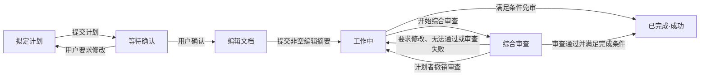
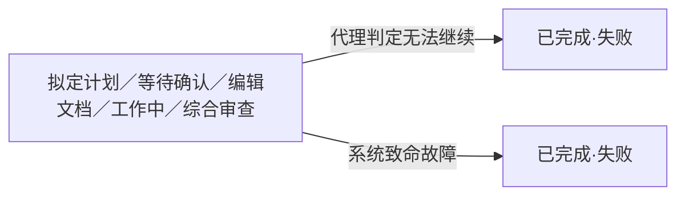
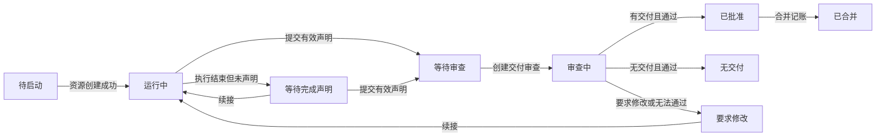

# 16 - 简单模式与任务模式的任务编排

本文说明工作室如何组织一项需要计划、分工、审查和整合的任务。正文面向第一次接触任务模式的
读者，只使用中文业务名称；程序中的状态名、工具名和字段名集中放在文末的实现名称对照附录。

本章描述当前唯一有效的任务编排设计。数据库、工具协议、状态联合和 UI 投影都直接使用本文定义，
不提供旧状态、旧工具或旧数据库记录的运行期兼容入口。

## 16.1 先理解任务模式

### 16.1.1 两种工作模式

工作室根对话有两种工作模式：

- 简单模式：根代理直接处理用户请求，适合范围清楚、不需要正式分工和审查记录的工作。
- 任务模式：根代理担任计划者，用一条持久化任务记录组织计划、执行者、审查和最终结果。

任务模式收到一项新请求时，先在常驻的 `TaskRuntime` 内存 owner 中创建任务记录并进入“拟定计划”，
随后异步写入 SQLite。计划确认前后使用的是同一条任务记录，不再存在“计划前状态”和“正式任务
状态”两层结构。进程运行期间，TaskRun 与其 WorkUnit、Completion、Review、Issue、Merge 子事实
共同组成一个内存 `TaskAggregate`；SQLite 只作为重启恢复基线、冷加载和历史查询来源。

一个根对话同一时刻只续接一项未完成任务。同一项目可以被不同根对话中的多项任务同时处理；系统不再
建立项目占用记录，也不以“同项目已有活动任务”为由拒绝新任务。并行任务依靠任务编号、独立工作目录、
记录所有权和版本比较更新彼此隔离。

### 16.1.2 四种角色

| 角色 | 主要职责 |
| --- | --- |
| 计划者 | 理解目标、维护计划、分派工作、整合成果、发起整体审查并结束任务 |
| 执行者 | 在分配的独立工作目录中完成一个可独立验证的成果并提交完成声明 |
| 审查者 | 按冻结目标检查一份交付或整体结果，提交结论和可执行修改建议 |
| 探索者 | 围绕明确问题收集事实、定位实现并返回证据 |

角色表示职责和记录所有权，不是普通能力表。所有角色都可以使用普通读取、写入、命令、版本库和协作
工具，但执行者、审查者和探索者只能在分配给自己的规范工作目录中操作。审查职责可以要求审查者不要
改动被审查成果，这属于行为约定，不通过隐藏普通工具强制实现。

## 16.2 五条总原则

任务模式遵循以下原则：

1. 状态只记录任务已经走到哪里，不授予或撤销模型能力。
2. 只有会提交业务事实的专用工具受状态约束；普通读取、写入、命令和版本库操作不受主状态限制。
3. 转换被拒绝时保持原状态，并一次返回全部原因、所有可行路径和每条路径缺少的条件。
4. 任务服务不读取项目版本库来决定计划、状态、审查、合并或完成。未提交修改、当前提交变化、合并
   标记、提交关系和真实文件差异都不是业务门槛。
5. 路径归属、防逃逸、防误删、并发上限、身份所有权、版本比较更新和清理确认属于独立安全边界，
   不能被解释为主状态带来的模型能力限制。

程序只约束“能否提交某项状态事实”，不替代理决定唯一工作路线。代理可以先探索、直接修改、分派工作、
请求用户输入或调整待办；若某个状态动作暂时不能提交，程序应解释怎样达到条件，由代理选择下一步。

## 16.3 六状态平级生命周期

### 16.3.1 总图

每条任务记录只保存以下六个平级状态：



任意非终态还可以进入“已完成·失败”：



“已完成”是唯一终态，内部结果只有成功和失败两类。失败再区分“代理判定无法继续”和“系统致命
故障”。终态不可恢复；终态后的新用户消息创建一条新的“拟定计划”任务，不复活旧任务。

停止不是任务状态。停止只取消当前模型执行并推进执行代次，任务仍停留在原来的六状态之一。

### 16.3.2 六个状态的含义

| 状态 | 已经发生的事实 | 主要可提交的下一项事实 |
| --- | --- | --- |
| 拟定计划 | 任务记录已创建，计划者正在形成完整计划 | 提交计划，或以失败结果结束 |
| 等待确认 | 完整计划已冻结，正在等待用户答复 | 用户确认、用户要求修改，或以失败结果结束 |
| 编辑文档 | 用户已确认计划，计划者正在补充设计和实施边界 | 提交非空编辑摘要，或以失败结果结束 |
| 工作中 | 可以并行执行、交付审查、返工、整合和合并记账 | 开始综合审查、满足条件时成功结束，或失败结束 |
| 综合审查 | 整体审查目标已冻结 | 通过后成功结束，或因修改、失败、撤销回到工作中 |
| 已完成 | 任务已经以成功或失败结果结束 | 无；新消息创建新任务 |

“编辑文档”是一个生命周期检查点，不表示计划者只能修改文档文件。计划者可以编辑任何文件；状态转换
只要求一份非空摘要，不检查路径、文件变化或版本库状态。

### 16.3.3 完整转换表

| 来源状态 | 触发事实 | 目标状态 | 关键条件 |
| --- | --- | --- | --- |
| 拟定计划 | 提交计划 | 等待确认 | 计划非空、归属正确、记录版本一致 |
| 等待确认 | 用户确认 | 编辑文档 | 确认对应当前计划，且未被重复处理 |
| 等待确认 | 用户要求修改 | 拟定计划 | 修改意见先持久化，再启动新计划者执行 |
| 编辑文档 | 完成文档编辑 | 工作中 | 编辑摘要非空、归属正确、记录版本一致 |
| 工作中 | 开始综合审查 | 综合审查 | 所有当前有效工作单已经结算，审查目标可冻结 |
| 综合审查 | 要求修改或无法通过 | 工作中 | 审查结论和状态变化在同一事务提交 |
| 综合审查 | 审查执行失败 | 工作中 | 本轮关闭并保存失败原因 |
| 综合审查 | 计划者撤销审查 | 工作中 | 撤销原因非空，本轮关闭为已撤销 |
| 工作中 | 条件免审完成 | 已完成·成功 | 全部完成条件和免审条件成立 |
| 综合审查 | 审查通过后完成 | 已完成·成功 | 最新审查通过且全部完成条件成立 |
| 任意非终态 | 代理判定无法继续 | 已完成·失败 | 摘要和证据非空，归属和版本正确 |
| 任意非终态 | 系统致命故障 | 已完成·失败 | 系统保存原始原因和来源执行轮次 |

等待确认不提供放弃或取消转换。用户不确认时，任务可以一直保持等待确认；停止执行也不会把它改成
取消、暂停或失败。用户要求调整计划时才回到拟定计划。

### 16.3.4 哪些事实不再是主状态

以下情况都不形成新的主状态：

- 没有活动模型执行；
- 用户点击停止；
- 某个执行者正在返工；
- 计划者正在整合或合并成果；
- 一个资源操作失败；
- 补偿清理失败；
- 当前存在可恢复问题；
- 项目存在未提交修改或版本库异常。

这些事实分别记录在模型执行、工作单、审查轮、合并记录、资源操作或问题记录中。状态查询会同时展示，
但不能据此投影出“暂停”“阻塞”“合并中”等第七种主状态。

## 16.4 任务生命周期与模型执行轮次

### 16.4.1 两者回答不同问题

| 概念 | 回答的问题 | 持续时间 |
| --- | --- | --- |
| 任务生命周期 | 整项任务已经走到哪一步，最终结果是什么 | 从收到请求到成功或失败结束 |
| 模型执行轮次 | 某个代理这一次开始运行、调用工具并结束的过程 | 一次运行，可被停止或中断 |

一项任务可以跨越零个、一个或多个模型执行轮次。没有活动执行轮次只说明目前没有模型正在运行，不会
改变任务状态。一次模型执行结束也不代表任务结束；下一次执行必须从持久化状态继续，而不是从上一轮
最后一段文字猜测进度。

### 16.4.2 新输入如何开启执行

- 新任务请求到达任务模式根对话时，系统先把“拟定计划”任务提交到 TaskRuntime，再为计划者开启模型
  执行；两者都不等待 SQLite 落库。
- 用户确认计划后，系统把任务改为“编辑文档”，再开启新的计划者执行。
- 用户要求修改计划后，系统把任务改回“拟定计划”，再开启新的计划者执行。
- 执行者或审查者提交持久化结果后，系统按需为计划者排入新的执行。
- 非终态任务收到普通新消息时，在同一任务、同一主状态下创建新的计划者执行。
- 已完成任务收到任何新消息时，创建新的任务记录并从“拟定计划”开始。

用户确认、用户补充信息和子代理结果始终通过新的模型执行交付，不注入或复活已经结束的旧执行。

### 16.4.3 用户停止的准确语义

用户点击停止时，系统执行以下动作：

1. 在 TaskRuntime 原子提交一条不可变停止事件并推进任务的执行代次，再异步落库；
2. 取消该任务全部代理当前正在运行的模型执行；
3. 让旧代次的迟到工具结果失效；
4. 保留已经提交的计划、工作单、完成声明、审查轮、合并记录和问题记录；
5. 保持主任务状态不变。

停止不是统一状态转换工具的动作，也不会产生“暂停”或“已完成”。用户再次发送消息时，系统使用新
代次在同一任务、同一状态下启动计划者，计划者先查询状态，再决定续接哪些子工作。

执行者被停止且尚未提交完成声明时，工作单转为可续接的“等待完成声明”，保存来源执行和停止原因；
计划者可以向原执行者开启新轮次。若工作单本来已经在要求修改等可续接状态，则保持该业务状态。

审查者被停止时，本轮审查关闭为“审查失败”并记录用户停止，不改变主任务状态。交付审查可以重新创建
新一轮；综合审查仍保留冻结目标，计划者可以基于同一目标启动替代审查轮，或撤销综合审查回到工作中。

### 16.4.4 哪些动作结束当前执行

状态动作成功后，只有需要把控制权交给用户或另一名代理时才强制结束当前模型执行：

- 提交计划后等待用户确认，结束当前计划者执行；
- 用户答复由新的计划者执行接收；
- 完成文档编辑后，为“工作中”开启新的计划者执行；
- 开始综合审查并成功创建审查者后，当前计划者可以结束并等待结果；
- 任务进入已完成后，结束该任务全部执行。

撤销综合审查、解决问题等不需要交接控制权的成功动作可以在当前执行中继续。被拒绝的调用、资源操作
失败和解决问题动作都不能被程序当成阶段已经完成，也不强制结束当前执行。

## 16.5 状态查询和统一状态转换

### 16.5.1 当前任务状态查询

计划者始终可以调用只读状态查询，包括六个状态中的任何一个。查询不修改记录、不启动代理、不创建
资源，也不读取项目版本库。

查询必须把“任务状态”和“执行活动”分开返回，至少包括：

1. 当前任务编号、六状态之一、完成结果、记录版本和执行代次；
2. 当前和排队中的计划者、执行者、审查者模型执行概览；
3. 工作单、尝试链、完成声明、审查轮和合并记录的有界概览；
4. 待处理用户交互和未完成待办；
5. 可恢复问题、相关资源和解决状态；
6. 成功完成所需全部门槛，以及每项是否满足；
7. 当前全部合法状态动作；
8. 每个动作能否立即执行、需要的输入和仍缺少的事实；
9. 最近一项已完成任务的结果摘要，便于新任务理解历史。

查询不能因为当前没有活动执行就显示“暂停”，也不能因为资源问题显示“阻塞”。默认结果必须有界；
完整工作说明、审查内容、逐文件覆盖和资源诊断由分页读取工具提供。

状态查询和状态转换必须使用同一个条件判断内核。查询显示可立即执行的动作，在记录版本未变化时不应
被另一套规则拒绝；若并发更新已经推进版本，转换工具应明确要求重新查询。

### 16.5.2 统一状态动作

计划者通过一个统一入口提交主任务事实。该入口支持：

| 动作 | 正常来源 | 正常结果 |
| --- | --- | --- |
| 提交计划 | 拟定计划 | 冻结计划并进入等待确认 |
| 完成文档编辑 | 编辑文档 | 保存非空摘要并进入工作中 |
| 开始综合审查 | 工作中 | 冻结整体目标、创建审查轮并进入综合审查 |
| 继续综合审查 | 综合审查且没有活动审查轮 | 基于原冻结目标创建替代审查轮，主状态不变 |
| 撤销综合审查 | 综合审查 | 关闭审查轮并回到工作中 |
| 成功完成任务 | 工作中或综合审查 | 重验成功门槛，写入成功结果并进入已完成 |
| 失败结束任务 | 任意非终态 | 写入无法继续的失败结果并进入已完成 |
| 解决问题 | 任意非终态 | 更新问题记录，主状态不变 |

“继续综合审查”在程序接口中复用“开始综合审查”动作；它只在综合审查目标仍然有效且当前没有未结束
审查轮时创建替代审查，不重新冻结目标。

用户确认和要求修改不由计划者伪造，而是由用户交互处理入口调用同一状态判断内核。执行者完成声明、
审查结论和合并记账仍使用职责明确的专用入口，但它们也必须复用同一套归属、版本和状态判断规则。

### 16.5.3 成功、拒绝和操作失败

所有提交业务事实的工具统一返回三类结果。

成功结果应包含：

- 请求动作、原状态、新状态和新版本；
- 本次写入的持久化事实；
- 事务提交后需要执行的外部动作；
- 转换后全部合法动作及其当前可用性。

拒绝结果必须：

- 不产生状态、记录或资源副作用；
- 返回稳定原因编号和明确中文说明；
- 返回当前状态、请求动作、目标状态、当前版本和执行代次；
- 一次列出全部阻碍，而不是修正一个后再暴露下一个；
- 列出所有可行路径、每条路径缺少的事实和可以重试的条件；
- 不替代理选择唯一流程，也不自动补做中间步骤。

操作失败表示业务条件已经通过，但资源创建、子对话持久化、代理注册、激活或补偿时出错。结果必须
说明失败阶段、原始原因、可恢复性、受影响资源、补偿结果、当前记录最终状态和全部可行后续路径。

转换拒绝保持主任务原状态且没有任何副作用。资源操作失败和补偿失败必须返回事务提交或补偿后的
canonical 最终状态：失败发生在业务事务提交前时仍是原状态；业务事实已经提交时不得伪装成拒绝或
虚报原状态。可恢复问题独立保存并展示在状态查询中，不形成主状态，也不因“存在未解决问题”笼统禁止
其他动作。某项动作如果依赖相关资源完整性，应直接列出缺少的业务事实；问题记录本身不是额外门禁。

### 16.5.4 解决问题

解决问题动作接收问题编号、解决摘要和证据，在版本一致时把问题记为已解决。它不自动重试失败操作，
不自动创建工作单，不改变主状态，也不推进执行代次。若问题关联的资源或工作单仍不满足另一项动作的
条件，那项动作应继续返回具体缺项。

解决失败或补偿失败可以产生新的问题记录。新问题不会覆盖原始错误和补偿结果，也不会把任务切到某个
隐藏的阻塞状态。

### 16.5.5 身份、版本和重复调用

每次写入都校验调用者拥有对应任务、工作单或审查轮，并使用记录版本进行比较更新。身份不匹配时返回
结构化拒绝，但不能泄露其他任务的路径、内容和资源详情。

每个会创建记录或资源的调用都使用 Runtime 从当前 provider tool call 注入的稳定调用编号；该编号不由
模型填写。相同编号和相同规范输入返回第一次结果；相同编号但输入不同返回冲突；新编号表示新尝试。
重复调用不能重复创建资源、推进状态或发送唤醒。

## 16.6 拟定计划、等待确认和编辑文档

### 16.6.1 拟定计划

任务模式收到请求时，在启动计划者之前原子创建任务记录。创建只要求根对话、项目和用户请求归属明确，
不检查项目目录是否存在，不初始化版本库，也不读取当前分支、当前提交或工作区修改。

计划者可以探索项目、修改文件、运行命令和请求补充信息。提交计划时必须提供属于当前任务的非空完整
计划，并匹配任务版本。成功后冻结本版计划、创建等待确认交互并进入等待确认。

提交计划是指定结束动作：只有成功提交才算本轮完成。被拒绝或失败的调用不算完成；计划者可以按返回
路径修正后重试。

### 16.6.2 等待确认

等待确认只有两条正常离开路径：

- 用户确认当前计划：原子保存确认事实，任务进入编辑文档，并开启新的计划者执行；
- 用户要求修改：原子保存修改意见，任务回到拟定计划，并开启新的计划者执行。

确认必须绑定当前计划版本。重复答复返回第一次处理结果；旧计划的迟到确认必须拒绝，并说明当前等待
的是哪一版计划。普通补充消息可以持久化并启动新执行，但不会凭文字猜测出第三种状态转换。

等待确认不提供放弃、取消或暂停。用户点击停止只影响模型执行；若此时没有活动执行，任务仍保持等待
确认。

### 16.6.3 编辑文档

编辑文档用于让计划者在用户确认后补充设计、更新说明并整理实施边界。这个名称不限制文件类型；计划者
可以修改项目内任何文件，也可以只完成必要探索后提交摘要。

完成文档编辑只校验：

- 摘要非空；
- 调用者拥有当前任务；
- 当前状态确实是编辑文档；
- 请求版本和任务版本一致；
- 重复调用编号和输入一致。

程序不校验文档路径、文件是否真实变化、项目是否为版本库、工作区是否干净或当前提交是否变化，也不
自动暂存、提交、重置或复制文件。成功后任务进入工作中。

## 16.7 工作中：执行、审查、返工和整合

“工作中”是任务的主要活动状态，不是一种活动的独占阶段。计划者可以同时创建执行者、处理多个交付
审查、让原执行者返工、自己修改主工作区、整合已批准成果并登记合并。

例如：

```text
创建执行者甲和执行者乙
→ 甲先完成并通过交付审查
→ 计划者立即整合并登记甲的成果
→ 乙继续执行
→ 乙完成后再审查和整合
→ 所有工作单结算后开始综合审查
```

整个过程中主任务始终是“工作中”。合并是工作动作和不可变记录，不是主状态。

### 16.7.1 工作说明和创建执行者

每个执行者工作单承担一个可独立验证的成果。工作说明至少包含：

- 明确目标、工作范围和不包含的内容；
- 有稳定编号的实施步骤和每一步预期结果；
- 已知依赖、已有证据和仍需核实的事实；
- 有稳定编号的验证命令和只读检查；
- 完成声明必须提供的内容。

工作范围用于分工、审查和冲突提示，不是文件写入授权。执行者可以修改自己规范独立工作目录内的任意
仓库文件，但必须在完成声明中如实列出。

创建执行者是受状态约束的资源工具。只有工作中可以创建新工作；综合审查因目标已经冻结而拒绝创建，
并同时给出“完成当前审查”与“撤销审查后返回工作中”两条路径。其他状态应列出怎样进入工作中，不能
只返回“当前阶段不允许”。

创建前先校验状态、所有者、工作说明、并发上限、版本和重复调用编号。输入门槛失败时不创建工作单。
合法创建依次执行：

1. 创建待启动工作单和唯一尝试编号；
2. 分配包含任务编号的系统分支名和独立工作目录路径；
3. 以创建时项目当前提交为基准创建独立工作目录；
4. 从新目录读取实际基准提交并写回工作单；
5. 持久化执行者子对话和固定工作说明；
6. 注册并激活执行者；
7. 把工作单改为运行中。

主工作区是否有已暂存、未暂存或未跟踪修改不构成门槛，未提交内容也不会隐式复制到新目录。非版本库、
路径不存在、尚无首个提交、版本库程序不可用、启动失败、超时、非零退出、分支冲突、路径冲突和输入
输出错误都在真正创建独立工作目录时报告。

创建失败结果必须保留具体失败阶段和原始原因，并逐项说明工作单、目录、分支、子对话和代理究竟是未
创建、已标记失败、已移除、清理失败还是状态未知。无副作用或补偿成功时，本次工作单记为已失败，主
任务仍为工作中，可以用新调用创建新尝试。

资源可能已创建且补偿失败时，工作单进入需要处理并新增可恢复问题，主任务仍为工作中。后续可以预览和
处理资源、解决问题、关闭本次尝试或创建明确替代关系；程序不能因为这次失败把主任务强制切到额外状态。

### 16.7.2 尝试链和续接

新尝试必须引用它替代的失败或取消工作单，形成可追溯尝试链。旧记录保持终态，不被改写；同一旧工作单
不能同时拥有两个当前后继。后文所称“当前有效工作单”，指每条尝试链最后一项没有被替代的工作单。

活动执行被停止、预算用尽或一次执行结束但没有声明时，不伪造完成记录。可以续接的工作单保留原执行者、
子对话、分支和独立工作目录，计划者可以向原执行者开启新模型执行。只有资源或所有权已无法安全证明时，
工作单才进入需要处理并保存问题。

### 16.7.3 执行者完成声明

有交付的完成声明必须包含：

- 非空结果提交标识；
- 非空、规范化的仓库相对改动路径列表；
- 对固定工作说明中每项验证要求的结果；
- 完成内容摘要。

无交付声明不能携带结果提交或改动路径，但仍需说明验证结果和无交付原因。验证结果必须恰好覆盖全部
固定编号；缺失、重复和未知编号要一次聚合返回。

结果提交和改动路径是执行者声明的审计事实。任务服务只校验字段组合、相对路径格式、调用者归属、记录
版本和工作单状态，不验证提交存在、提交关系、工作目录当前提交、工作目录是否干净或真实文件差异。

成功声明创建不可变完成记录，并把工作单置为等待审查。要求修改后的新声明形成新的不可变修订，旧修订
保留用于审计。

### 16.7.4 交付审查

交付审查绑定工作单最新完成声明，并冻结工作说明、验收条件、验证结果、结果提交、改动路径、审查者
身份和审查轮版本。

审查者必须覆盖冻结清单中的每个规范路径。提交时逐项声明已审查；缺失、未审、重复、额外、绝对路径
和非规范路径一次聚合返回。要求修改或无法通过时必须给出问题位置、确定证据、影响和可执行修改建议；
通过时不能同时提交问题。

交付审查结果只改变工作单和审查轮，主任务保持工作中：

| 结论 | 工作单结果 |
| --- | --- |
| 有交付且通过 | 已批准，等待计划者整合 |
| 无交付且通过 | 无交付，正常结算 |
| 要求修改 | 要求修改，可向原执行者续接 |
| 无法通过 | 要求修改，保存阻碍和修改建议 |
| 审查执行失败 | 本轮关闭，工作单恢复为等待审查或进入需要处理 |

交付审查被拒绝时不改变工作单和主任务。只有有效结论提交后才持久化结果，并按需唤醒计划者。

### 16.7.5 立即整合和合并记账

工作单有已批准交付且执行者已经关闭后，计划者可以立即整合，不需要等待其他执行者结束。计划者自行
选择合并、挑选提交、压缩、变基或手工修改，也自行解决冲突；任务服务不执行这些动作。

整合完成后，计划者提交合并记账，记录完成声明修订、声明的整合前后提交标识、整合方法、摘要和重复
调用编号。调用编号由 Runtime 注入；所有提交标识是模型声明的审计值。工具只检查归属、交付已批准、执行者已关闭、记录版本、
重复调用和连续合并记录的字段关系，不读取主工作区或验证版本库提交。

成功记账新增不可变合并记录，把工作单改为已合并，并授权资源层清理对应独立工作目录。主任务继续保持
工作中，其他执行者和审查可以并行推进。

## 16.8 综合审查和成功完成

### 16.8.1 开始综合审查

只有同时满足以下条件才能从工作中进入综合审查：

1. 每条尝试链的当前有效工作单都是已合并或无交付；
2. 不存在运行中、等待完成、等待交付审查、审查中、要求修改、已批准或需要处理的当前有效工作单；
3. 不存在未结束的交付审查或综合审查；
4. 每份已批准交付都有连续对应的合并记录；
5. 待处理用户交互和待办不会改变本次整体审查目标；
6. 任务版本和执行代次一致。

开始动作在同一事务中从完成声明和合并记录冻结整体审查目标、创建审查轮并把任务改为综合审查。审查
目标不通过读取项目版本库差异生成。重命名和复制应同时保留旧路径与新路径；删除、二进制、生成文件、
锁定文件和数据库变更都不能因文件类型被过滤。

创建审查者等外部资源失败时，补偿已经创建的部分，主任务保持工作中并返回完整操作失败结果。补偿失败
时保存可恢复问题和资源现场，仍不产生阻塞状态。

### 16.8.2 综合审查期间

综合审查表示整体目标已经冻结。普通读取、写入和命令仍然可用，但创建新工作单、接受会改变目标的完成
声明、发起交付审查或登记新合并等业务工具必须拒绝。拒绝应说明目标为何会失效，并列出两类主要路径：

1. 完成本轮审查并在通过后结束任务；
2. 撤销审查回到工作中，再创建新工作或登记新事实。

若审查者因用户停止而关闭，主状态仍为综合审查。计划者可以在冻结目标未变化时创建替代审查轮；也可以
提交非空原因撤销综合审查。撤销会把当前审查轮记为已撤销、任务改回工作中，并在事务提交后中断仍在
运行的审查者。迟到结论必须拒绝，不能覆盖撤销事实。

### 16.8.3 综合审查结论

| 结论 | 审查轮结果 | 主任务结果 |
| --- | --- | --- |
| 通过 | 通过 | 保持综合审查，等待成功完成动作 |
| 要求修改 | 要求修改 | 回到工作中 |
| 无法通过 | 无法通过 | 回到工作中 |
| 审查执行失败 | 审查失败 | 回到工作中；用户停止审查者的特殊情况除外 |
| 计划者撤销 | 已撤销 | 回到工作中 |

要求修改、无法通过和审查失败不自动创建执行者，也不替计划者选择返工方法。状态查询应列出直接修改、
创建执行者、向原执行者续接和重新审查等所有合法路径。

### 16.8.4 两条成功完成路径

成功完成有两类路径。

第一类是条件免审，从工作中直接进入已完成·成功：

- 没有可整合交付，包括未创建工作单，或所有当前有效工作单均为无交付；或者
- 整项任务从始至终只创建过一个执行者工作单，该交付已经通过完整交付审查并完成合并记账。

只要曾创建第二个执行者工作单，包括替代失败尝试，就不能退回单执行者免审路径。

第二类是综合审查完成：所有有效工作单已经结算，最新综合审查通过，且冻结目标仍与持久化完成声明和
合并记录一致，再从综合审查进入已完成·成功。

### 16.8.5 成功完成的共同条件

无论走哪条路径，成功完成还必须同时满足：

1. 当前状态是工作中或综合审查；
2. 每条尝试链的当前有效工作单都是已合并或无交付；
3. 完成声明、交付审查和合并记录关系完整；
4. 不存在未结束审查；
5. 不存在待处理用户交互和未完成待办；
6. 除正在提交完成动作的计划者外，没有活动执行者或审查者模型执行；
7. 任务版本、执行代次和相关子记录版本没有变化；
8. 条件免审或综合审查门槛之一成立。

可恢复问题记录本身不构成额外完成门槛。若问题导致某个当前工作单仍为需要处理、某份合并记录不完整或
某个活动资源尚未收束，上述具体事实会阻止成功完成；若业务成果已经完整而只剩经过授权但清理失败的
独立资源，任务可以成功结束，资源问题继续保留供安全清理。

完成动作不检查项目目录、当前提交、未提交修改、真实文件差异或版本库操作状态。任何条件不满足时保持
原状态，一次返回全部阻碍和所有可行路径。

### 16.8.6 已完成·成功

成功结果保存：

- 非空完成摘要；
- 完成时间；
- 实际采用的审查门槛及关联审查记录；
- 完成时的任务版本和执行代次。

写入成功终态后，迟到完成声明、审查结论、合并记账、唤醒和旧代次请求都必须拒绝。

## 16.9 已完成·失败

### 16.9.1 代理判定无法继续

计划者可以在任意非终态提交“无法继续”的失败结果。调用必须包含非空摘要、可核实证据和导致无法继续
的原因，并匹配所有者、任务版本和执行代次。不要求先经过工作中或综合审查，也不要求满足成功完成门槛。

程序应返回当前仍可走的其他路径，让计划者在提交前自行判断；但只要失败请求本身合法，程序不能强迫
代理先进入某个中间状态。

### 16.9.2 系统致命故障

身份认证永久失效、关键配置不可恢复、核心协议破坏、持久化内部不变量破坏等明确无法继续维护任务事实
的错误属于系统致命故障。普通工具输入错误、限流、临时网络错误、容量不足、资源创建失败和补偿失败都
是可恢复问题，不能自动结束任务。

首个系统致命故障以来源执行轮次作为重复调用依据，在一个事务中：

1. 保存失败种类、摘要、证据、原始原因、来源执行轮次和完成时间；
2. 把任务写为已完成·失败；
3. 把未结束工作单收束为已失败，把未结束审查轮收束为审查失败；
4. 推进执行代次，使旧结果失效。

事务成功后才中断仍在活动的代理。第二个致命故障和迟到结果不能覆盖首个终态事实。独立工作目录默认
继续保护，不因失败终态自动删除。

代理判定无法继续时也要在终态事务中收束未结束子记录，并在提交后中断活动代理。两类失败的差别在于
来源和证据，不在于是否形成终态。

## 16.10 执行者工作单和审查轮

主任务只有六个状态，但下层记录仍有自己的状态。下层状态描述局部事实，不向上投影新的主状态。

### 16.10.1 十二个工作单状态

| 工作单状态 | 含义 |
| --- | --- |
| 待启动 | 分配记录已建立，独立工作目录、子对话或代理仍在创建 |
| 运行中 | 执行者有活动模型执行 |
| 等待完成声明 | 当前没有活动执行，等待声明或向原执行者续接 |
| 等待审查 | 不可变完成声明已保存，可以创建交付审查 |
| 审查中 | 交付审查者正在检查最新完成声明 |
| 要求修改 | 交付审查未通过，可以向原执行者续接 |
| 已批准 | 有交付且审查通过，等待计划者整合 |
| 已合并 | 交付已经完成合并记账 |
| 无交付 | 已确认本次工作不产生交付并正常结算 |
| 需要处理 | 资源、预算或所有权需要计划者或人工处理 |
| 已失败 | 本次尝试失败并结束 |
| 已取消 | 本次尝试被取消并结束 |



已合并和无交付是成功完成时可接受的正常结算状态。已失败和已取消保留历史；继续任务时创建引用旧记录
的新尝试。没有后继的失败或取消工作单仍是当前有效工作单，会阻止综合审查和成功完成。需要处理必须先
恢复、关闭或被合法新尝试替代。

### 16.10.2 六个审查轮状态

| 审查轮状态 | 含义 |
| --- | --- |
| 等待结论 | 审查轮已经创建，尚无有效结论 |
| 通过 | 本轮审查通过 |
| 要求修改 | 发现必须修改的问题 |
| 无法通过 | 当前材料或条件不足，并附有可执行建议 |
| 审查失败 | 审查执行未形成有效业务结论 |
| 已撤销 | 计划者显式撤销综合审查，迟到结论不得提交 |

除等待结论外，其余都是审查轮终态。再次审查要创建新一轮，不能重开旧轮。交付审查和综合审查共用
这些状态，但只有综合审查的有效结论会按第 16.8 节改变主任务状态。

## 16.11 用户交互、等待和唤醒

### 16.11.1 用户交互

请求用户输入时，待处理交互必须先持久化，当前模型执行再正常结束。用户答复和隐藏输入在同一事务提交：

- 对话空闲时立即开启新模型执行；
- 已有执行时排入后续队列，不改变正在运行的旧执行；
- 重复答复按交互状态和稳定编号去重；
- 答复不能修改或复活已经结束的原执行。

计划确认、普通补充信息和工具审批遵守各自业务规则，但都使用新的模型执行交付。

### 16.11.2 等待子代理

等待工具订阅子对话变化，只在进度、用户交互或执行终态发生变化时返回。它返回新增消息和最新持久化
事实，不要求计划者每次重新读取完整列表，也不会因为固定几分钟没有结束就自动判定失败。

如果子代理已经开始新执行，短暂显示空闲不能被误认为新执行已结束。等待只观察执行活动，不改变任务
或工作单状态。

子代理因运行时故障结束时，故障代理状态和来源执行轮次的失败结果必须先提交到 ThreadActor 的内存
权威状态，再立即作为执行终态唤醒等待方并投递给 TaskRuntime；SQLite 在后台异步跟随。执行者或
审查者故障由 TaskRuntime 收束对应工作单或审查轮并唤醒健康的计划者；根计划者故障使当前任务以
系统致命故障结束。该收束不自动重放旧执行，也不复活已经结束的任务。

### 16.11.3 计划者唤醒

执行者结束、执行者失败、审查结论和审查者失败都先提交 TaskRuntime 内存事实，再产生计划者唤醒；
两者都不等待 SQLite。唤醒携带来源 owner 与修订号用于幂等和缺口检测，但不携带另一套权威状态。
唤醒是否已经投递以根 Thread mailbox 接受稳定 mail ID 的内存事实为准，TaskRuntime 只保存对应的热
去重投影；重启或冷激活时才从 SQLite mailbox 基线重建该投影，活动路径不得查询数据库判定是否送达。

根对话空闲时首个唤醒启动新执行；根对话正在执行时，连续任务唤醒可以合并到下一次执行。用户输入和
工具审批不参与合并。重复事件、进程重启扫描和并发提交共享稳定唤醒编号，不能产生第二次执行。

唤醒投递失败不改变已提交的任务事实。用户稍后发送消息仍可在同一任务、同一状态下启动计划者续接。

## 16.12 独立工作目录和清理安全

### 16.12.1 工作目录归属

| 角色 | 规范工作目录 |
| --- | --- |
| 根计划者 | 项目主工作区 |
| 探索者 | 为其分配的项目工作区 |
| 执行者 | 工作单拥有的独立工作目录 |
| 交付审查者 | 被审查执行者的同一独立工作目录 |
| 综合审查者 | 项目主工作区 |

文件、命令、版本库和语言服务都从同一个规范根目录构造。子代理无法证明持久化所有者时必须拒绝运行，
不能回退项目主工作区。

同一项目允许多项任务并行，因此独立目录、分支和资源登记必须包含任务编号和子对话编号。资源层仍要
防止不同任务使用相同路径或分支；这种资源冲突只使当前资源调用失败，不改变主任务状态。

### 16.12.2 创建失败和补偿

资源层必须区分：

- 参数检查或进程启动前失败，确定没有创建资源；
- 外部命令失败且能确定没有创建本次资源；
- 超时或状态未知，可能已经创建资源；
- 业务操作失败且补偿清理也失败。

只有资源可能由本次调用创建时，才能按精确任务、工作单、目录和分支规格尝试补偿，避免删除调用前已经
存在的资源。主错误和所有补偿错误必须一起返回并持久化到工作单。

### 16.12.3 清理授权

工作单状态本身不是删除授权。只有以下事实之一才能请求清理：

- 无交付工作单已正常关闭；
- 已批准交付已经完成合并记账；
- 计划者明确放弃未采纳成果；
- 终态收束或问题解决流程已经取得用户确认并保存清理授权。

即使工作单已失败或取消，没有明确授权也必须保留现场。

### 16.12.4 预览、确认和执行复核

用户可见清理采用三步：

1. 预览精确目录、分支、登记状态、修改、领先提交、改动文件和资源版本；
2. 用户确认精确资源集合；
3. 执行前重新读取全部事实，任何变化都要求重新预览。

执行只能处理数据库证明属于系统、位于独立工作目录根下、名称符合约定且与预览一致的精确叶子资源。
永远不能删除项目主工作区、整个独立目录根、任务父目录、主分支或非系统分支。

每一步都要拒绝符号链接、目录联接和其他把路径转向根外的重解析节点。外部命令返回后、文件系统兜底
删除前再次验证祖先路径。登记、目录和分支全部缺失可视为已清理；只缺一部分时仅处理仍能安全证明的
组件，其余保留问题和现场。

项目工作区是否干净、待删除分支当前提交和领先数量只用于清理预览与防误删，不参与任务状态、完成声明、
审查、合并记账或完成判断。

## 16.13 完成后的行为

已完成记录不可修改为活动状态。查询可以读取其成功或失败结果、摘要、审查门槛、证据和历史子记录；
迟到工具调用返回终态拒绝，不创建副作用。

已完成后的新用户消息无论是新需求、追问还是修正请求，都创建一条新的拟定计划任务。新任务可以引用
上一任务作为背景，但不能修改上一任务的状态、完成结果或版本。这样每一项请求都有独立、可审计的生命
周期。

---

## 技术附录甲：持久化、并发和重复调用

### 甲.1 一条任务、一份完整状态

收到任务请求时，在启动首个计划者模型执行前创建任务记录。任务记录用一个强类型联合保存六状态之一；
已完成状态内部再保存成功或失败结果。状态种类索引从完整状态派生，不能由应用单独写入。

任务、工作单和审查轮各有单调递增版本。每次状态变化或会影响后续条件的事实变化都必须在 TaskRuntime
串行 mailbox 中同时匹配记录编号和旧版本。任务另有单调递增执行代次，用于隔离停止前后的模型执行和
工具调用。SQLite writer 只验证落库修订连续性，不参与业务转换取舍。

每次真实子事实变化同时把 TaskRun 修订号推进一次，并产生一个新的 Task owner 热修订；完整规范化事实
完全相同的重复调用直接返回当前聚合，不推进 TaskRun 修订、owner 热修订或待落库队列。SQLite 只接受
预期修订连续的完整快照，同修订重放还必须逐字段相同，不能以修订号相同为由覆盖不同内容。

同一根对话最多有一条未完成任务。同一项目不设任务互斥，也没有项目占用记录；多个根对话可以各自拥有
任务。跨任务隔离依赖任务编号、记录所有权、独立目录和分支归属。

### 甲.2 原子状态判断

状态判断层接收完整业务命令，返回下一完整状态、事务内持久化效果和事务后外部效果。它不访问项目版本库、
网络、文件系统或代理进程。

TaskRuntime 在一个 owner transition 中重新检查所有者、旧状态、任务版本、执行代次和子记录关系，
原子替换完整 `TaskAggregate`、追加待落库批次并立即发布类型化事实。SQLite 成功确认只推进
`durableRevision`，不得改变业务状态。启动或中断代理、发送唤醒等可恢复进程内效果消费热提交；
创建、删除分支或工作目录等不可逆外部动作必须等待对应意图修订号耐久化。外部步骤失败时按已经提交的
意图补偿，不能回滚或伪装尚未发生的内存事实。

### 甲.3 重复调用

所有会产生记录、资源、交互或唤醒的操作都使用 Runtime 从 provider tool call 注入的稳定调用编号：

- 相同编号和相同规范输入返回第一次结果；
- 相同编号但输入不同返回稳定冲突；
- 新编号表示新尝试；
- 重复用户答复、重复解决问题、重复唤醒和重启扫描不能推进第二次版本。

跨 owner 资源操作先提交可证明的意图，等待该意图的显式耐久化屏障，再执行外部操作，最后提交结果。
进程在中间退出时，启动恢复根据 SQLite 中最后成功落库的步骤继续，不从对话文字猜测执行进度。

### 甲.4 不兼容数据库版本

下一版使用不兼容数据库结构，不迁移旧运行任务。数据库重建只影响产品记录，不扫描或删除磁盘上的独立
工作目录和分支；失去持久化所有者的资源继续保留，等待明确的孤儿资源恢复流程。

## 技术附录乙：模型执行预算和续接

执行者单次模型执行可以设置实际经过时间上限。仅因时间用尽时，可以在同一执行者、工作单、子对话、
分支和独立目录中自动开启有界续接：

- 自动续接次数必须有固定上限；
- 续接前可压缩对话上下文，压缩也有独立时限；
- 压缩、取消、超时或持久化失败不能伪造完成声明；
- 自动续接耗尽后，工作单进入需要处理并唤醒计划者。

续接请求以工作单和来源执行编号去重。替换后的对话内容与上一轮执行结果必须先持久化，才能启动新执行。
计划者向原执行者发送明确消息时，空闲执行者启动新轮次，活动执行者排入下一轮。资源所有权损坏不能靠
普通续接消息自动解决。

## 技术附录丙：进程重启恢复

启动时将遗留的运行中模型执行和工具调用记为因程序重启而中断。工作单根据完成声明、审查结论和活动
执行事实恢复到可续接状态。等待结论的交付审查关闭为审查失败，主任务仍为工作中；等待结论的综合审查
也关闭为审查失败，并按正常审查失败规则把主任务改回工作中。若审查轮在重启前已经因用户停止而关闭，
则保留当时的综合审查主状态和冻结目标，可以创建替代审查轮或撤销回工作中。

恢复不读取项目版本库，不执行重置、清理、放弃冲突、挑选提交或切换分支。任务、工作单、审查轮、合并
记录、问题记录和资源所有者从 SQLite 冷基线恢复到 TaskRuntime；从 owner 激活完成起，后续查询和
转换只使用内存聚合。

已经持久化但未投递的用户答复、计划者唤醒和执行者续接应继续投递。没有待处理输入时不自动启动计划者；
用户新消息会在同一非终态任务和当前状态下启动新执行。

对话恢复使用预览和应用两步。应用时重新检查任务版本、执行代次、来源执行、子记录和资源身份；任一事实
变化都返回凭据已过期。恢复不回退任务状态、工作单尝试、完成声明、审查轮或合并记录。

## 技术附录丁：桌面端验收

桌面端长任务验收分别观察持久化任务状态和模型执行活动：

- 六状态、完成结果、任务版本和执行代次；
- 计划者、执行者和审查者当前模型执行；
- 工作单状态、尝试链、预算续接和完成声明；
- 审查轮、合并记录、问题记录和用户交互；
- 停止前后迟到调用是否被代次拒绝。

思考中、运行某个工具和生成回复属于瞬时执行活动，不能伪装成持久化任务进展。验收应覆盖新建任务、
停止后续接、进程重启恢复、终态后新建任务、同项目多任务并行和独立资源清理。

## 技术附录戊：设计验收清单

实现完成后至少验证：

1. 六个顶层状态由同一任务记录持久化，不存在计划前投影或第七种主状态；
2. 等待确认只能确认或要求修改；
3. 编辑文档只要求非空摘要，不检查文件路径和版本库；
4. 工作中可以并行执行、交付审查、返工、整合和合并；
5. 第一份通过审查的交付可以立即合并，不等待其他执行者；
6. 条件免审和综合审查通过都可以成功完成；
7. 任意非终态可以进入已完成·失败，并区分无法继续和致命故障；
8. 转换拒绝、资源失败和补偿失败保持原主状态并返回全部正确路径；
9. 停止只取消模型执行，主状态不变，旧代次迟到结果被拒绝；
10. 已完成后新消息创建新任务，不复活终态；
11. 同一项目允许多项活动任务，资源仍按任务编号隔离；
12. 普通读写、命令和版本库工具不受主状态限制；
13. 项目未提交修改、当前提交变化和版本库异常不成为业务状态门槛。

---

## 实现名称对照附录

本附录是全文集中使用程序名称的位置。正文中的中文概念与目标实现按以下各表对应。

### 附录一：模式、角色和记录

| 中文名称 | 实现名称 |
| --- | --- |
| 简单模式 | `Simple` / `simple` |
| 任务模式 | `Task` / `task` |
| 计划者 | `planner` |
| 执行者 | `executor` |
| 审查者 | `reviewer` |
| 探索者 | `explorer` |
| 任务记录 | `TaskRun` |
| 执行者工作单 | `WorkUnit` |
| 不可变完成声明 | `WorkCompletion` |
| 审查轮 | `ReviewRound` |
| 合并记录 | `MergeRecord` |
| 可恢复问题 | `TaskIssue` |
| 独立工作目录 | `worktree` |
| 模型执行轮次 | `Turn` |
| 对话 | `Thread` |

当前设计没有项目占用记录；同一项目的多个根对话可以并行拥有活动任务。

### 附录二：任务主状态和完成结果

主状态是一个强类型枚举：

```text
TaskRunState =
  Planning
  | PendingConfirmation
  | EditingDocuments
  | Working
  | Reviewing
  | Completed { outcome }
```

| 中文状态 | 实现名称 |
| --- | --- |
| 拟定计划 | `Planning` |
| 等待确认 | `PendingConfirmation` |
| 编辑文档 | `EditingDocuments` |
| 工作中 | `Working` |
| 综合审查 | `Reviewing` |
| 已完成 | `Completed { outcome }` |

完成结果是：

```text
TaskOutcome =
  Succeeded { summary, completedAt, reviewGate }
  | Failed { kind, summary, evidence, cause, completedAt }

TaskFailureKind =
  UnableToProceed
  | Fatal
```

| 中文结果 | 实现名称 |
| --- | --- |
| 成功 | `Succeeded` |
| 代理判定无法继续 | `Failed { kind: UnableToProceed }` |
| 系统致命故障 | `Failed { kind: Fatal }` |

### 附录三：不兼容边界

当前数据库结构不迁移其他任务状态形状；版本不匹配时重建产品数据库。任务状态、工具输入和 Bridge
联合都只接受本章列出的当前变体，未知状态或字段直接拒绝。重建数据库不扫描、重置或删除磁盘上的
独立工作目录和分支；失去持久化所有者的资源保留到明确的孤儿资源恢复流程处理。

### 附录四：工具名称

| 中文职责 | 实现名称 | 行为 |
| --- | --- | --- |
| 查询当前任务状态 | `task_status` | 分别返回任务状态、执行活动、进度、问题和完成门槛 |
| 统一状态动作 | `task_transition` | 提交下列六种状态动作并执行版本比较更新 |
| 停止模型执行 | `task_stop` | 记录停止事件并推进执行代次，不改变主状态 |
| 创建执行者 | `task_spawn_executor` | 校验结构化蓝图并创建工作单和独立工作目录 |
| 提交执行者完成声明 | `report_completion` | 保存不可变完成声明 |
| 请求交付审查 | `task_request_delivery_review` | 冻结一份完成声明并创建审查轮 |
| 提交审查结论 | `review_exit` | 提交当前审查轮的结构化结论 |
| 登记合并结果 | `task_record_merge` | 保存合并记录，不改变主状态 |
| 读取工作说明 | `read_work_unit_handoff` | 读取完整持久化实施蓝图 |
| 读取完整审查轮 | `read_review_round` | 分页读取审查事实和 findings |
| 读取逐文件覆盖 | `read_review_file_coverage` | 分页读取逐文件覆盖 |

`task_transition` 只支持以下 `action`：

```text
submitPlan
finishDocumentEditing
beginIntegratedReview
cancelIntegratedReview
complete
resolveIssue
```

删除旧目标设计中的 `stop` 和 `recover` 状态动作。

### 附录五：统一状态动作接口

```text
task_transition {
  action,
  expectedRevision,
  expectedGeneration,
  summary?,
  reviewRoundId?,
  reason?,
  outcome?,
  evidence?,
  cause?,
  issueId?,
  resolutionEvidence?
}
```

| `action` | 主要必要字段 |
| --- | --- |
| `submitPlan` | 当前 `Turn` 的最新非空计划、`expectedRevision`、`expectedGeneration` |
| `finishDocumentEditing` | 非空 `summary`、`expectedRevision`、`expectedGeneration` |
| `beginIntegratedReview` | `expectedRevision`、`expectedGeneration` |
| `cancelIntegratedReview` | `reviewRoundId`、非空 `reason`、版本和代次 |
| `complete` 成功 | `outcome: succeeded`、非空 `summary`、版本和代次 |
| `complete` 无法继续 | `outcome: failed`、非空 `summary`、`evidence`、`cause`、版本和代次 |
| `resolveIssue` | `issueId`、非空 `summary`、`resolutionEvidence`、版本和代次 |

系统致命故障通过内部命令写入 `Failed { kind: Fatal }`，复用相同状态判断和终态事务，不允许普通调用者
伪造 `Fatal`。

统一成功结果：

```text
accepted {
  status,
  action,
  previousState,
  currentState,
  taskRunId,
  revision,
  generation,
  durableEffects,
  externalEffects,
  availableActions
}
```

统一拒绝结果：

```text
rejected {
  status,
  code,
  message,
  currentState,
  requestedAction,
  requestedState,
  taskRunId,
  revision,
  generation,
  reasons,
  availablePaths
}
```

`reasons` 中每项包含稳定 `code`、中文 `message` 和必要关联记录编号。`availablePaths` 中每项包含目标
状态、动作、是否可立即执行、所需输入、已满足事实和缺失事实，不携带唯一推荐项。

统一操作失败结果：

```text
failed {
  status,
  code,
  phase,
  recoverable,
  message,
  taskRunId,
  workUnitId?,
  reviewRoundId?,
  agentId?,
  resource?,
  cause,
  compensation,
  currentState,
  revision,
  generation,
  availablePaths
}
```

### 附录六：状态查询接口

```text
task_status {
  task {
    taskRunId,
    state,
    outcome?,
    revision,
    generation
  },
  executionActivity {
    plannerTurns,
    executorTurns,
    reviewerTurns,
    queuedTurns,
    lastStop?
  },
  progress {
    workUnits,
    reviewRounds,
    mergeRecords,
    pendingInteractions,
    todo
  },
  issues,
  completionGate {
    available,
    reviewGate,
    blockers
  },
  availableActions,
  latestCompletedTask?
}
```

`state` 只可能是附录二的六个 `TaskRunState` 变体。`executionActivity` 独立描述模型执行，不能生成
`Paused`、`Stopping` 或 `Blocked` 等主状态。

### 附录七：工作单和审查轮实现名称

| 工作单中文状态 | 强类型表示 |
| --- | --- |
| 待启动 | `Pending` |
| 运行中 | `Running` |
| 等待完成声明 | `WaitingReview::AwaitingReport` |
| 等待审查 | `WaitingReview::Ready` |
| 审查中 | `WaitingReview::Reviewing` |
| 要求修改 | `ChangesRequired` |
| 已批准 | `ReviewPassed::Delivery` |
| 已合并 | `Completed::Merged` |
| 无交付 | `ReviewPassed::NoDelivery`，结算后为 `Completed::NoDelivery` |
| 需要处理 | `Paused`，内容为 `NeedsAttention` |
| 已失败 | `Failed` |
| 已取消 | `Cancelled` |

| 审查轮中文状态 | 强类型表示 |
| --- | --- |
| 等待结论 | `PendingDispatch`、`Dispatched` 或 `Running` |
| 通过 | `Passed` |
| 要求修改 | `ChangesRequired` |
| 无法通过 | `Blocked` |
| 审查失败 | `Failed` |
| 已撤销 | `Cancelled` |

下层仍可使用 `Paused`、`Blocked`、`Failed` 和 `Cancelled` 等实现名称；它们只属于工作单或审查轮，
不能投影成同名主任务状态。

### 附录八：其他持久化和资源字段

| 中文名称 | 实现名称 |
| --- | --- |
| 主任务完整状态 | `TaskRunState` |
| 完成结果 | `TaskOutcome` |
| 失败种类 | `TaskFailureKind` |
| 工作单完整状态 | `WorkUnitState` |
| 审查轮完整状态 | `ReviewRoundState` |
| 状态完整内容列 | `state_json` |
| 状态种类索引列 | `state_kind` |
| 记录版本 | `revision` |
| 执行代次 | `generation` |
| 持久化调用编号 | `requested_by_call_id`（Runtime 注入，不是模型输入） |
| 被替代工作单编号 | `supersedesWorkUnitId` |
| 结果提交 | `headCommit` |
| 改动路径 | `changedFiles` |
| 验证结果 | `verificationResults` |
| 逐文件审查 | `fileReviews` |

独立工作目录和分支继续使用任务级隔离名称：

```text
.pure/worktrees/<taskRunId>/<threadId>
pure-task-<taskRunId>-<threadId>
```

桌面桥接、事件流、网络状态接口和界面领域模型必须一次性使用同一组强类型状态，不保留任意字符串阶段
或未知状态降级。任务状态不复制进对话执行快照，对话执行活动也不缓存成任务主状态。
