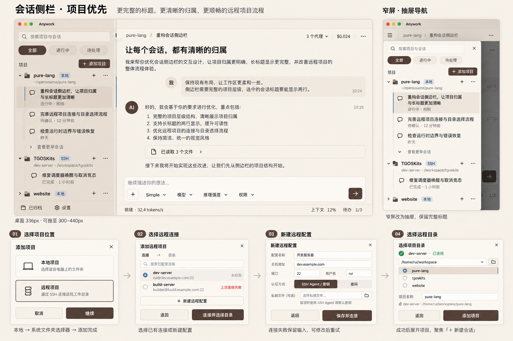

# 19 - anywork UI

桌面产品中文名为「糊来帮」，英文及其他语言回退名为 `anywork`。窗口、系统入口和应用界面按
各自语言环境显示对应名称。图标以用户提供的猫咪图片为原图，保留完整蓝色圆角主体、移除
外围留白并将圆角外设为透明。Flutter 工程和 Dart 包统一名为 `anywork`，Rust crate 继续使用
`pl-*`。Linux bundle 携带桌面入口与图标，窗口图标内嵌于 runner；用户可显式运行 bundle 中的
桌面登记脚本把当前 bundle 登记到 XDG 用户应用目录，构建和运行不自动修改宿主桌面。

## 19.1 边界

anywork 是 Flutter 桌面应用，使用 Material 3、Riverpod、go_router 与 typed FRB。UI 只能通过
bridge 访问 Studio 运行时，不读取 SQLite、Agent TOML 或 Skill 文件。Flutter Web 只用于 demo
integration 验收，不能伪造原生 provider、文件系统或进程能力。

data 层负责 FRB DTO 到 domain 的一次转换；reducer 接收小型 canonical state snapshot、历史 page
和增量 notification；
Widget 只负责展示与发命令。窗口关闭必须等待 typed shutdown 完成并回收 Flutter、DTD、
MCP/LSP 和 child process tree。
shutdown 成功后 bridge 可先于进度流订阅解除初始化；订阅取消仅在 bridge 仍可用时调用
native cancel，随后始终释放 Dart 侧订阅与句柄，不得在 `RustLib.dispose()` 后调用 FRB API。
Timeline Markdown 使用 `gpt_markdown` 的现代解析管线与内置 autolink，不传递旧版
`components` / `inlineComponents`；自定义引用块、图片与链接通过 builder 扩展。外链点击仍经过
HTTP(S) URL 校验，远程图片仅允许 HTTPS 且由用户主动加载；图片 alt 从结构化 Markdown 节点读取。

状态栏上下文悬浮窗展示 runtime 的已用 token 与模型总容量，容量来自模型调用时冻结的
binding，不在前端按 provider 硬编码或查询当前目录回填历史。容量未知（包括映射中的非正值）
时，总容量及百分比以 `—` 占位，可访问性值同样不报告虚假的 `0%`，圆环只显示底圈；已知
正容量且已用 token 为零时正常显示 `0%`；累计总 token 与上下文容量仍为不同统计。

## 19.2 动态模式与 workflow 状态

新 Thread 默认选择 `mode.simple`。composer 的模式 selector 读取 Mode 目录快照，使用稳定
`modeId` 作为值、`displayName` 作为文案，不写死 Simple/Task 枚举。模式切换命令只在 root
idle、无 pending interaction 时可用；旧活动 run 由 runtime 归档，拒绝结果由 canonical
snapshot 恢复 UI。Thread Mode 不出现在普通 Skills 设置和按需调用列表；两个内置模式不可
删除或覆盖（Mode 体系见 [11](./11-thread-mode.md)）。

起始页的模型与思考强度 selector 读取当前草稿 Mode 的 `modeModelRoutes` 默认值；切换 Mode
立即展示该 Mode 最后保存的选择。已有 root Thread 的 selector 只读取 Thread runtime 中的
`modelRoute`，修改时同时更新该 Thread 与其当前 Mode 默认值，不改变其他 Thread。child Thread
继续只读展示创建时冻结的 Profile route。路由 unavailable 时保留原 selector 并显示错误，
不得在 Flutter 侧选择另一个 provider 或 model。模型旁的警告表示当前路由不可用，独立于
模型切换是否受限；点击警告应展示运行时提供的不可用原因，没有具体原因时展示通用说明。
root Thread 非空闲或存在活动 workflow 时不打开模型或思考强度选择菜单，也不提交切换命令；
点击选择器显示当前状态对应的可关闭原因提示，运行中的会话停止当前执行或等待完成、活动工作流
等待结束后恢复选择。提示不阻止编辑草稿，
切换资格与路由可用性均来自当前 Thread 快照，不在 Flutter 侧推断新的路由或放宽准入。

起始页 composer 另外提供会话工作区选择：`local`（默认，使用 Project 目录）或 `worktree`
（从 Project 的 Git 仓库 `HEAD` 新建独立工作树）。该选择属于所在项目的输入草稿，按项目隔离
保存，并随首个 prompt 提交给创建命令。本地与 SSH 项目都提供 `worktree`：非 Git 项目、
无 `HEAD` 或远端当前不可用由提交时的类型化错误就地反馈，草稿与错误状态不清除。
已建会话的工作区模式只读来自 canonical 目录事实，GUI 不推导、不本地改写，也不把选择当作
第二份持久状态。

Thread runtime state snapshot 只向 GUI 暴露状态栏需要的通用 workflow 投影：mode、run、revision、lifecycle
与当前阶段。未开始的图模式显示"未开始"；Simple 只显示 Mode。GUI 不提供完整 graph、
history、展开详情或人工 transition，也不根据阶段 ID 推演动作；状态变更只来自 bridge
snapshot，不执行本地乐观 transition。

## 19.3 通用 Interaction 与计划确认

composer dock 只响应 `UserInput` 与 `ToolApproval`。任务计划由 `plan_submit` 通过固定 Plan
状态机发起，协议上仍是通用 UserInput；GUI 从其中稳定 ID 为 `plan_confirmation` 的唯一问题
派生 Plan 展示，不增加 Interaction kind、持久化状态或第二套 continuation。普通澄清仍由
`request_user_input` 发起并使用既有分步问题 dock。完整派生 UI 合同（摘要卡、右侧详情、
替换式反馈栏、宽窄窗口布局）见 [13](./13-plan.md)。

## 19.4 Agents 设置

Agents 页是唯一 Agent 配置中心。顶部独立展示“主智能体 / Main agent”的用途和模型、
思考强度配置，不提供启用开关；下方分别展示系统子代理与用户子代理。系统项名称、用途、指令和固定
workspace mode 只读，无删除入口；系统子代理可配置 enabled、provider/model 与模型声明驱动的 effort。
用户项按单 TOML 文件原子创建、保存或删除，并可选择三种 workspace mode。无效文件以独立
诊断展示，不阻断页面其余项。preserved worktree 显示 revision、branch、base/head、
dirty/changed-files preview 与显式 cleanup。运行中 Agent 目录与 Profile 设置目录明确分区；
所有 mutation 使用 settings revision CAS 并以 canonical snapshot 原子刷新（见
[12](./12-collaboration.md)）。

Agents 导航、配置页、preserved worktree recovery 和用户 Profile 详情中的固定界面文案必须
跟随 Studio locale，并由统一 l10n catalog 提供。Profile ID、provider/model、effort、
workspace mode 的持久化值，以及分支、路径、commit、worktree 状态和诊断数据保持 canonical
原值；本地化只影响展示标签、说明、操作和校验反馈，不得改写配置或运行时数据。

中文界面的产品语义统一使用“智能体”，`subagent` 显示为“子智能体”，不得混用“代理”、
`Agent` 或 `Subagent`；`ssh-agent` 等同名系统技术概念不适用该译法。固定界面文案采用正式、
简明的现代汉语，普通概念不夹用英文；MCP、LSP、SSH、HTTP、URL、API、Git、OpenAI、
DeepSeek、TOML 等标准缩写、产品名和协议名可以保留。界面展示 canonical 枚举或状态时，
只在展示层映射为本地化标签，底层值保持不变。

## 19.5 联网搜索设置

General 页把 OpenAI Web Search 与 DeepSeek 原生联网搜索显示为两张独立卡片。OpenAI 卡片
保留 mode、context size、域名和位置等配置，并明确文案只表示 OpenAI 搜索；DeepSeek 卡片
只提供启用开关，不展示官方未承诺的 cached/indexed、域名、位置或上下文选项。两张卡片都
消费 bridge 返回的 configured、effective、availability、selected provider/model；当前
DeepSeek route 可用时其原生搜索优先，OpenAI 卡片仍可显示"可用但未选中"。保存必须携带
Settings CAS revision，并以返回的完整 canonical snapshot 原子更新 UI；不得本地推演 backend
仲裁、凭据或模型能力（仲裁合同见 [20](./20-config.md)）。

## 19.6 Thread title 展示

子智能体创建时以调用者提供的 `taskSummary` 作为初始标题。标题区智能体切换列表直接
显示概要（单行渲染，悬浮时显示完整文本 Tooltip），角色与运行状态独立显示，行宽不足时只
做行内省略；详情列表同样不把任务
概要藏在折叠区域。前端沿用 canonical Thread title，不从消息正文生成标题，也不使用进度
摘要替换标题。子会话 Timeline 展示主智能体初始任务、补充消息与子智能体阶段性回复；
切换与重开会话后保持相同正文和来源标签。

新会话首条 prompt 提交后，侧栏和会话页眉立即显示 prompt 摘要；Explorer model 生成的最终
title 通过 `ThreadDirectoryChanged` 更新，两处始终从同一个 StudioState projection 渲染。UI
不显示独立的"正在命名"状态，也不在本地维护第二份 title（生成与提交流程见
[18](./18-studio-state.md)）。

Thread tile 在悬停或键盘聚焦时提供 rename action，保存对话框提交 typed rename command；
空标题和超过 80 个字符的输入在 UI 与 runtime 两侧都拒绝。展开侧栏和窄屏抽屉中的项目与
Thread 标题在悬停或键盘聚焦时显示 canonical name/title 的完整文本；截断只影响行内渲染，
不改变提示内容。项目路径仍只作为展开布局的辅助信息；项目或 Thread 存在 recovery issue
时，诊断详情优先于名称提示。

侧栏会话行只读消费 Thread 的工作区模式：`worktree` 会话在标题旁显示工作树图标并提供跟随
Studio locale 的说明文案，`local` 会话不显示该图标。图标只表达会话工作区种类，不承载第二份
状态；会话工作区地址只用于会话级打开目标（见 [18](./18-studio-state.md) §18.9），分支、路径
等物理细节仍在 recovery preview 与 Agents 预览中呈现。

## 19.7 视觉主题与布局

启动初始化及主界面快照尚未就绪时，居中展示基于原启动图绘制的暹罗猫双爪交替敲键盘
循环动画、当前语言的应用名称和加载指示。键盘保持固定，插画去除底色并使用透明背景；系统要求
减少动画时显示同一插画的静态帧。等待页沿用应用主题；就绪后直接进入主界面，
不增加最短展示时间。

启动页按真实初始化阶段显示说明；主界面出现后，恢复检查继续在后台运行，Agents 设置页
显示局部进度，会话页仅在检查失败时显示原因与重试入口。尚未完成的检查不显示“没有问题”。
首个可用画面展示已选中会话后自动打开该会话并加载首个历史窗口；会话首次加载使用骨架占位
与文字，已有正文的刷新保留正文并显示轻量进度；失败显示原因与重试入口。正常持久化排队
与写入不显示诊断横条；只有保存降级、恢复中、阻塞或存储压力暂停新推理时才显示诊断。
所有状态由 canonical snapshot 或实际初始化操作推进，不用延时或虚假百分比推测进度。
诊断横条里的“重试保存”与“继续”是两个动作：重试只把积压事实写下去，绝不自动恢复模型/工具
调用；硬故障重试成功仍保持暂停，只有后端把 `ThreadStorageState.canResume` 报为真时“继续”入口
才可用，点击后后端仍按故障代数与目标 durable 水位重查，代数过期或水位未达即拒绝。短暂压力
（队列/字节预算）在安全间隙自动等待并自动恢复，不显示“继续”，也不改写检查以外的事实。

主页、会话、详情与全部设置固定采用同一暹罗浅色主题：奶油底色、海豹棕主操作、少量眼眸蓝
点缀。不提供深色主题或跟随系统选项，操作系统切换外观不会改变 Studio。侧栏布局与响应式
行为遵循项目优先设计。

效果图仅指导颜色与层次，不要求复制示例文字、改变功能或让待办常驻。侧栏选中项采用拿铁
背景和细蓝标记；新会话、发送、确认、保存为海豹棕。眼眸蓝只用于辅助选中标记和小型活动
指示，不用于按钮、大块容器、正文或链接。成功、警告、错误继续同时使用图标、文字与对应
语义色。

| 主题角色 | 色值 |
| --- | --- |
| surface / surfaceContainerLowest | `#F3EDE3` / `#F6F0E7` |
| surfaceContainerLow / surfaceContainer | `#EFE6DA` / `#E7DED2` |
| surfaceContainerHigh / surfaceContainerHighest | `#E1D4C5` / `#D9CAB9` |
| primary / onPrimary | `#514039` / `#F6F0E7` |
| onSurface / onSurfaceVariant | `#40362F` / `#66584E` |
| outlineVariant / outline | `#D8CDBF` / `#8A7A6C` |
| 眼眸蓝装饰 / 活动指示 | `#6F94A8` / `#55798C` |
| 成功 / 成功容器 | `#42604C` / `#E5EBE2` |
| 警告 / 警告容器 | `#795625` / `#F0E3CD` |
| 错误 / 错误容器 | `#914447` / `#F3E0DD` |

颜色由 Flutter ColorScheme、组件主题与单一语义 ThemeExtension 拥有。页面只消费主题角色；
公共徽标按 neutral、brand、active、success、warning、error 语义展示。Markdown、代码、链接、
弹层与状态控件也必须继承主题，不保留独立静态色板或明暗分支。内容图片和品牌资源保留
原色。正常文字对比度至少 4.5:1，必要图形和焦点边界至少 3:1；装饰性眼眸蓝不能作为唯一
状态提示。采用适中密度、细分隔和统一字级；模式、模型、推理强度、权限与代理切换使用
无常驻边框的文字菜单，悬停与键盘聚焦提供反馈；发送、确认和保存承担主要操作强调。

主界面侧栏采用项目优先结构，项目下嵌套会话；不重复展示应用名称或 logo。总栏提供"添加
项目"，每个项目行常驻新建会话按钮；顶部提供跨历史目录搜索及状态过滤，底部保留归档与
设置。归档是破坏性动作，确认对话框是唯一入口：取消不产生效果，确认后运行中的会话先结束活动
工作再归档；仅活动工作无法收束时提示仍在运行，其他失败展示脱敏原因和诊断编号。归档同时
清理该会话树在 worktree 模式下的工作树，确认文案必须说明工作树及其未
提交、未整合内容会被删除。会话标题最多两行，完整标题可通过悬浮或键盘聚焦查看。侧栏默认
336px，桌面可调宽
300–440px；不足 960px 时采用保留完整文字树的覆盖抽屉。添加项目使用分步向导选择本地或
SSH，SSH 支持选择已有连接、新建配置及选择远程目录；返回保留输入，失败原地重试，成功
采用 canonical 项目后关闭。

完整交互、响应式和异常状态约定见[项目侧栏设计](concepts/project-sidebar.md)。

首页保留打开项目、历史会话与完整输入能力。对话区聚焦正文，工具过程、推理与计划详情按需
展开；普通待办不主动打开抽屉打断阅读。计划确认仍显式展示反馈与确认操作。代理状态栏与
输入区同属当前选中 Thread 的对话列，不跨侧栏或详情面板；会话总费用保留在页眉。模型、
模式和推理选择移入输入区域，运行期状态、能力与 LSP 详情保留在代理状态栏及其更多菜单
中。宽窗口的详情与对话并排，空间不足时使用覆盖面板，输入与状态区域不被并排详情挤出
可操作范围；窄窗口可折叠或换行辅助控件，不能删除入口。长对话滚动恢复、历史分页、文本
选择、流式阅读与每 Thread 草稿继续遵守已有生命周期；设置保存继续以 canonical snapshot
为准。

SSH 服务器行常驻"重新连接"入口，无需先测试连接；说明重连会加载最新远程环境并中断正在
运行的远程命令，不增加确认弹窗。操作状态按服务器隔离，重连按钮显示自己的进度，同一
服务器的测试、重连、打开、编辑和删除在操作期间禁用，处理函数同步拒绝重复进入；不同
服务器可独立操作。连接结果以 bridge 返回的 canonical snapshot 为准；失败清除旧成功展示、
保留错误并允许重试。

## 19.8 设置页组织与 Dart 展示边界

所有设置页采用固定页头、局部可滚动正文、稳定操作区；资源页以名称、状态、主要操作和
可展开详情形成一致层级。模型服务用量保留独立查询，不能用模型统计替代。Agents 分开系统
与用户 Profile；指令采用分区编辑；技能提供过滤与逐项启停；MCP/LSP 聚焦服务状态与恢复
操作；SSH 分开连接管理、认证表单和目录浏览；统计区分模型汇总与历史；安全页逐项解释
权限；通用页分开界面偏好、联网搜索和更新。窄窗口采用纵向布局，字段和操作不得溢出或
消失。

Provider 设置采用"列表 + 编辑页"结构：列表页只提供"添加供应商"入口和 provider 卡片
（provider key、preset、状态、当前路由模型、模型数量、额度状态等摘要），点击进入编辑
页；base URL 只在编辑页展示。编辑页使用本地草稿，提供保存和取消；保存成功后即时写入
配置并返回列表，取消不修改当前配置。删除和默认 provider 选择即时写入。创建草稿与切换
preset 共用同一草稿工厂，以 catalog preset 一次性替换完整的不可变 provider 草稿，preset
身份变化时重建整组表单状态；不在事件处理器中逐字段拼接供应商默认值。展示 provider
effective models（bundled 与附加模型顺序由服务端统一解析）；允许追加用户自定义模型，
冲突 slug 直接拒绝，Flutter 不自行实现合并规则。模型列表展示上下文窗口、最大输出
token、自动压缩阈值、temperature、effort 候选值、capabilities、输入模态和截断策略等
关键参数。provider 编辑页不提供 provider 级协议或连接方式控件：每个模型行展示协议、
支持模式和当前模式，只有支持多个模式的模型提供 HTTP/WS 选择并保存为该模型的
connection override；自定义模型编辑器必须显式选择协议、支持模式与默认模式，Chat + WS
在保存前拒绝。协议/模式/默认值必须来自 model descriptor，不得按 preset ID 分支。更新
API key 时空输入表示保留现有 secret；provider key 重命名必须携带 originalId，以便服务端
保留 secret、headers、catalog metadata 和模型能力。设置页不展示 raw TOML 编辑器。

Agents 标签页只展示四个系统子代理 Profile 与用户 Profile，不展示主智能体配置区域。系统
Profile 卡片将模型与"思考强度"作为两个独立下拉控件展示；模型选项使用
`Provider / Model · Protocol · Connection`，思考强度候选值来自当前模型
声明。模型改变时，有候选的模型切换为其声明的默认 effort，没有显式默认时使用首个候选；
无候选模型保存空选择并禁用强度控件。仅改变思考强度时保持当前 provider 和 model 不变。
模型、思考强度与启用状态变更都携带 settings revision 即时保存，但 Flutter 不进行持久
optimistic 更新，也不保存第二份 selection；成功后以 bridge 返回的完整 typed canonical
settings snapshot 原子更新 store，失败时保持原 canonical 状态。

token 速度统计按 provider 实例 ID、实际发送 model、请求期思考强度组成的三元组分条展示；
汇总表、紧凑卡片、历史记录与历史筛选使用同一完整组合，并展示 provider、model 和思考
强度，显示名称不参与身份判定。同 provider/model 的不同强度不得混算或在筛选中串组。
强度值沿用模型声明的原始标识；空值统一显示"未指定/未记录"，与显式 `none` 独立。筛选
标识必须无歧义地区分三项及空值，旧数据不可根据当前设置补写强度。历史模型单元格以发送
模型为主，配置模型不同时显示次级上下文；tooltip 与 Semantics 说明配置、发送、返回值及状态。
发送值与返回值均存在且不同时显示 warning 的“不一致”，未返回和旧数据分别显示中性“未报告”
与“未采集”，不只靠颜色表达。模型下拉筛选旁的“仅看不一致”复选框按 AND 组合，只包含
`mismatched`；无结果显示专用空态。宽布局不增加列，紧凑布局复用资源行、指标与语义徽标。
供应商用量与模型
性能统计是不同信息，不能互相替代：列表保留用量摘要与刷新，详情保留全部分组读数和
原有状态；没有实时查询结果时显示 canonical 不可用/错误状态，不将配置完整伪装成在线。
设置页打开时只展示 last-known state；只有手动"检查额度"命令访问网络，不做后台定时轮询。

聊天界面使用双栏布局：左侧项目/大会话栏和主聊天区，不展示右侧工具历史面板。主聊天区
底部状态栏左侧展示当前 agent 身份、`Auto / Plan` 模式、当前模型和推理强度，右侧展示
上下文使用量、按货币分组的费用估算与 Skill/MCP/LSP 数量；权限模式保留在 Composer。
Skill/MCP/LSP 默认只显示数量，悬浮、点击或键盘聚焦时展示当前 agent 的完整列表。状态栏
不得显示 agent 数量或子代理列表；大会话下的 agent 数量、状态和切换只通过标题区唯一的
`n agents` 菜单表达。状态栏响应式按聊天 footer 自身宽度折叠低频读数，并保证详情弹层
不被状态栏滚动容器或窗口边界裁剪。聊天界面的 agent 目录属于 root Thread 的轻量产品
状态，信息来自 Thread directory 的 product stream；`n agents` 菜单只展示 owner、父子
关系、任务概要、角色和状态，不携带 timeline、Todo、interaction 或 context；菜单项按运行
状态分组排序（执行中、失败、空闲、关闭中或已关闭），同组内保持 owner 与父子顺序及层级
缩进；菜单高度有界，超出部分滚动查看并显示滚动条；选择条目后再订阅对应 Thread，底部
状态栏不维护第二套 agent 活动面板。

桌面窗口必须支持自由缩放：anywork 只声明首选窗口尺寸，不把 UI 绑定到固定宽高；设置页
内容跟随窗口尺寸自适应。Provider 标签页在常规桌面宽度使用单栏 provider 卡片列表，卡片
内部承载摘要、操作和展开编辑内容；窄窗口下保持单栏滚动并压缩卡片元信息，避免表格和
编辑区域被裁剪。聊天状态栏在窄窗口下保留左侧高频控制，并把右侧只读状态按断点收入
更多菜单。

上下文详情中的缓存命中率始终保留，并消费后端独立的累计缓存统计；有效样本中的
缓存读取总量除以输入总量，输入已含缓存，不重复相加。命中、未命中与百分比使用
同一有效样本集合；即使历史调用缺失用量，后续有效样本仍持续更新累计值。统计不完整
时明确标注“基于已报告数据”，不受总用量完整性或输出计数缺失阻断。无有效正分母时
命中率显示 `-`，真实零命中显示 `0%`；未知不是零，不从输入估算补算。
打开中的浮窗随 canonical snapshot 更新，不需要关闭重开才能看到最新累计值。

Dart 设置页按领域单独组织，不以聚合页拼凑无关业务。页面只编排状态与命令，资源行、
页头/分区、表单布局、详情展开和错误反馈由职责明确的共享组件提供；SSH 连接表单、远程
目录浏览、Agent Profile 编辑和 worktree 恢复各有独立模块。共享组件不持有业务状态，
不猜测 canonical 保存结果，也不把真实业务操作藏进通用字符串分发器。界面结果由
[原生人工验收](./24-testing.md)核对：输入/选择/命令后实际展示的内容、后端确认结果、
错误恢复与资源生命周期；不以私有 widget 类型、装饰参数、内部数组或中间调用顺序
充当用户可见结果。

## 19.9 Timeline 工具过程与完整结果

工具组默认使用紧凑摘要；展开后逐项展示工具与目标，参数和完整输出按需再展开。长输出
在有界区域内滚动并支持选择，不以省略号替代唯一的结果入口。成功的普通工具仍保留完整
结果；workflow 成功 mutation 的内部 snapshot 继续隐藏。工具目标只从已有参数提取展示，
不改变协议。

工具读取图片成功后，Timeline 默认只显示可点击的「已读取图片」及文件名或调用路径，不
预加载图片字节。点击文字在该条目内展开归档图片，再次点击收起；多图独立展开。展开后
可继续放大查看，加载失败提供显式重试，折叠与重开复用当前 Thread 的附件缓存。读取中
和失败使用各自状态文案，不因工具名为 `view_image` 就宣称已读取成功；普通工具详情与
用户上传附件的展示不受此约定影响。图片入口消费 canonical 工具输出中的 typed
attachment，不由 Flutter 解析 opaque 工具载荷；实时、历史分页和会话恢复使用同一份媒体
投影，字节通过 Thread 附件读取接口加载；本地与 SSH 项目共用此路径，不把远端路径交给
本地文件系统或浏览器读取。展开图片后保持该条目与小图在可视区域内，避免时间线自动贴底
把新展开的小图推出屏幕；收起与再次展开继续复用缓存（投影与访问校验见
[18](./18-studio-state.md)）。

Turn 的失败、取消与预算限制从历史中持久化的 typed Turn item 派生，在该轮内容末尾显示
终态提示；不能因活动 Turn 清空而丢失。活动 Turn 与最近 Turn 分别表达：活动 Turn 清空
后仍保留 canonical 最近终态及原因；订阅建立或重订阅时，后端会把 owner 保留的最新终态 Turn 以
同一 `turnCompleted` 事实补发（见 [07](./07-streaming.md) §7.2），界面因此不依赖“当时在场”，
也不缓存自己见过的 `running` 状态；owner 首次安装/进程回收后冷恢复时，该保留值由后端按持久化
终态索引读出最近一条 durable Turn 记录播种（不读消息正文），retired 子会话没有 owner 时订阅同样
补发这条 `turnCompleted`，因此重开或慢恢复都能看到最近终态；同一 Turn 的旧 revision 不得覆盖终态，新 Turn 不受
旧 Turn 迟到事件覆盖；不同 Turn 同秒更新时按 canonical revision 判定较新的 Turn。GUI 和
Driver 使用同一 typed Turn 数据源，不缓存最后看到的
running 状态来推测最近 Turn。运行中 Turn 的阶段来自 canonical `turnUpdated` 帧：任务启动/结束
与模型 attempt 提交都会补发阶段帧，活动行因此不依赖 Timeline 窗口是否已加载当前行的
工具细节。当前活动行本身取自 typed `ThreadActivity`（同一 Thread 唯一 observer 的纯内存投影，
含阶段、稳定 activity 身份与并行工具数量/最近开始摘要，见 [18](./18-studio-state.md) §18.8.1），
可选的完整工具/正文详情按活动身份按需读取而不是每帧物化。计划摘要与活动块按内容高度参与滚动布局，短内容贴底的
空白不压缩真实内容；不用固定高度或裁剪隐藏溢出。最终文本只解析一次，保留真实换行与
代码中的字面反斜杠。

## 19.10 连续历史阅读

历史正文仍走 `history.sqlite` 的 keyset 分页（`latest`/`around`/`before`/`after`，大 Turn
可跨页；窗口上限与页缓存见 [17](./17-studio-storage.md) §17.4），终态提示只属于包含该 Turn
末条的覆盖范围。完整 Turn 历史消费者保留原查询接口。

Timeline 的唯一 body owner 是 ChatView：runtime 内部按 Thread 同时持有 history（`history.sqlite`
的 keyset 页）与 pending（尚未落盘的运行中条目），并由**同一个 view** 交付一个 typed 窗口；Dart
只消费该窗口的 typed 条目与差量，不自行读 SQL、不合并实时 overlay，也不维护第二份
`cachedItems` 正文缓存或独立实时尾部队列。职责按「内容窗口」与「状态流」分开：正文只由内容窗口
（窗口版本 + `UpdateItem` 差量）交付，状态流的 `epoch`/`base_revision` 只判状态事实的新旧与
连续性，不携带正文。订阅快照只更新 canonical 运行状态与活动预览，不把实时数据写成另一个历史
尾部队列。

打开正在运行的 Thread 时窗口直接包含尚未保存的 pending 条目（可见即可读），不等待 writer
保存水位、checkpoint 或数据库确认；保存只推进 `saved`/durable 水位，不改变身份、顺序、内容
revision 与执行终态。重同步重新建立订阅并消费首帧（`epoch` 递增）以作废旧代次的窗口请求；
显式跳到最新时由同一个 view 交付该 Thread 的权威窗口（`Reset`），不在 Dart 侧读 SQL `Latest`
首窗再拼 overlay。阅读历史时实时事件只更新内容与新内容提示，不抢占当前阅读锚点或跟随底部状态。

历史页只走 `history.sqlite` 的 keyset 分页（latest/around/before/after），不经过 Thread owner、
不读取驻留内存历史。增量事件按版本化封套（`epoch`/`base_revision`/`revision`）判连续；正文本身
不由状态流交付，而是由**唯一内容窗口**交付：同一 item 的全部字段变化合批为一次 `UpdateItem`
（`expected_revision` 一次基线校验、`revision` 一次内容版本提交，`omitted_bytes` 与保存水位
`saved` 随批提交），字段按稳定 `ChatField` 身份输出 `Append`/`Replace`/`Remove`/`Unchanged`，
正文按具体文本字段应用而不是向 JSON 字符串追加字节；缺口或 `lagged` 时重新订阅并从数据库窗口重建
（见 [07](./07-streaming.md) §7.4、[17](./17-studio-storage.md) §17.4）。

ChatView 是 pending/live/history 的唯一 body owner：未落盘的流式条目与已落盘历史条目在同一个
canonical 条目集合里按 ordinal 排序，宿主只消费窗口差量，不维护第二份 `cachedItems` 正文缓存、
也不维护终态正文覆盖层。窗口条目按有界预览交付（`omitted_bytes` 记录省略字节），需要完整正文时用
**同一个 view** 的按身份读取（`expand`/`readComplete`）请求，成功后交出的仍是该窗口的权威快照，
宿主直接把它当成一次 `Reset` 应用；客户端不再有 `kTimelineItemBodyBudget` 之类的截断策略，也不
在窗口过期时拼接旧载荷。同一个 view 复用同一个 `Session`，因此回源不会另开实例、也不会读到别的
Thread 的条目；请求已发出但正文尚未可读时条目保持可见并可重试，不当作身份缺席。

四个事实互不替代：item 内容 `revision`、窗口 `version`、保存水位 `saved` 与执行终态
`ChatLifecycle`。终态只由执行事实决定，迟到预览不能把终态条目拉回流式；保存确认只翻 `saved`，
不改变身份、顺序、内容 revision、正文或执行终态，所以终态条目可以尚未保存、已保存条目仍可继续
增量。后续 HistoryReader 页或按身份读回返回同 item ID/revision 后，该终态才算 SQL 确认，非可见
正文此时即可释放，之后需要时再走同一窗口回源。

沿滚动方向距边缘 1.5 个视口时预取；不足一屏自动补齐，直到填满、到端或失败。向旧加载
淘汰远端新条目，向新加载淘汰远端旧条目；可见条目与阅读锚点优先保留。失败保留正文，
在对应边缘提供显式重试，另一方向不受影响；超过 150ms 才显示不占正文高度的加载提示。

位置由 item 身份、条目内偏移和跟随末尾状态表达。切回优先显示缓存，插入、淘汰、窗口
变化和图片展开均按同一可见锚点校正，不根据总滚动高度差猜测。GUI 只保留当前窗口的可见页
与前后少量预取页（pending 与尚未确认的终态同样由该窗口交付，Dart 不另存覆盖层）；非可见
正文按窗口淘汰释放，远离窗口的页与非选中 Thread workspace 也可释放。历史浏览只提示新内容，
流式末尾跟随按帧合并渲染，不逐 token 查询 SQL，也不反复
启动动画。Markdown 展示可按内容版本复用，不改变原始文本。超长纯文本正文（单段也可能达
数十万字符）在**有界测量窗**内按同一 style/宽度/`TextScaler`/方向/locale 量出的**真实行
起点**切成有界块：已稳定的块复用同一个 `Text` 实例、只有仍在增长的尾块重新布局；复用前对
已封存前缀**逐块逐字精确校验**，同 identity 的 Replace 改动任何位置都会重建，不做首尾采样
也不做哈希近似。断点只取行起点、各块按顺序拼接仍等于原文，因此复制的文本与可见换行按 SDK
契约（`getSelectedContent` 顺序拼接各 Selectable、不插分隔）不变，仍需实机确认。只有 `ltr`
且本次 canonical 正文无 RTL/bidi 控制字符时才启用，否则清掉已封存块、整体退回单个 `Text`；
测量窗内量不出安全断点（超长无空白 run、CJK 无空格断行、缩进续行）时只是不再新增块，保留
已封存前缀 + 单个尾块，仍以真实行起点分块而不是整体回退。收益是有条件的：逐帧追加时每帧只
重排尾块，一次性换入超大正文的那一帧仍与整段布局同阶（与优化前同级），后续帧继续按批封存。
不为指标切分普通短句，也不引入第二份正文事实源。

## 19.11 运行中发送消息

主会话运行时仍可编辑、添加附件和发送。输入区只有一个主按钮：运行中无草稿和附件时显示中性色停止按钮，
有内容时切换为高对比强调色发送按钮，空闲无内容时为浅灰禁用态；提交中显示禁用进度。
运行时发送显示“发送并继续”，输入区获得焦点时可按 Esc 停止并保留草稿；输入区不显示 Esc 停止提示，
也不说明发送会打断当前执行。停止只暂停，不产生新输入。只有提交请求在途时禁用重复提交，受理后清空本次
草稿并恢复编辑，不等待新 Turn 出现；失败保留草稿及附件。提交使用稳定 ID，网络重试不重复执行。
输入框回车提交：Enter 提交满足前置条件的当前草稿，语义与主按钮一致（运行中即“发送并继续”）；
Shift+Enter 插入换行，多行草稿不受影响。
普通 Composer 输入框聚焦且可编辑时，Ctrl+V、Cmd+V 与 Shift+Insert 优先读取系统剪贴板图片；
图片规范化为 PNG 后通过现有本地附件 admission 进入 canonical 草稿，预览继续显示在输入框上方的
附件栏并可用 X 删除。剪贴板无图片时保持按当前选区粘贴文本；读取、解码或模型能力错误写入
Composer failure，保留已有草稿和附件。该入口不扩展 FRB 附件协议，也不建立独立的图片草稿状态。
Timeline 和状态提示消费 canonical 输入与执行状态，区分已受理、正在停止当前执行和继续处理中，
保留旧输出及真实取消终态。子会话输入仍由主智能体协调，GUI 保持只读；待决审批与问答使用专用面板。
