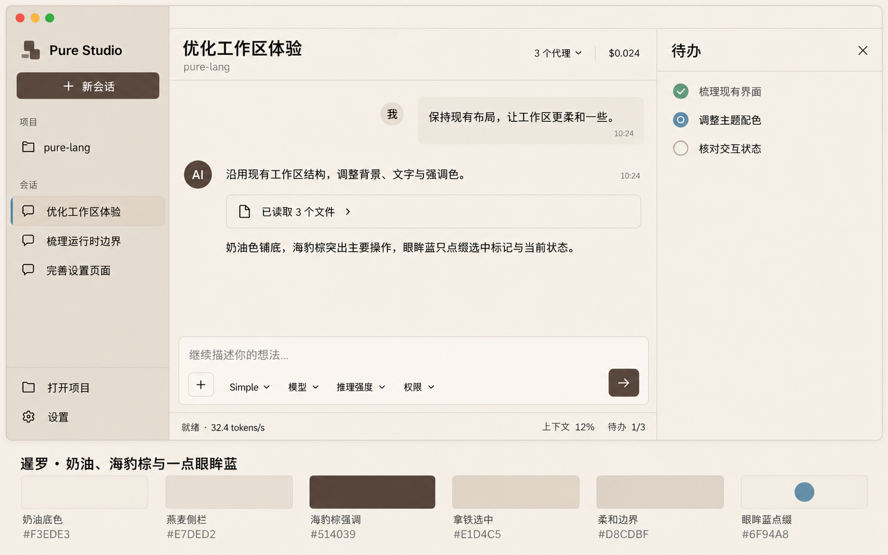
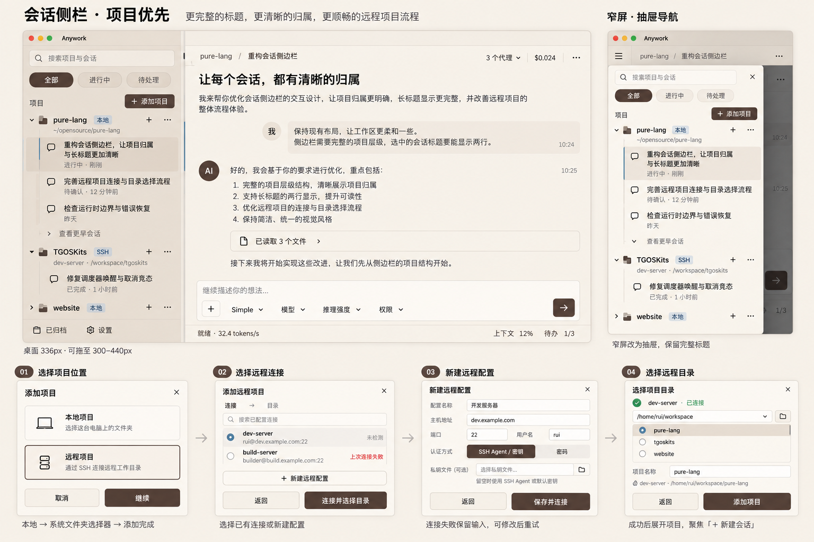

# 19 - anywork UI

桌面产品中文名为「糊来帮」，英文及其他语言回退名为 `anywork`。窗口、系统入口和应用界面按
各自语言环境显示对应名称。图标以用户提供的猫咪图片为原图，保留完整蓝色圆角主体、移除
外围留白并将圆角外设为透明。Flutter 工程和 Dart 包统一名为 `anywork`，Rust crate 继续使用
`pl-*`。Linux bundle 携带桌面入口与图标，窗口图标内嵌于 runner；用户可显式运行 bundle 中的
桌面登记脚本把当前 bundle 登记到 XDG 用户应用目录，构建和运行不自动修改宿主桌面。

## 19.1 边界

会话列表在现有分组及筛选范围内按最近用户消息时间倒序排列，使用 canonical Thread 的
`lastUserMessageAt`，缺失时使用 `createdAt`，同秒使用 ID 降序稳定破平。用户消息成功受理
（包括排队）后会话前移；模型回复、工具执行、运行状态、自动标题及配置更新不改变排序。
列表、分页合并、搜索与归档后的候选会话选择使用同一顺序，不从本地草稿或流式事件猜测时间。
旧目录缺少该字段时按创建时间排序，下一次成功发送后更新；不扫描历史补齐时间，
迁移与元信息保存边界见 [17](./17-studio-storage.md)。

桌面 bundle 同时携带预构建 Rust bridge 与独立 helper 资源；资源定位和消费属于 Rust
宿主边界，不由 Dart 加载后传输。分发、校验与 worker 生命周期遵循 [22](./22-ssh-remote.md)。

anywork 是 Flutter 桌面应用，使用 Material 3、Riverpod、go_router 与 typed FRB。UI 只能通过
bridge 访问 Studio 运行时，不读取 SQLite、Agent TOML 或 Skill 文件。Flutter Web 只用于 demo
integration 验收，不能伪造原生 provider、文件系统或进程能力。

data 层负责 FRB DTO 到 domain 的一次转换；reducer 接收小型 canonical state snapshot、历史 page
和增量 notification；
Widget 只负责展示与发命令。窗口关闭必须等待 typed shutdown 完成并回收 Flutter、DTD、
MCP/LSP 和本地 child process tree；远端 helper 在 GUI 退出或 SSH 失联后由心跳租约
自行清理，窗口不等待远端退出确认。应用退出有单一总期限 30 秒，由 native 宿主在首次 close
前独立武装，重复关闭或重试都不延长；到期强制结束本进程并以退出码 1，正常完成为退出码 0，
清理不依赖 Dart 或 bridge 是否返回，写日志也不得延误该期限。

bridge 以 `BridgeShutdownReport`、`BridgeShutdownOutcome`、`BridgePendingPersistence`、
`BridgeShutdownIssue` 镜像 runtime 的 typed 报告（形状权威源见
[18](./18-studio-state.md) §18.5.1），退出入口 `shutdown_runtime(remaining_ms, external_issues)`
的 `remaining_ms` 取 native 宿主剩余清理时间且上限 28 秒，`external_issues` 是 Dart 在进入
runtime 前已完成并观测到的 typed 外部取消结果（含关机进度订阅）；GUI 只消费报告，不自行推断
保存是否成功。报告为 `Degraded` 或超时表示未完成安全收束，界面不得据其宣称保存成功或正常退出。
bridge 侧彼此独立的 owner 组（bridge 持有的订阅与其他在途更新操作）在同一首次绝对期限内
**并发**观测，任一组 owner 的 join 阻塞都不得让另一组尚未被取消或观测；关机进度只反映这些
收束并发在途，不作为串行的调用契约。桌面收束与 runtime 阶段共用同一编排与同一期限，不维护
第二套 cleanup。
在 Dart 侧取消之前另有轻量的早期退出入口 `begin_runtime_exit(remaining_ms)`：它同步封闭 Rust
准入并广播 runtime 独立取消，但不触发初始化、不做真正 stop/join、不发布 `Stopped`；native
首次 close 先调用它，同一 runtime 的 join 与 finalize 仍由 `shutdown_runtime` 的同一编排完成。
诊断收尾独立于 runtime 初始化状态，`finish_shutdown_diagnostics` 在安全 dispose 之前或退出
之前调用，使 runtime 从未安装或安装失败时也能回收诊断资源。

启动期第二实例无法取得实例锁时，界面提示「已有实例在运行」；启动失败的错误码集合
（`instanceBusy`、`cancellationTooLate`、`overloaded` 等）在 Dart 侧以穷尽 switch 映射为稳定的
本地化文案与诊断编号，不得因未知变体抛出解析异常而覆盖原始 typed 错误。shutdown 失败不再
取消本次关窗去等待用户确认：失败阶段聚合成带 `code` 与 `correlation_id` 的脱敏诊断后继续关闭，
不阻塞在用户确认上，也不提供无限重试；剩余期限只用于完成安全收束与退出，不延长总期限。

关窗前 Dart 先进入早期退出入口 `begin_runtime_exit(remaining_ms)` 封闭 Rust 准入：它与退出闩
的封闭原子地观察已发布 runtime（关闭胜出后不再安装、安装先胜出必被收束）、固定同一首个绝对
期限，并在既定 runtime 上同步封闭 domain 准入、向包含活动 Turn/模型/工具的彼此独立在途 owner
广播一次取消；同时预先广播 bridge 侧内容订阅与更新操作取消，其真实错误进入同一 collector。这
一步只发信号：不触发初始化、不做真正 stop/join、不 close Thread、不发布 `Stopped`。随后 Dart
再有界完成并观测自身拥有、bridge 无法代持的外部取消（产品/Thread 流、更新操作与关机进度流），
把任何未确认的 typed `BridgeShutdownIssue` 随同 `remaining_ms` 一起传给 `shutdown_runtime`；
bridge 再并入自身订阅/更新取消结果，两者与 runtime 阶段共用同一编排、同一成功前置条件，绝不
先让 runtime `Clean` 释锁后再补写降级，也不存在第二套 cleanup。同一 runtime 的资源 join 与
finalize 仍由 `shutdown_runtime` 的同一编排完成，早期 arm 绝不被当作最终终态。bridge 与 runtime
在同一个首个绝对期限内完成门串行、订阅/更新取消、runtime 阶段与诊断收尾。关机进度流使用自持
token，早期广播不会提前终止它；它同样需要真实取消 ACK，因此在 runtime 收束前完成取消、并以
`Clean` 报告确认终态；进度流在没有先收到 native `Stopped` 的情况下结束是预期行为。

更新安装的空闲判定与关闭启动是同一原子步骤：runtime 先在任何取消之前完成原子空闲检查，随后
bridge 通过注入同一严格编排的 adapter hook 解除并等待自身订阅（在 runtime 提交后、收尾前），
其取消 ACK 与 runtime 阶段共享同一 `Clean` 前置条件；busy 时既不取消订阅也不改变运行状态。
订阅取消仅在 bridge 仍可用时调用 native cancel，随后始终释放 Dart 侧订阅与句柄，不得在
`RustLib.dispose()` 后调用 FRB API。
Timeline Markdown 使用 `gpt_markdown` 的现代解析管线与内置 autolink，不传递旧版
`components` / `inlineComponents`；自定义引用块、图片与链接通过 builder 扩展。外链点击仍经过
HTTP(S) URL 校验，远程图片仅允许 HTTPS 且由用户主动加载；图片 alt 从结构化 Markdown 节点读取。

Markdown 阅读排版以 [VS Code Markdown Preview](https://github.com/microsoft/vscode/blob/main/extensions/markdown-language-features/media/markdown.css)
为主要参照，以 [Zed Markdown Preview](https://github.com/zed-industries/zed/blob/main/crates/markdown/src/markdown.rs)
交叉检查，采用通用文档样式而非独立卡片化设计，不要求跨渲染引擎像素级复刻。
标题采用相对正文字号的递进字级，H1/H2 带轻分隔线；正文、段落与块级内容保持编辑器常见的
阅读节奏，核对默认块间空行与额外内边距的实际合成效果，避免间距重复累加；
不为逼近编辑器间距牺牲跨标题、正文的选择复制顺序。自定义标题作为块级选择单元仍参与
外层连续选择，不通过独立文本编辑控件隔离标题，也不改变全局选择排序。列表续行与条目正文对齐，
嵌套缩进适中，条目间距小于段落间距。行内代码以等宽字体和轻底色区分，避免粗重描边和
字重打断中文阅读，不通过插入空格或换行修改原文或复制结果，长代码片段仍须随正文换行。
行内代码优先保证复制字符及顺序准确；当前不使用会切分选择片段的布局占位强加左右间距。
引用使用常规左侧线、低对比背景、弱化文字和适量内边距，不呈现圆角卡片，保留内部多段与
嵌套结构。代码块采用简洁低对比代码区域、常规内边距及小圆角，语言信息不使用强调色栏；
表格采用清晰表头与轻分隔，不采用卡片装饰。保留文本选择和长行横向滚动。
这些规则覆盖消息、推理和计划等阅读表面，允许字级与语义色随表面变化，但结构节奏一致。
窄窗口与文字缩放下不得裁切、重叠或挤出消息区；流式到完成态不改变内容语义。颜色继续
消费现有主题角色，不引入独立 Markdown 色板。

状态栏上下文悬浮窗展示 runtime 的已用 token 与模型总容量，容量来自模型调用时冻结的
binding，不在前端按 provider 硬编码或查询当前目录回填历史。容量未知（包括映射中的非正值）
时，总容量及百分比以 `—` 占位，可访问性值同样不报告虚假的 `0%`，圆环只显示底圈；已知
正容量且已用 token 为零时正常显示 `0%`；累计总 token 与上下文容量仍为不同统计。

## 19.2 动态模式与 workflow 状态

新 Thread 默认选择 `mode.simple`。composer 的模式 selector 读取 Mode 目录快照，使用稳定
`modeId` 作为值、`displayName` 作为文案，不写死 Simple/Task 枚举。模式切换命令只在 root
idle、无 pending interaction 时可用；旧活动 run 由 runtime 归档，拒绝结果由 canonical
snapshot 恢复 UI。Thread Mode 不出现在普通 Skills 设置和按需调用列表；两个内置模式不可
删除或覆盖（Mode 体系见 [11](./11-thread-mode.md)）。

起始页的模型与思考强度 selector 读取当前草稿 Mode 的 `modeModelRoutes` 默认值；切换 Mode
立即展示该 Mode 最后保存的选择。已有 root Thread 的 selector 只读取 Thread runtime 中的
`modelRoute`，修改时同时更新该 Thread 与其当前 Mode 默认值，不改变其他 Thread。child Thread
继续只读展示创建时冻结的 Profile route。路由 unavailable 时保留原 selector 并显示错误，
不得在 Flutter 侧选择另一个 provider 或 model。模型旁的警告表示当前路由不可用，独立于
模型切换是否受限；点击警告应展示运行时提供的不可用原因，没有具体原因时展示通用说明。
root Thread 非空闲或存在活动 workflow 时不打开模型或思考强度选择菜单，也不提交切换命令；
点击选择器显示当前状态对应的可关闭原因提示，运行中的会话停止当前执行或等待完成、活动工作流
等待结束后恢复选择。提示不阻止编辑草稿，
切换资格与路由可用性均来自当前 Thread 快照，不在 Flutter 侧推断新的路由或放宽准入。

起始页 composer 另外提供会话工作区选择：`local`（默认，使用 Project 目录）或 `worktree`
（从 Project 的 Git 仓库 `HEAD` 新建独立工作树）。该选择属于所在项目的输入草稿，按项目隔离
保存，并随首个 prompt 提交给创建命令。本地与 SSH 项目都提供 `worktree`：非 Git 项目、
无 `HEAD` 或远端当前不可用由提交时的类型化错误就地反馈，草稿与错误状态不清除。
已建会话的工作区模式只读来自 canonical 目录事实，GUI 不推导、不本地改写，也不把选择当作
第二份持久状态。

Thread runtime state snapshot 只向 GUI 暴露状态栏需要的通用 workflow 投影：mode、run、revision、lifecycle
与当前阶段。未开始的图模式显示"未开始"；Simple 只显示 Mode。GUI 不提供完整 graph、
history、展开详情或人工 transition，也不根据阶段 ID 推演动作；状态变更只来自 bridge
snapshot，不执行本地乐观 transition。

## 19.3 通用 Interaction 与计划确认

composer dock 只响应 `UserInput` 与 `ToolApproval`。任务计划由 `plan_submit` 通过固定 Plan
状态机发起，协议上仍是通用 UserInput；GUI 从其中稳定 ID 为 `plan_confirmation` 的唯一问题
派生 Plan 展示，不增加 Interaction kind、持久化状态或第二套 continuation。普通澄清仍由
`request_user_input` 发起并使用既有分步问题 dock。完整派生 UI 合同（摘要卡、右侧详情、
替换式反馈栏、宽窄窗口布局）见 [13](./13-plan.md)。

## 19.4 Agents 设置

Agents 页是唯一 Agent 配置中心。顶部独立展示“主智能体 / Main agent”的用途和模型、
思考强度配置，不提供启用开关；下方分别展示系统子代理与用户子代理。系统项名称、用途、指令和固定
workspace mode 只读，无删除入口；系统子代理可配置 enabled、provider/model 与模型声明驱动的 effort。
用户项按单 TOML 文件原子创建、保存或删除，并可选择三种 workspace mode。无效文件以独立
诊断展示，不阻断页面其余项。preserved worktree 显示 revision、branch、base/head、
dirty/changed-files preview 与显式 cleanup。运行中 Agent 目录与 Profile 设置目录明确分区；
所有 mutation 使用 settings revision CAS 并以 canonical snapshot 原子刷新（见
[12](./12-collaboration.md)）。

Agents 页的 provider/model 选择弹层属于当前设置页；打开、选择及 canonical snapshot 刷新只更新
当前智能体配置，不改变设置 tab、设置路由或返回聊天页。选择完成后仍展示服务端返回的 canonical
值，不以本地草稿或弹层关闭动作推导导航状态。

Agents 导航、配置页、preserved worktree recovery 和用户 Profile 详情中的固定界面文案必须
跟随 Studio locale，并由统一 l10n catalog 提供。Profile ID、provider/model、effort、
workspace mode 的持久化值，以及分支、路径、commit、worktree 状态和诊断数据保持 canonical
原值；本地化只影响展示标签、说明、操作和校验反馈，不得改写配置或运行时数据。

中文界面的产品语义统一使用“智能体”，`subagent` 显示为“子智能体”，不得混用“代理”、
`Agent` 或 `Subagent`；`ssh-agent` 等同名系统技术概念不适用该译法。固定界面文案采用正式、
简明的现代汉语，普通概念不夹用英文；MCP、LSP、SSH、HTTP、URL、API、Git、OpenAI、
DeepSeek、TOML 等标准缩写、产品名和协议名可以保留。界面展示 canonical 枚举或状态时，
只在展示层映射为本地化标签，底层值保持不变。

## 19.5 联网搜索设置

General 页把 OpenAI Web Search 与可选的 DeepSeek hosted 搜索显示为两张独立卡片。OpenAI 卡片
保留 mode、context size、域名和位置等配置，并明确文案只表示 OpenAI 搜索；DeepSeek 卡片
只提供启用开关，不展示官方未承诺的 cached/indexed、域名、位置或上下文选项。两张卡片都
消费 bridge 返回的 configured、effective、availability、selected provider/model；当前
endpoint 显式声明 DeepSeek hosted 能力时该搜索优先；官方 DeepSeek Responses route 显示
provider unsupported，并可使用 OpenAI standalone 搜索。保存必须携带
Settings CAS revision，并以返回的完整 canonical snapshot 原子更新 UI；不得本地推演 backend
仲裁、凭据或模型能力（仲裁合同见 [20](./20-config.md)）。

## 19.6 Thread title 展示

子智能体创建时以调用者提供的 `taskSummary` 作为初始标题。标题区智能体切换列表直接
显示概要（单行渲染，悬浮时显示完整文本 Tooltip），角色与运行状态独立显示，行宽不足时只
做行内省略；详情列表同样不把任务
概要藏在折叠区域。前端沿用 canonical Thread title，不从消息正文生成标题，也不使用进度
摘要替换标题。子会话 Timeline 展示主智能体初始任务、补充消息与子智能体阶段性回复；
切换与重开会话后保持相同正文和来源标签。

新会话首条 prompt 提交后，侧栏和会话页眉立即显示 prompt 摘要；Explorer model 生成的最终
title 通过 `ThreadDirectoryChanged` 更新，两处始终从同一个 StudioState projection 渲染。UI
不显示独立的"正在命名"状态，也不在本地维护第二份 title（生成与提交流程见
[18](./18-studio-state.md)）。

Thread tile 在悬停或键盘聚焦时提供详情与快捷操作，rename 保存对话框提交 typed rename command；
空标题和超过 80 个字符的输入在 UI 与 runtime 两侧都拒绝。展开侧栏和窄屏抽屉中的项目与
Thread 标题在悬停或键盘聚焦时显示 canonical name/title 的完整文本；截断只影响行内渲染，
不改变提示内容。项目路径在按需详情展示；项目或 Thread 存在 recovery issue
时，诊断详情优先于名称提示。

侧栏详情与项目、会话操作菜单复用统一锚定弹层生命周期与真实布局边界，保留键盘、
触控和窗口变化时的关闭及焦点恢复规则。行内操作取得焦点或打开菜单时，操作入口优先；
详情不得因后代焦点或持续悬停立即重开并遮挡菜单。会话打开菜单保留当前宿主真实支持的
VS Code、Zed 与 terminal 入口；目录排序继续消费 `lastUserMessageAt`，不因状态通知改变。
共享 `StudioMenu` 与 `StudioIconMenu` 提供同步 `onBeforeOpen` 通知，供调用方在菜单浮层
建立前收起互斥详情；`onOpen`、`onClose` 仍只报告实际菜单开合。侧栏详情的暂停重开状态
由实际菜单开合管理，拒绝打开的菜单不得留下暂停状态；不在子菜单已打开后关闭父锚定面。
项目详情同样以完整项目行的边界锚定，名称仍是键盘选择入口；不得将名称区的边缘当作
侧栏行边缘而遮住该行新建、更多按钮或相邻会话的状态/操作区。

侧栏会话行只读消费 Thread 的工作区模式：`worktree` 会话在右侧固定状态区显示工作树图标并提供跟随
Studio locale 的说明文案，`local` 会话不显示该图标。图标只表达会话工作区种类，不承载第二份
状态；会话级打开目标必须采用 canonical 会话工作区地址（见 [18](./18-studio-state.md) §18.9），
该地址也可在按需详情中展示与复制，不以项目路径替代。分支等更多物理细节仍在
recovery preview 与 Agents 预览中呈现。

## 19.7 视觉主题与布局

启动初始化及主界面快照尚未就绪时，居中展示基于原启动图绘制的暹罗猫双爪交替敲键盘
循环动画、当前语言的应用名称和加载指示。键盘保持固定，插画去除底色并使用透明背景；系统要求
减少动画时显示同一插画的静态帧。等待页沿用应用主题；就绪后直接进入主界面，
不增加最短展示时间。真实阶段由启动专属 stream 推送，不周期调用读取接口。

启动页按真实初始化阶段显示说明；主界面出现后，恢复检查继续在后台运行，Agents 设置页
显示局部进度，会话页仅在检查失败时显示原因与重试入口。尚未完成的检查不显示“没有问题”。
首个可用画面展示已选中会话后自动打开该会话并加载首个历史窗口；会话首次加载使用骨架占位
与文字，已有正文的刷新保留正文并显示轻量进度；失败显示原因与重试入口。正常持久化排队
与写入不显示诊断横条；只有保存降级、恢复中、阻塞或存储压力暂停新推理时才显示诊断。
所有状态由 canonical snapshot 或实际初始化操作推进，不用延时或虚假百分比推测进度。
诊断横条里的“重试保存”与“继续”是两个动作：重试只把积压事实写下去，绝不自动恢复模型/工具
调用；硬故障重试成功仍保持暂停，只有后端把 `ThreadStorageState.canResume` 报为真时“继续”入口
才可用，点击后后端仍按故障代数与目标 durable 水位重查，代数过期或水位未达即拒绝。短暂压力
（队列/字节预算）在安全间隙自动等待并自动恢复，不显示“继续”，也不改写检查以外的事实。

主页、会话、详情与全部设置固定采用同一暹罗浅色主题：奶油底色、海豹棕主操作、少量眼眸蓝
点缀。不提供深色主题或跟随系统选项，操作系统切换外观不会改变 Studio。侧栏布局与响应式
行为遵循项目优先设计。

效果图仅指导颜色与层次，不要求复制示例文字、改变功能或让待办常驻。侧栏选中项采用拿铁
背景和细蓝标记；新会话、发送、确认、保存为海豹棕。眼眸蓝只用于辅助选中标记和小型活动
指示，不用于按钮、大块容器、正文或链接。成功、警告、错误继续同时使用图标、文字与对应
语义色。

| 主题角色 | 色值 |
| --- | --- |
| surface / surfaceContainerLowest | `#F3EDE3` / `#F6F0E7` |
| surfaceContainerLow / surfaceContainer | `#EFE6DA` / `#E7DED2` |
| surfaceContainerHigh / surfaceContainerHighest | `#E1D4C5` / `#D9CAB9` |
| primary / onPrimary | `#514039` / `#F6F0E7` |
| onSurface / onSurfaceVariant | `#40362F` / `#66584E` |
| outlineVariant / outline | `#D8CDBF` / `#8A7A6C` |
| 眼眸蓝装饰 / 活动指示 | `#6F94A8` / `#55798C` |
| 成功 / 成功容器 | `#42604C` / `#E5EBE2` |
| 警告 / 警告容器 | `#795625` / `#F0E3CD` |
| 错误 / 错误容器 | `#914447` / `#F3E0DD` |

颜色由 Flutter ColorScheme、组件主题与单一语义 ThemeExtension 拥有。页面只消费主题角色；
公共徽标按 neutral、brand、active、success、warning、error 语义展示。Markdown、代码、链接、
弹层与状态控件也必须继承主题，不保留独立静态色板或明暗分支。内容图片和品牌资源保留
原色。正常文字对比度至少 4.5:1，必要图形和焦点边界至少 3:1；装饰性眼眸蓝不能作为唯一
状态提示。采用适中密度、细分隔和统一字级；模式、模型、推理强度、权限与代理切换使用
无常驻边框的文字菜单，悬停与键盘聚焦提供反馈；发送、确认和保存承担主要操作强调。

按钮菜单、设置选择字段和状态详情共用统一的锚定弹层约定。弹层以真实触发控件的布局
边界为锚点，与文字方向的起始边对齐并保留一致的小间距；通常优先在下方展开，空间
不足时向上避让，底部入口自然向上展开。定位依据实际布局，不以条目声明高度、选中项
位置或条目数量估算弹层坐标；长模型目录与智能体列表不得因此远离触发器。
侧栏项目与会话详情使用同一共享布局的侧向放置：优先在文字方向的尾侧展开，
不足时换到另一侧，并按实际可用侧空间收敛宽度、按安全区域收敛高度。详情不得覆盖
相邻侧栏行；没有满足最小可读宽度的侧空间时拒绝打开，不回退为遮挡行的下方浮层。
行本体保持唯一键盘停点，Enter/Space 仍选择会话；详情观察真实行焦点，不新增面板停点。
侧栏搜索/过滤结果中的已有会话行仍实时采用 canonical 目录元数据；成员资格变化才
触发定向重查询，不能把“无需重查成员”解释为保留旧状态或旧标题。
框架的底层锚定原语与控制器管理弹层生命周期，共享布局层根据框架提供的真实锚点、
覆盖层及实际内容尺寸决定约束和位置；不维护第二份浮窗生命周期，不修改应用级安全区。
弹层宽高受窗口安全区域及可用侧空间约束，按钮间距为 6px，窗口边缘保留至少 8px；
真实绘制表面的尺寸与定位使用的尺寸一致，长内容有界滚动并显示滚动条。
无可用侧空间或触发器未布局时拒绝打开，取消或触发器失效后不得执行旧的延迟打开请求。
窗口缩放和布局变化不得留下过期坐标或脱离触发器的浮窗；触发器离开可见区域或卸载时
关闭弹层。文本选区菜单继续锚定选区，对话框继续采用模态布局，不套用按钮菜单语义。

共享弹层只负责展示、开关与选择事件，不拥有业务选择或保存状态。菜单保留选中提示，
打开时使选中项可见，不通过移动整张菜单对齐选中项；支持键盘打开、方向键与 Tab 导航、
Enter/Space 选择、Escape 与外点关闭及焦点恢复。点击或键盘打开后的选择及键盘取消恢复
真实触发器焦点，但不得触发自动重开；外点关闭尊重新点击目标的焦点。悬停不抢输入焦点，
关闭后不得遗留抑制状态阻止下一次真实键盘入口；点击打开的详情可由 Escape 关闭。
表单选择保留字段校验、禁用状态、空值
和草稿语义；状态详情保留悬停、点击、键盘入口与打开期间的 canonical 数据刷新。
各入口继续使用稳定的交互标识，模型分组、智能体状态排序与父子层级不由共享弹层改变。

主界面侧栏采用项目优先结构，项目下嵌套会话；不重复展示应用名称或 logo。总栏提供"添加
项目"，每个项目行常驻新建会话按钮；顶部提供跨历史目录搜索及状态过滤，底部保留归档与
设置。归档是破坏性动作，确认对话框是唯一入口：取消不产生效果，确认后运行中的会话先结束活动
工作再归档；仅活动工作无法收束时提示仍在运行，其他失败展示脱敏原因和诊断编号。归档同时
清理该会话树在 worktree 模式下的工作树，确认文案必须说明工作树及其未
提交、未整合内容会被删除。会话标题紧凑单行，完整标题与详情可通过悬浮或键盘聚焦查看。侧栏默认
336px，桌面可调宽
300–440px；不足 960px 时采用保留完整文字树的覆盖抽屉。添加项目使用分步向导选择本地或
SSH，SSH 支持选择已有连接、新建配置及选择远程目录；返回保留输入，失败原地重试，成功
采用 canonical 项目后关闭。

完整交互、响应式和异常状态约定见[项目侧栏设计](concepts/project-sidebar.md)。

首页保留打开项目、历史会话与完整输入能力。对话区聚焦正文，工具过程、推理与计划详情按需
展开；普通待办不主动打开抽屉打断阅读。计划确认仍显式展示反馈与确认操作。代理状态栏与
输入区同属当前选中 Thread 的对话列，不跨侧栏或详情面板；会话总费用保留在页眉。模型、
模式和推理选择移入输入区域，运行期状态、能力与 LSP 详情保留在代理状态栏及其更多菜单
中。宽窗口的详情与对话并排，空间不足时使用覆盖面板，输入与状态区域不被并排详情挤出
可操作范围；窄窗口可折叠或换行辅助控件，不能删除入口。长对话滚动恢复、历史分页、文本
选择、流式阅读与每 Thread 草稿继续遵守已有生命周期；设置保存继续以 canonical snapshot
为准。

SSH 服务器行常驻"重新连接"入口，无需先测试连接；说明重连会加载最新远程环境并中断正在
运行的远程命令，不增加确认弹窗。操作状态按服务器隔离，重连按钮显示自己的进度，同一
服务器的测试、重连、打开、编辑和删除在操作期间禁用，处理函数同步拒绝重复进入；不同
服务器可独立操作。连接结果以 bridge 返回的 canonical snapshot 为准；失败清除旧成功展示、
保留错误并允许重试。

## 19.8 设置页组织与 Dart 展示边界

供应商编辑页对内置与自定义模型提供独立的上下文压缩阈值输入框、滑块和恢复默认操作。
输入使用精确的正整数 tokens，滑块与输入双向同步；展示模型默认、用户覆盖与实际生效值，
解释上下文安全上限。编辑跟随页面草稿保存语义，成功后以服务端 canonical snapshot 替换，
失败保留可修正草稿且不宣称已保存；模型之间的设置互不影响。

GUI 的上下文与词元数量共用十进制紧凑显示：小于 1,000 为整数，千级使用小写 `k`，
百万及以上使用小写 `m`；四舍五入最多保留两位小数并去除尾零，例如 `212.32k`、`1.2m`。
舍入到单位边界时提升单位；缺失数据保持未知而不伪装为零。该规则覆盖状态、模型参数、
统计、调用详情与压缩用量，不改变底层精确数值或配置输入，也不套用于金额、字节、百分比
和调用次数。阈值解析与安全规则以 [06](./06-model.md) 为准。

所有设置页采用固定页头、局部可滚动正文、稳定操作区；资源页以名称、状态、主要操作和
可展开详情形成一致层级。模型服务用量保留独立查询，不能用模型统计替代。Agents 分开系统
与用户 Profile；指令采用分区编辑；技能提供过滤与逐项启停；MCP/LSP 聚焦服务状态与恢复
操作；SSH 分开连接管理、认证表单和目录浏览；统计区分模型汇总与历史；安全页逐项解释
权限；通用页分开界面偏好、联网搜索和更新。窄窗口采用纵向布局，字段和操作不得溢出或
消失。

### 页面与实时订阅生命周期

产品流按 [18](./18-studio-state.md) §18.2.1 的 typed topic/作用域组合，由 data 层和
可释放 provider/lease 拥有，组件不解析 raw JSON。Shell 只常驻导航目录、配置及诊断摘要，
设置壳只持有导航/公共配置；当前可见标签页拥有其统计、Profiles、服务、技能或用量观察者。
保留隐藏标签的 UI 状态不保留其后台订阅。可见会话组合自己的状态流、内容窗口与根会话费用，
离开/切换后释放旧观察者；草稿与阅读锚点保持原生命周期。

每个 topic 的事件由 data/domain 的单一接线进入 canonical state，页面只读取 selector；
`lagged`、失败或关闭只影响对应可见区域，并在重同步期间保留最后有效内容。设置中的 MCP、
LSP、Skills、Provider usage、模型性能、持久化队列与 Profiles 是独立职责，不合并为隐藏的
“services”订阅；只有当前可见标签页或明确的 Driver/诊断观察者才持有相应 lease。会话窗口、
费用与可见性以生命周期代次拒绝旧异步收尾，保证快速切换不清除新窗口、滚动锚点或草稿。

共享同一 topic 的观察者复用一个订阅，最后一个释放时取消；重新进入先取得最新基线。
初次无数据才使用骨架/整页等待；后续刷新、重连及失败保留已有内容、滚动、选择、过滤与
编辑草稿，仅给局部进度/错误。selector 使用职责内数据、值相等及稳定条目身份，不能让
模型统计牵动整个设置壳，也不以无关通知重置表单。统计 pending 在固定页头轻量展示，
不在正文前反复插入/移除大块提示；gap/readFailed 仍明确显示。持久化详情直接消费队列
事件，不周期查询接口。启动/正常刷新均无 GUI 接口轮询；分页、搜索、显式检查/重试与
事件缺口恢复属于按需查询，UI 动画和输入防抖不属于轮询。

Provider 设置采用"列表 + 编辑页"结构：列表页只提供"添加供应商"入口和 provider 卡片
（provider key、preset、状态、当前路由模型、模型数量、额度状态等摘要），点击进入编辑
页；base URL 只在编辑页展示。编辑页使用本地草稿，提供保存和取消；保存成功后即时写入
配置并返回列表，取消不修改当前配置。删除和默认 provider 选择即时写入。创建草稿与切换
preset 共用同一草稿工厂，以 catalog preset 一次性替换完整的不可变 provider 草稿，preset
身份变化时重建整组表单状态，表单验证身份也随草稿重建，不能把旧表单移接到新预设下。
通用文本字段跟随草稿的程序化变更同步显示值；用户输入回传不重置光标或输入法组合区。
名称、基础 URL、凭据和模型参数遵循同一规则，不残留上一个预设或被删除模型的输入。
凭据存在只表示「已配置」，不显示为连接「就绪」；用量观察失败时，仅对应服务商的状态
标记失败，并在列表与详情显示该服务商的具体错误。查询失败不能覆盖其他服务商的结果，
也不能把用量接口成功等同于模型推理能力验证通过。
不在事件处理器中逐字段拼接供应商默认值。展示 provider
effective models（默认/成功缓存/在线声明与手工模型由服务端统一解析）；允许追加用户自定义模型，
冲突 slug 直接拒绝，Flutter 不自行实现合并规则。模型列表展示上下文窗口、最大输出
token、自动压缩阈值、temperature、effort 候选值、capabilities、输入模态和截断策略等
关键参数。provider 编辑页不提供 provider 级协议或连接方式控件：每个模型行展示协议、
支持模式和当前模式，只有支持多个模式的模型提供 HTTP/WS 选择并保存为该模型的
connection override；自定义模型编辑器必须显式选择协议、支持模式与默认模式，Chat + WS
在保存前拒绝。协议/模式/默认值必须来自 model descriptor，不得按 preset ID 分支。更新
API key 时空输入表示保留现有 secret；provider key 重命名必须携带 originalId，以便服务端
保留 secret、headers、catalog metadata 和模型能力。设置页不展示 raw TOML 编辑器。

支持在线探测的 provider 详情提供“刷新模型”，展示独立加载状态、当前来源（默认/成功缓存/在线）、
成功/检查时间与错误。程序启动各实例独立探测一次，失败时模型列表继续展示 last-known 或首次
默认定义，不把一家失败扩散到其他家，也不把额度检查等同模型发现。打开/读取设置不额外探测，
不新增定时轮询。具体网络、缓存与不可用语义见 [06](./06-model.md)、[20](./20-config.md)。

模型选择器和编辑页只消费当前实例完整 canonical 有效模型 descriptor；动态模型与可编辑
custom model 分开。默认 catalog 缓存只用于默认/preset 展示，不能重新合并后覆盖在线名单，不能
丢失完整模态、预算、参数或价格。未知预算保持未知，未知价格不显示金额。后台目录具有独立水位，
reducer 同时检查 desired/目录水位，迟到事件不能覆盖新设置或新目录。被服务撤下的选中项明确
显示不可用，保持用户选择，不自动跳到推荐模型。

Agents 标签页只展示四个系统子代理 Profile 与用户 Profile，不展示主智能体配置区域。系统
Profile 卡片将模型与"思考强度"作为两个独立选择控件展示。会话（含新会话草稿）、
角色配置及 Profile 编辑复用同一套会话模型选择器的紧凑触发器与弹出菜单，
不保留设置专用的表单式模型菜单。设置调用方负责字段说明与表单校验提示，
不改变选择器的外观及选择行为。模型选项按 provider 实例 ID 分组，组标题展示
服务商名称；模型行仅展示模型名称与 catalog 声明的输入能力，不重复服务商名称，
不展示协议或 HTTP/WS 连接信息。文本、视觉等能力使用带图标与本地化文字的紧凑小卡片，
不得从模型名称推断能力。分组与选择身份不依赖显示名称，同名服务商仍为独立分组。
模型选项与能力标签的 Driver 标识使用无歧义的路由元组编码，不能以未转义的分隔符
拼接 provider ID 与模型 slug；角色选项的标识同时包含角色身份。
共享组件仅负责展示和选择事件；调用方保留会话运行限制、不可用路由提示、canonical
保存及各自的 effort 规则。空列表、未解析路由、长名称与窄窗口不得导致自动改选或内容溢出，
选中态与键盘操作保持可访问。服务商配置页仍保留协议和连接方式编辑信息。
思考强度候选值来自当前模型声明。模型改变时，有候选的模型切换为其声明的默认 effort，没有显式默认时使用首个候选；
无候选模型保存空选择并禁用强度控件。仅改变思考强度时保持当前 provider 和 model 不变。
模型、思考强度与启用状态变更都携带 settings revision 即时保存，但 Flutter 不进行持久
optimistic 更新，也不保存第二份 selection；成功后以 bridge 返回的完整 typed canonical
settings snapshot 原子更新 store，失败时保持原 canonical 状态。

token 速度统计按 provider 实例 ID、实际发送 model、请求期思考强度组成的三元组分条展示；
汇总表、紧凑卡片、历史记录与历史筛选使用同一完整组合，并展示 provider、model 和思考
强度，显示名称不参与身份判定。同 provider/model 的不同强度不得混算或在筛选中串组。
强度值沿用模型声明的原始标识；空值统一显示"未指定/未记录"，与显式 `none` 独立。筛选
标识必须无歧义地区分三项及空值，旧数据不可根据当前设置补写强度。历史模型列标题为“模型”，
以请求（配置）模型为第一行，正文色略加粗；缺失时回退已记录的发送模型或历史模型，
不根据当前设置推断历史。配置与发送模型均存在且不同时，以灰色小字、缩进箭头 `↳`
展示实际发送模型；发送与响应模型均存在且不同时，以橙色显示“↳ 上游响应模型: xxx”，
有映射时再缩进一级，末尾跟小圆角“模型不匹配”徽标，使用浅橙背景、橙色文字及细边框。
长名称及徽标允许合理换行，不挤占邻列；亮暗主题均保证辨识度。正常匹配不增加状态行，
未返回和旧数据分别保留中性“未报告”与“未采集”，不只靠颜色表达。
历史行不常驻显示供应商，悬停模型区域的 tooltip 与 Semantics 包含供应商名称和实例 ID
（相同时不重复），以及请求、发送、响应值及状态。性能汇总和筛选仍保留必要的供应商信息。
模型下拉筛选旁的“仅看不一致”复选框按 AND 组合，只包含 `mismatched`；无结果显示专用空态。
宽布局不增加列，紧凑布局复用同一模型层级语义及性能指标。
供应商用量与模型
性能统计是不同信息，不能互相替代：列表保留用量摘要与刷新，详情保留全部分组读数和
原有状态；没有实时查询结果时显示 canonical 不可用/错误状态，不将配置完整伪装成在线。
设置页打开时只展示 last-known state；只有手动"检查额度"命令访问网络，不做后台定时轮询。

聊天界面使用双栏布局：左侧项目/大会话栏和主聊天区，不展示右侧工具历史面板。主聊天区
底部状态栏左侧展示当前 agent 身份、`Auto / Plan` 模式、当前模型和推理强度，右侧展示
上下文使用量、按货币分组的费用估算与 Skill/MCP/LSP 数量；权限模式保留在 Composer。
Skill/MCP/LSP 默认只显示数量，悬浮、点击或键盘聚焦时展示当前 agent 的完整列表。状态栏
不得显示 agent 数量或子代理列表；大会话下的 agent 数量、状态和切换只通过标题区唯一的
`n agents` 菜单表达。状态栏响应式按聊天 footer 自身宽度折叠低频读数，并保证详情弹层
不被状态栏滚动容器或窗口边界裁剪。聊天界面的 agent 目录属于 root Thread 的轻量产品
状态，信息来自 Thread directory 的 product stream；`n agents` 菜单只展示 owner、父子
关系、任务概要、角色和状态，不携带 timeline、Todo、interaction 或 context；菜单项按运行
状态分组排序（执行中、失败、空闲、关闭中或已关闭），同组内保持 owner 与父子顺序及层级
缩进；菜单高度有界，超出部分滚动查看并显示滚动条；选择条目后再订阅对应 Thread，底部
状态栏不维护第二套 agent 活动面板。

桌面窗口必须支持自由缩放：anywork 只声明首选窗口尺寸，不把 UI 绑定到固定宽高；设置页
内容跟随窗口尺寸自适应。Provider 标签页在常规桌面宽度使用单栏 provider 卡片列表，卡片
内部承载摘要、操作和展开编辑内容；窄窗口下保持单栏滚动并压缩卡片元信息，避免表格和
编辑区域被裁剪。聊天状态栏在窄窗口下保留左侧高频控制，并把右侧只读状态按断点收入
更多菜单。

上下文详情中的缓存命中率始终保留，并消费后端独立的累计缓存统计；有效样本中的
缓存读取总量除以输入总量，输入已含缓存，不重复相加。命中、未命中与百分比使用
同一有效样本集合；即使历史调用缺失用量，后续有效样本仍持续更新累计值。统计不完整
时明确标注“基于已报告数据”，不受总用量完整性或输出计数缺失阻断。无有效正分母时
命中率显示 `-`，真实零命中显示 `0%`；未知不是零，不从输入估算补算。
打开中的浮窗随 canonical snapshot 更新，不需要关闭重开才能看到最新累计值。

Dart 设置页按领域单独组织，不以聚合页拼凑无关业务。页面只编排状态与命令，资源行、
页头/分区、表单布局、详情展开和错误反馈由职责明确的共享组件提供；SSH 连接表单、远程
目录浏览、Agent Profile 编辑和 worktree 恢复各有独立模块。共享组件不持有业务状态，
不猜测 canonical 保存结果，也不把真实业务操作藏进通用字符串分发器。界面结果由
[原生人工验收](./24-testing.md)核对：输入/选择/命令后实际展示的内容、后端确认结果、
错误恢复与资源生命周期；不以私有 widget 类型、装饰参数、内部数组或中间调用顺序
充当用户可见结果。

## 19.9 Timeline 工具过程与完整结果

工具组默认使用紧凑摘要；展开后逐项展示工具与目标，参数和完整输出按需再展开。长输出
在有界区域内滚动并支持选择，不以省略号替代唯一的结果入口。成功的普通工具仍保留完整
结果；workflow 成功 mutation 的内部 snapshot 继续隐藏。工具目标只从已有参数提取展示，
不改变协议。

工具图片默认显示图片图标、数量摘要与紧邻文案的折叠箭头；成功的 `view_image` 使用
「已查看 N 张图像」，文件名、调用路径与尺寸作为辅助提示，不预加载图片字节。同一工具
调用的图片共用摘要与展开意图，不同调用独立展开；图片条目仍以调用身份、附件身份和同一
调用内的重复序号区分，不因资源相同而合并调用。点击摘要后在下方显示约 120×120 的圆角
缩略图，保留图片比例与完整预览，多图随可用宽度换行，再次点击收起。点击缩略图仍可
打开可缩放大图，关闭后回到原阅读位置；加载失败提供显式重试，折叠与重开复用当前 Thread
的附件缓存。加载、成功和失败占位保持稳定尺寸，减少异步读取带来的布局抖动。读取中
和失败使用各自状态文案，不因工具名为 `view_image` 就宣称已读取成功；普通工具详情与
用户上传附件的展示不受此约定影响。图片入口消费 canonical 工具输出中的 typed
attachment，不由 Flutter 解析 opaque 工具载荷；实时、历史分页和会话恢复使用同一份媒体
投影，字节通过 Thread 附件读取接口加载；本地与 SSH 项目共用此路径，不把远端路径交给
本地文件系统或浏览器读取。图片展开、收起与异步加载遵循统一条目布局协调契约（§19.10），
不拥有图片专用滚动路径；收起与再次展开继续复用缓存（投影与访问校验见
[18](./18-studio-state.md)）。

Turn 的失败、取消与预算限制从历史中持久化的 typed Turn item 派生，在该轮内容末尾显示
终态提示；不能因活动 Turn 清空而丢失。活动 Turn 与最近 Turn 分别表达：活动 Turn 清空
后仍保留 canonical 最近终态及原因；订阅建立或重订阅时，后端会把 owner 保留的最新终态 Turn 以
同一 `turnCompleted` 事实补发（见 [07](./07-streaming.md) §7.2），界面因此不依赖“当时在场”，
也不缓存自己见过的 `running` 状态；owner 首次安装/进程回收后冷恢复时，该保留值由后端按持久化
终态索引读出最近一条 durable Turn 记录播种（不读消息正文），retired 子会话没有 owner 时订阅同样
补发这条 `turnCompleted`，因此重开或慢恢复都能看到最近终态；同一 Turn 的旧 revision 不得覆盖终态，新 Turn 不受
旧 Turn 迟到事件覆盖；不同 Turn 同秒更新时按 canonical revision 判定较新的 Turn。GUI 和
Driver 使用同一 typed Turn 数据源，不缓存最后看到的
running 状态来推测最近 Turn。运行中 Turn 的阶段来自 canonical `turnUpdated` 帧：任务启动/结束
与模型 attempt 提交都会补发阶段帧，活动行因此不依赖 Timeline 窗口是否已加载当前行的
工具细节。当前活动行本身取自 typed `ThreadActivity`（同一 Thread 唯一 observer 的纯内存投影，
含阶段、稳定 activity 身份与并行工具数量/最近开始摘要，见 [18](./18-studio-state.md) §18.8.1），
可选的完整工具/正文详情按活动身份按需读取而不是每帧物化。计划摘要与活动块按内容高度参与滚动布局，短内容贴底的
空白不压缩真实内容；不用固定高度或裁剪隐藏溢出。最终文本只解析一次，保留真实换行与
代码中的字面反斜杠。

## 19.10 连续历史阅读

历史正文仍走 `history.sqlite` 的 keyset 分页（`latest`/`around`/`before`/`after`，大 Turn
可跨页；窗口上限与页缓存见 [17](./17-studio-storage.md) §17.4），终态提示只属于包含该 Turn
末条的覆盖范围。完整 Turn 历史消费者保留原查询接口。

Timeline 的唯一 body owner 是 ChatView：runtime 内部按 Thread 同时持有 history（`history.sqlite`
的 keyset 页）与 pending（尚未落盘的运行中条目），并由**同一个 view** 交付一个 typed 窗口；Dart
只消费该窗口的 typed 条目与差量，不自行读 SQL、不合并实时 overlay，也不维护第二份
`cachedItems` 正文缓存或独立实时尾部队列。职责按「内容窗口」与「状态流」分开：正文只由内容窗口
（窗口版本 + `UpdateItem` 差量）交付，状态流的 `epoch`/`base_revision` 只判状态事实的新旧与
连续性，不携带正文。订阅快照只更新 canonical 运行状态与活动预览，不把实时数据写成另一个历史
尾部队列。

打开正在运行的 Thread 时窗口直接包含尚未保存的 pending 条目（可见即可读），不等待 writer
保存水位、checkpoint 或数据库确认；保存只推进 `saved`/durable 水位，不改变身份、顺序、内容
revision 与执行终态。重同步重新建立订阅并消费首帧（`epoch` 递增）以作废旧代次的窗口请求；
显式跳到最新时由同一个 view 交付该 Thread 的权威窗口（`Reset`），不在 Dart 侧读 SQL `Latest`
首窗再拼 overlay。阅读历史时实时事件只更新内容与新内容提示，不抢占当前阅读锚点或跟随底部状态。

历史页只走 `history.sqlite` 的 keyset 分页（latest/around/before/after），不经过 Thread owner、
不读取驻留内存历史。增量事件按版本化封套（`epoch`/`base_revision`/`revision`）判连续；正文本身
不由状态流交付，而是由**唯一内容窗口**交付：同一 item 的全部字段变化合批为一次 `UpdateItem`
（`expected_revision` 一次基线校验、`revision` 一次内容版本提交，`omitted_bytes` 与保存水位
`saved` 随批提交），字段按稳定 `ChatField` 身份输出 `Append`/`Replace`/`Remove`/`Unchanged`，
正文按具体文本字段应用而不是向 JSON 字符串追加字节；缺口或 `lagged` 时重新订阅并从数据库窗口重建
（见 [07](./07-streaming.md) §7.4、[17](./17-studio-storage.md) §17.4）。

ChatView 是 pending/live/history 的唯一 body owner：未落盘的流式条目与已落盘历史条目在同一个
canonical 条目集合里按 ordinal 排序，宿主只消费窗口差量，不维护第二份 `cachedItems` 正文缓存、
也不维护终态正文覆盖层。窗口条目按有界预览交付（`omitted_bytes` 记录省略字节），需要完整正文时用
**同一个 view** 的按身份读取（`expand`/`readComplete`）请求，成功后交出的仍是该窗口的权威快照，
宿主直接把它当成一次 `Reset` 应用；客户端不再有 `kTimelineItemBodyBudget` 之类的截断策略，也不
在窗口过期时拼接旧载荷。同一个 view 复用同一个 `Session`，因此回源不会另开实例、也不会读到别的
Thread 的条目；请求已发出但正文尚未可读时条目保持可见并可重试，不当作身份缺席。

Timeline 宿主对外提供按 `threadId` 生命周期管理的 `TimelineSession`：界面只订阅当前打开会话的
`events`，通过 `dispatch` 发送分页、聚焦、正文补齐和锚点命令，并在切换时 `close`。事件至少覆盖
窗口 `Reset/Patch`、分页开始/完成/失败、正文补齐、运行态变化、流滞后和会话关闭；Widget 不直接
查询 SQL、调用分页接口或轮询。会话事件经过版本和身份校验后投影到 Flutter 状态，迟到事件不能写入
新会话。

四个事实互不替代：item 内容 `revision`、窗口 `version`、保存水位 `saved` 与执行终态
`ChatLifecycle`。终态只由执行事实决定，迟到预览不能把终态条目拉回流式；保存确认只翻 `saved`，
不改变身份、顺序、内容 revision、正文或执行终态，所以终态条目可以尚未保存、已保存条目仍可继续
增量。后续 HistoryReader 页或按身份读回返回同 item ID/revision 后，该终态才算 SQL 确认，非可见
正文此时即可释放，之后需要时再走同一窗口回源。

Timeline 区分跟随最新、查看当前条目和主动浏览历史三种阅读意图；暂停自动贴底不等于
向历史翻页。Dart 阅读锚点以类型化意图保存身份和偏移，控制器保存查看条目的锚点但不因此
把 canonical 窗口从 Latest 改成 Around；只有主动浏览历史的锚点授权历史聚焦。重连/重开
查看条目时仍读取 Latest 窗口，锚点仍在窗口内则恢复原位置，已被新内容淘汰则回到最新；
窗口快照交付不抹掉仍有效的查看锚点。此意图是 GUI 内存状态，不改变 bridge 或持久化协议。
最新端显式展开条目可暂停贴底，保持操作入口及新内容可读，但展开、收起和
由此产生的尺寸变化不新造翻页方向或请求旧页。主动浏览历史只由外层真实滚轮、拖动或
键盘滚动接管；历史中操作条目保留已有方向与窗口，不以局部尺寸变化替代读者翻页意图。
历史阅读沿滚动方向距边缘 1.5 个视口时预取；不足一屏沿同一方向补齐，到端后不反向补页。
跟随最新与历史翻页是独立意图：最新窗口经隐藏、分组后不足一屏时，按实际布局向旧扩充，
直到填满、到达历史起点、窗口容量上限或失败。扩充保持 Latest 聚焦与最新端，不淘汰较新
条目，也不生成手动阅读锚点；初次打开、返回最新、内容收起和视口变高都使用这一规则。
扩充能力由 canonical 窗口交付，GUI 不复制窗口容量常量，不以滚动方向推测是否允许扩充。
没有滚动范围或已抵达当前窗口边缘时，滚轮仍可表达翻页方向；不能因像素位置未改变而
丢弃继续翻页或返回最新的意图。布局变化把手动阅读位置钳位到最新端时保持手动阅读，
下一次向下滚轮才恢复 Latest 跟随，即使此时已无更新页或没有可滚动距离。
用户上翻后才转为历史阅读，允许窗口向旧移动；无滚动范围时拖动同样可以选择翻页方向。
向旧加载淘汰远端新条目，向新加载淘汰远端旧条目；可见条目与阅读锚点优先保留。失败保留正文，
在对应边缘提供显式重试，另一方向不受影响；加载提示只由当前分页状态驱动，不使用定时器延迟或轮询。
实时内容和正文补齐快照不结束分页请求，也不清除分页错误；只有对应命令完成或显式重新聚焦
才重置其请求状态，避免持续输出期间重复请求或悄悄隐藏失败。
分页或聚焦改变分组边界时，仍有共同条目的推理组和工具组保留展开状态，避免阅读过程中
因分组首条变化而收起正文；离开窗口的分组状态仍随窗口释放。

用户上翻即暂停自动跟随，即使仍在底部阈值内也保持手动阅读；新输出、内容补齐、图片展开、
分页和窗口缩放不能恢复跟随。只有用户向下滚回最新端或显式跳到最新，才同时恢复界面跟随
与 ChatView 的 Latest 聚焦；锚点校正不得取消进行中的拖动。
滚轮、触控板与滚动条共用一个 Flutter 官方滚动位置。消息列采用
`CustomScrollView` 与 `SliverList.builder` 构成正向、按需构建的可变高度列表，只布局视口及少量缓存区域；
列表使用稳定行身份和 `findChildIndexCallback`，不维护自定义滚动位置、高度缓存或总高度估算，
也不为计算滚动范围预先构建整个窗口的 Markdown、工具详情或图片。ChatView 继续拥有唯一
有界内容窗口与双向分页，GUI 不另存历史页或实时尾部。短会话仍整体贴底。
滚动条范围由 Flutter 根据当前窗口和已布局的真实几何逐步收敛；不以视口内行的平均高度、
统一占位高度或总高度差校正滚动位置。未加载历史不计入滑块比例。长消息只要仍与视口相交就必须继续绘制，不能因行首离开
视口而隐藏仍可见的正文。
窗口行身份或顺序变化时由稳定身份重新匹配子树，字体缩放变化时等待真实布局完成；不能让新条目
沿用同一索引上的旧身份。布局完成后仍以可见条目身份与条目内偏移恢复阅读位置。
分页、裁剪和会话恢复以可见条目身份及其实际绘制偏移恢复位置，不使用总高度差推算。
窗口变化后仅在锚点真实进入布局时用一次 `ScrollPosition.correctBy` 做最小几何校正；恢复只响应明确
的结构变化与恢复意图，用户滚动立即接管，普通滚动结束不重建中心或重写坐标。
正文完整性仅由 ChatView 的省略量声明；Dart 不再对工具参数、结果或推理追加本地截断。
显式加载全文后保留窗口交付的完整正文，不能再次标成预览或停留在加载状态；工具详情
通过有界内部滚动区限制布局高度，而不是通过删减正文限制高度。
所有行按时间顺序使用同一个正向列表，不再拆分正反增长区域。条目尺寸变化由 Timeline
统一协调：工具组、工具详情、推理组、图片摘要和计划入口使用同一个类型化变更契约，
条目只管理展示状态，不自行定位或改写跟随状态。显式展开/收起在展示变更前记录稳定
owning 条目身份、阅读锚点与可选的操作入口屏幕位置；布局后优先保持入口位置，必要时
仅在 Timeline 自身视口内做最小可见性调整，不跨祖先强制定位、不按总高度差推算。
被动变化（流式正文、正文补齐、异步图片、窗口及视口尺寸变化）复用同一帧末几何协调：
最新态继续贴底，其余意图保持条目身份与条目内偏移；同帧多次变化合并，与窗口/预览恢复
共用一个有效恢复意图，不建立各类条目的独立定位循环。计划详情继续使用现有侧面板。
布局校正受 Thread、窗口和条目身份及用户接管代次约束；新的显式意图、用户滚动、切换
会话或条目离窗使旧校正失效，不让迟到回调覆盖当前位置或取消进行中的拖动。
详情内部滚轮仅移动参数或结果，不改变外层阅读意图。
跟随末尾由布局期边界修正合并执行；显式索引恢复仅在没有用户手势时进行，预览正文不足以
表达目标时保留恢复意图，完整正文到位后完成恢复。拖动滑块时暂停预取，释放后再补页。
用户主动滚动且已离开最新端时，行展示可暂缓采用新的内容版本，规范窗口仍持续接收增量；
滚动空闲后一次采用最新版本，结构性分页和切换会话立即生效，不排队保存每个 token。
空闲恢复只刷新确实延后的行，并在本帧布局完成后捕获阅读锚点；静态历史滚动不创建新的
锚点恢复意图，迟到的空闲回调不能覆盖后续滚轮、拖动或会话切换。
图片数量摘要按工具调用组织，图片仍由工具调用与附件身份共同标识，点击后加载归档图片并
支持内联预览、重试和放大；同一资源的不同调用保留独立展开状态。行因离开视口而回收后，
窗口内的图片展开意图仍保留；条目离开窗口时释放对应展示状态与附件缓存，再次翻回可重新
读取归档图片。切换会话清除旧会话图片缓存，不跨 Thread 复用附件内容。
人工验收 `cargo xtask manual-gui --scenario tool-scroll` 同时覆盖发送图片、工具读取图片、
放大预览与惰性行回收；显式传入 `--ssh-target user@host` 时，在该服务器独立临时目录内
通过真实 SSH 项目重复验收。模型使用本地 fixture，记录请求中的图片数量，不外推为真实
供应商识图结论；远程目录和测试连接名称随证据保留，便于复查。
“跳到最新”的操作区保留布局空间，显隐不改变消息视口高度。
位置由 item 身份、条目内偏移和跟随末尾状态表达。切回优先显示缓存，插入、淘汰、窗口
变化和图片展开均按同一可见锚点校正，不根据总滚动高度差猜测。GUI 只保留当前窗口的可见页
与前后少量预取页（pending 与尚未确认的终态同样由该窗口交付，Dart 不另存覆盖层）；非可见
正文按窗口淘汰释放，远离窗口的页与非选中 Thread workspace 也可释放。历史浏览只提示新内容，
流式末尾跟随按帧合并渲染，不逐 token 查询 SQL，也不反复
启动动画。Markdown 展示可按内容版本复用，不改变原始文本。超长纯文本正文（单段也可能达
数十万字符）在**有界测量窗**内按同一 style/宽度/`TextScaler`/方向/locale 量出的**真实行
起点**切成有界块：已稳定的块复用同一个 `Text` 实例、只有仍在增长的尾块重新布局；复用前对
已封存前缀**逐块逐字精确校验**，同 identity 的 Replace 改动任何位置都会重建，不做首尾采样
也不做哈希近似。断点只取行起点、各块按顺序拼接仍等于原文，因此复制的文本与可见换行按 SDK
契约（`getSelectedContent` 顺序拼接各 Selectable、不插分隔）不变，仍需实机确认。只有 `ltr`
且本次 canonical 正文无 RTL/bidi 控制字符时才启用，否则清掉已封存块、整体退回单个 `Text`；
测量窗内量不出安全断点（超长无空白 run、CJK 无空格断行、缩进续行）时只是不再新增块，保留
已封存前缀 + 单个尾块，仍以真实行起点分块而不是整体回退。收益是有条件的：逐帧追加时每帧只
重排尾块，一次性换入超大正文的那一帧仍与整段布局同阶（与优化前同级），后续帧继续按批封存。
不为指标切分普通短句，也不引入第二份正文事实源。

## 19.11 运行中发送消息

主会话运行时仍可编辑、添加附件和发送。输入区只有一个主按钮：运行中无草稿和附件时显示中性色停止按钮，
有内容时切换为高对比强调色发送按钮，空闲无内容时为浅灰禁用态；提交中显示禁用进度。
运行时发送显示“发送并继续”，输入区获得焦点时可按 Esc 停止并保留草稿；输入区不显示 Esc 停止提示，
也不说明发送会打断当前执行。停止只暂停，不产生新输入。只有提交请求在途时禁用重复提交，受理后清空本次
草稿并恢复编辑，不等待新 Turn 出现；失败保留草稿及附件。提交使用稳定 ID，网络重试不重复执行。
输入框回车提交：Enter 提交满足前置条件的当前草稿，语义与主按钮一致（运行中即“发送并继续”）；
Shift+Enter 插入换行，多行草稿不受影响。
普通 Composer 输入框聚焦且可编辑时，Ctrl+V、Cmd+V 与 Shift+Insert 优先读取系统剪贴板图片；
图片规范化为 PNG 后通过现有本地附件 admission 进入 canonical 草稿，预览继续显示在输入框上方的
附件栏并可用 X 删除。剪贴板无图片时保持按当前选区粘贴文本；读取、解码或模型能力错误写入
Composer failure，保留已有草稿和附件。该入口不扩展 FRB 附件协议，也不建立独立的图片草稿状态。
Timeline 和状态提示消费 canonical 输入与执行状态，区分已受理、正在停止当前执行和继续处理中，
保留旧输出及真实取消终态。子会话输入仍由主智能体协调，GUI 保持只读；待决审批与问答使用专用面板。

模型选择器的可用性来自活动 Thread 的实时会话状态；持久化检查点不包含模型资源，不能用其默认
不可用值覆盖实时路由。runtime 通知由同一投影 owner 从最新快照生成，仅状态变化时发布；
准备请求时临时借出会话不构成模型不可用，真实失效仍须显示告警。
