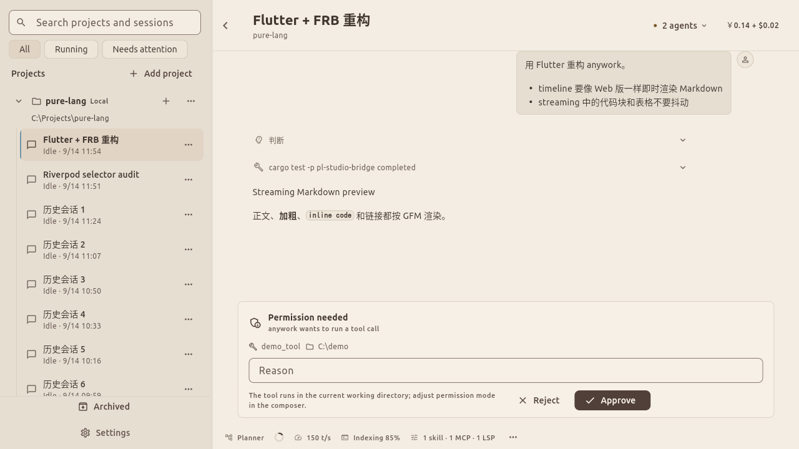
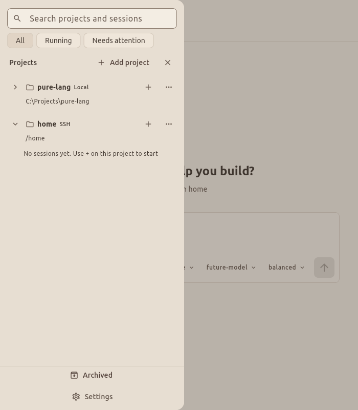

# 项目优先的会话侧栏概念

状态：已采纳的重构设计。基于 Flutter UI 与 `design/19-studio-ui.md` 的暹罗色系，替换全局新会话入口及项目、会话平铺分区。

## 设计依据

重构前 `StudioLayout.sidebarWidth` 为 232，900 以下切换到 60 宽图标栏；标题只显示一行。扩大有效文字宽度、允许两行及明确项目归属应一起解决，不能只靠悬浮提示。

参考 [Claude Code Desktop](https://code.claude.com/docs/en/desktop) 对并行会话、项目目录与 Local/SSH 环境的明确区分，以及 [Cursor Cloud Agents](https://cursor.com/docs/cloud-agent) 的独立远程执行环境。具体项目树、尺寸和弹窗步骤是本产品设计建议，不代表竞品原样布局。Anywork 此处的远程指已有 SSH 能力。

## 侧栏结构与阅读

- 顶部固定搜索“项目与会话”，下方提供全部、进行中、待处理过滤；搜索与过滤始终保留项目父节点，只临时展开匹配项，清除后恢复此前展开状态。
- “项目”总栏右侧显示“＋ 添加项目”。项目是一级，会话是二级；项目可独立展开多个，不因切换会话强制折叠其他项目。
- 项目行显示折叠箭头、文件夹、项目名、本地/SSH 标识和常驻“＋”；更多菜单提供项目管理。加号的辅助标签为“在〈项目名〉中新建会话”，点击不会误触项目折叠。
- 项目辅助行显示本地路径，或远程配置名与路径；同名项目以环境及路径消歧。完整路径可查看、复制。
- 会话缩进 16px，使用轻量引导线。正文 14px/20px，最多两行，短标题不强占两行；状态与相对时间独立辅助行，避免挤占标题。完整标题仍可悬浮或键盘聚焦查看。
- 会话工作区为新建工作树（`workspace_mode = worktree`）时，标题旁显示工作树图标与本地化说明；本地目录会话不显示。图标只读 canonical 值，不改变会话或项目配置。
- 选中会话使用拿铁底与细蓝标记；项目仅强调字重，避免两层同时大面积高亮。进行中、待确认、失败使用图标与文字，不单靠颜色。
- 会话更多菜单提供重命名、项目内置顶、归档；置顶保持在所属项目内。按钮在悬停或聚焦显示，并预留固定空间，避免标题跳动；触控环境常显。
- 归档对运行中的会话同样可用，不因运行态置灰：确认对话框是唯一入口，取消不产生任何效果，确认后 runtime 先结束该会话树的活动工作（中断当前 Turn、取消运行中任务、丢弃未消费输入）再归档；无法结束时保留会话并反馈类型化失败，不静默丢弃现场。
- 项目按置顶、最近使用排序；每项目先展示最近少量会话，提供“查看更早会话”，支持分页、加载失败重试。折叠项目保留待处理计数。排序不随每个流式片段变化。
- 底部固定已归档与设置；已归档列表保留项目归属，支持恢复。移除项目与删除磁盘目录必须分清，破坏性清理另用明确命名。
- 底部入口组成统一的纵向操作区，与列表以留有左右边距的细线分隔；每行图标、文字左对齐，采用一致的高度、圆角与间距。整行可点击并提供悬停、键盘聚焦反馈；归档模式以浅色背景标明选中，设置保留更新提示点。

## 自适应与人体工程

| 可用窗口宽度 | 布局建议 |
| --- | --- |
| ≥1200px | 侧栏默认 336px，可拖动 300–440px并记忆；对话正文最大 860px |
| 960–1199px | 默认 300px，允许拖宽，但为对话保留至少 600px |
| <960px | 菜单打开覆盖式项目抽屉，宽 `min(360px, 窗口宽度−24px)`，保留文字树；选中会话后关闭 |

以上尺寸按逻辑像素；文字放大导致内容不足时提前采用抽屉。手动折叠入口始终存在。详情面板空间不足时覆盖展示。窄屏弹窗改为可滚动全屏步骤页，页头与主要操作固定，软键盘出现时保证当前字段可见。

桌面按钮点击区域至少 32px，触控至少 44px；树支持方向键展开/折叠、Enter 选择、Tab 到操作。分隔条支持键盘调整和恢复默认宽度。搜索使用 Ctrl/Cmd+K，创建会话使用 Ctrl/Cmd+N；新建会话快捷键作用于当前明确项目，无项目时打开添加项目流程。正常文字对比度至少 4.5:1。

## 添加项目完整流程

1. 点击总栏“添加项目”，打开单个分步弹窗，选择本地项目或远程项目，未选择时“继续”禁用。
2. 本地：调用系统文件夹选择器；取消返回位置选择页。选择成功后校验目录并添加，目录名作为默认项目名。重复目录定位已有项目，不生成副本；访问失败保留流程并显示重新选择入口。
3. 远程：显示 `~/.ssh/config` 解析出的 SSH 配置列表、搜索及“新建远程配置”。已有配置展示别名、用户、主机、端口及带时间的上次连接结果；未经当前验证不标为在线。无配置时直接展示空态及新建入口；用户手写条目只读展示。
4. 选择已有配置，点击“连接并选择目录”；显示连接进度，失败可重试、编辑配置或返回选择其他连接。
5. 新建配置：在原弹窗内进入表单，收集别名（写入 `~/.ssh/config` 的 Host，创建后不可改名）、主机、端口（默认 22）、用户名与可选私钥；认证仅支持 ssh-agent 与密钥，不收集密码。字段错误就地提示；手写条目不提供编辑入口，仅 anywork 管理块可编辑或删除。
6. “保存并连接”明确把配置写入 `~/.ssh/config` 管理块并尝试连接。保存失败保留表单；保存成功但连接失败明确显示“配置已保存，连接失败”，重试复用同一配置。返回不会重复创建。尚未保存的草稿在步骤间保留，取消整个流程后丢弃。
7. 连接成功进入远程目录选择：明确显示服务器，支持路径输入、面包屑、上一级、刷新和目录浏览；目录加载成功才允许“添加项目”。更改路径后重新验证，不能用旧目录的成功状态提交新路径。文件不可选，空目录可选。
8. 提交前在本页展示项目名（默认目录名，可编辑）、环境和完整路径。点击“添加项目”期间锁定重复提交；失败保留服务器与目录以便重试。相同远程配置和规范化路径已存在时打开已有项目。
9. 后端确认成功后关闭弹窗，展开并滚动定位新项目，显示空态“还没有会话”，聚焦项目“＋ 新建会话”。不自动创建空会话；用户点击后在主区进入该项目的输入草稿。

## 返回、恢复与状态

- 用一个弹窗切换步骤，不叠加多个模态框；返回保留选择和输入，关闭后焦点回到发起按钮。目录浏览中的 Escape 可关闭；添加项目提交期间保持弹窗，直到结果明确。
- 首次主机身份核验或主机密钥变化，复用真实 SSH 信任流程并显示可核对信息，不自动信任。
- 凭据不出现在列表、通知或概念图中；SSH 配置持久化于用户 `~/.ssh/config` 的 anywork 管理块，不进入产品数据库。
- 列表、连接、目录浏览分别显示真实状态；错误留在对应步骤，提供具体修复入口，避免仅闪过 toast。
- 远程项目断连仍保留项目与历史会话，项目行显示断连与重连入口；需要连接的操作说明不可用原因，不能把历史阅读入口一起禁用。
- 添加成功但后续加载失败，项目仍显示重试入口，不把已成功的添加当成失败重新提交。
- 搜索包含历史目录，不能仅搜索当前加载的一页；正式实现时需核对后端查询及分页能力。

## 交付边界与验收建议

图像由内置 imagegen 生成，局部小字号以本说明和正式实现为准。

实现验收覆盖：长中英文标题、同名异路径项目、多个项目展开、大量会话分页、键盘与触控、文字放大、宽窄窗口、无项目、无配置、错误凭据、目录无权限、空目录、重复添加、连接失败后重试、每一步返回、提交期间重复点击及远程断连。搜索、置顶与归档恢复使用统一目录查询及 Settings／生命周期命令。

## 实现边界

目录查询、归档恢复、项目名称及 UI preferences 由 Studio 运行时提供 canonical 状态，经 FRB 与 HTTP 使用同一契约。归档保留的热事实覆盖未落盘冷行，耐久后可从热集合淘汰；异步工具刷新不能为已退役的会话实例重新发布恢复错误。

项目内第一页为 8 个普通会话，并附带配置中的置顶会话；后续每页 20 个，按身份去重。归档列表按当前打开项目组织；关闭的项目需要重新打开原目录后恢复其历史。宽度和两类置顶通过现有 Settings CAS 持久化，每类置顶最多 64 项。

原生截图与向导交互验收使用仓库统一的侧栏 harness 工具（入口以工具自身说明为准），在隔离会话中操作并验证进程回收，不访问真实 SSH 主机；真实运行时的目录／归档／恢复行为由 Rust 集成路径验证。

### Linux 实际界面

以下截图来自原生 Flutter Driver demo 验收，远程配置和目录数据为隔离 fixture。

