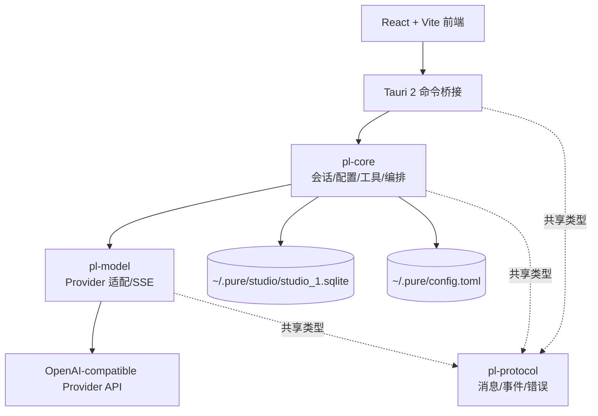
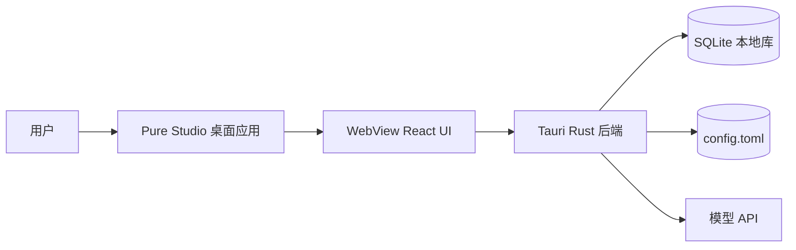
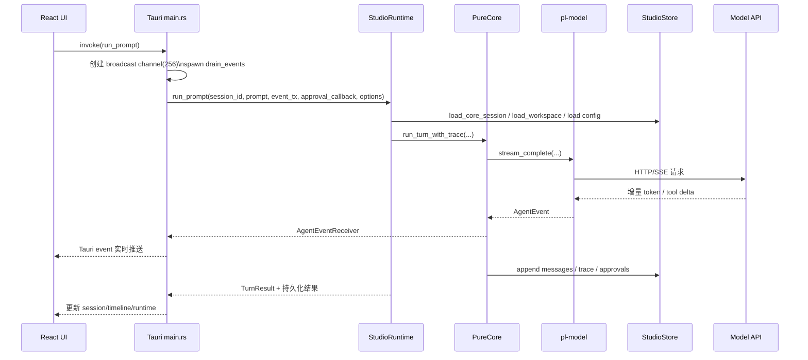

# ZR233 pure-lang 架构与设计深度研究与重构方案

> 归档说明：本文是早期调研报告，保留当时基于 Tauri/React 版本仓库状态形成的证据与建议，不再作为当前实现事实源。当前有效架构以 `README.md`、`design/01-overview.md`、`design/02-crates.md`、`design/03-pipeline.md`、`design/04-security.md`、`design/08-streaming.md` 和 `design/11-studio-ui.md` 为准；桌面端已经收束为 `pure-studio-flutter` + `pl-studio-bridge`，默认权限模式为 `PermissionMode::RequestApproval`。

## 连接器与外部来源

本次研究按你的要求，先以仓库本身为一手来源，再用高质量外部资料补充。优先来源如下：

| 来源类别 | 实际使用范围 | 作用 |
|---|---|---|
| `github (ZR233/pure-lang)` | 仓库代码、设计文档、目录结构、构建配置、测试与发布现状 | 作为主证据来源，定位到实际模块、文件和代码位置。 |
| Web 官方/原始资料 | Tauri 官方文档、SeaORM 官方文档、Rust 官方书籍、Alistair Cockburn 原始文章 | 用于校验安全、迁移、测试组织、架构分层等最佳实践。 citeturn48search0turn48search1turn48search2turn48search3turn49search0 |

## 执行摘要

`pure-lang` 当前已经具备相当明确的“桌面前端 + 核心编排 + 模型适配 + 协议层”分层意图：README 与设计文档把系统定义为 `pure-studio → pl-core → pl-model → pl-protocol` 的四层结构，桌面端采用 Tauri 2 + React/Vite，核心层负责会话、配置、工具审批、SQLite 状态与编排，模型层负责 OpenAI-compatible provider 与 SSE 流式输出，协议层负责消息/事件/错误等共享类型。配置落在 `~/.pure/config.toml`，Studio 状态落在 `~/.pure/studio/studio_1.sqlite`。citeturn45view0turn15view0turn15view1turn16view0turn25view2turn25view3turn38view0turn38view2

问题不在“有没有架构”，而在“架构边界没有被实现细化”。当前实现把大量职责继续压回少数超大文件：`pure-studio/src-tauri/src/main.rs` 已达到 **1491 行**，而仓库自己的协作约定明确要求模块目标控制在 **500 行以内**、超过 **800 行** 时新功能应继续拆分；`pl-core/src/config.rs` 也达到 **945 行**。同时，Tauri 命令桥接、UI 状态管理、配置 DTO、事件排水、审批状态、SQLite 读写、trace 序列化等都呈现集中化趋势。citeturn26view0turn30view0turn44view0turn27view0turn29view0turn28view7

我当时认为最优路径不是“轻微整理后继续堆功能”，也不是立刻拆成后台服务，而是实施一套**端口-适配器化的模块化单体重构**：保留桌面形态与 Cargo workspace，不做进程级拆分；将 `pl-core` 从“超级应用层”重构为清晰边界，把 `StudioStore`、`ConfigStore`、工具系统、事件转发和前端桥接从“实现细节”沉到底层适配器。后续实现已经改为 crate root 直接导出稳定 API、`interfaces` 承载端口 trait、`studio` / `core` / `tool` / `config` / `mcp` 承载真实实现，不再保留只转发类型的 `application`、`domain`、`infrastructure` 包装模块。该方案与 Hexagonal Architecture 的核心意图一致：把 UI、数据库和外部服务都放到边缘，核心只依赖抽象端口。citeturn15view0turn17view1turn48search3

推荐方案是下文的**方案乙：端口-适配器化模块化单体**。按 3 名工程师（2 名 Rust/后端兼桌面、1 名前端）估算，主线可在 **6–8 周** 内落地；若把 CI/CD、回归基线、数据迁移与安全治理一起纳入，则建议排 **8–10 周** 完整周期。这个方案在成本、风险、收益和兼容性之间最均衡：收益远高于“只做外科拆文件”，风险远低于“拆后台服务”。其关键验收指标应包括：不破坏现有 `config.toml` 与 `studio_1.sqlite`；Tauri 命令对前端保持兼容或提供兼容层；关键路径的单元/集成测试与回归测试成体系；事件流在高频 delta 下不再因 `broadcast` lag 而静默中断；前端与后端都有自动化流水线而非手工执行。citeturn31view3turn28view4turn47view2turn50view3turn39view0turn45view0turn49search0

## 当前代码库的架构概览

从 README、设计文档与 Cargo 依赖看，仓库是一个 **Cargo workspace 下的桌面应用型模块化单体**。四个一等模块分别是：`pl-protocol`（共享协议类型）、`pl-model`（模型 provider 与流式适配）、`pl-core`（核心编排、配置、会话、SQLite、工具系统）、`pure-studio`（Tauri 2 桌面应用，前端 React/Vite，后端命令桥接）。依赖方向也是单向的：`pl-model` 依赖 `pl-protocol`；`pl-core` 依赖 `pl-protocol` 与 `pl-model`，再叠加 SeaORM/TOML/Tokio；`pure-studio/src-tauri` 依赖 `pl-core` 与 `pl-protocol`；前端 `package.json` 则依赖 React、Tauri JS API、i18next。citeturn45view0turn15view0turn24view0turn25view0turn25view1turn25view2turn25view3turn20view0turn21view0turn21view1turn23view0

从职责分配看，`pl-protocol` 提供 `AgentEvent`、消息、错误与权限等公共类型，并把事件通道定义为 `tokio::sync::broadcast` 的 sender/receiver；`pl-model` 负责 provider、request/response wire 适配和 SSE 流式处理；`pl-core` 同时承担配置文件 IO、会话消息管理、SQLite 状态存储、工具审批、workspace 文件工具、角色路由以及 `PureCore::run_turn*` 编排；`pure-studio` 通过 Tauri 命令桥接触发 `run_prompt`，并将 `AgentEvent` 转成前端可消费的事件与 timeline。设计文档中已经清楚写出这一层次关系。citeturn15view0turn15view1turn17view2turn38view0turn38view2turn29view3turn50view0turn50view2

部署形态目前非常明确：这是一个**单机桌面应用**，不是服务端系统，也没有单独 CLI 路径。README 的启动方式是 `npm run tauri:dev`，Tauri 配置中 `bundle.active` 仍为 `false`，仓库页面同时显示 **No releases published**。这说明当前更接近“开发态/内部使用态”的桌面工具，而不是已建立标准制品发布链路的产品。设计文档也明确写了“当前没有 CLI 路径”。citeturn45view0turn46view0turn15view2

下面用三张图概括它的当前结构、部署拓扑和一次 prompt 的时序流。



图示依据 README 的分层说明、设计文档对 crate 职责的定义以及各 Cargo 依赖关系整理。citeturn45view0turn15view0turn24view0turn25view0turn25view1turn25view2



部署拓扑依据 README 的本地路径与 Tauri 配置：Studio 状态保存在本地 SQLite，provider/model/role 配置保存在本地 TOML，Rust 后端经网络访问模型 API。citeturn45view0turn16view0turn46view0



这个时序图基于设计文档的编排说明，以及 `main.rs` 中 `run_prompt` 创建 `broadcast::channel(256)`、`drain_events(...)`、`TurnOptions::manual(...)` 的实现，加上 `StudioRuntime::run_prompt` 与 `PureCore::run_turn_with_trace` 的函数签名。citeturn15view1turn17view2turn47view0turn47view2turn50view0turn50view2turn50view3

## 架构与设计问题识别与证据

下表按你要求把问题分成性能、可维护性、可扩展性、安全、测试/CI/CD、开发者体验六类；每条都尽量给出直接证据、代码位置与影响判断。

| 类别 | 发现 | 证据 | 影响判断 |
|---|---|---|---|
| 可维护性 | **超大文件与边界塌缩**。仓库约定要求模块目标 500 行以内、超过 800 行应继续拆分，但 `main.rs` 已 1491 行、`config.rs` 已 945 行。 | 协作约定：`Agents.md` 明确写了模块大小规则；`main.rs` 元数据为 1491 行；`config.rs` 元数据为 945 行。citeturn44view0turn26view0turn30view0 | 直接抬高理解成本、改动冲突率和回归风险。尤其对桌面命令桥接与配置逻辑，这会让“一个小改动牵动整文件”。 |
| 可维护性 | **Tauri 命令桥接过厚**。`main.rs` 同时承载状态、DTO、命令注册、审批管理、事件转发、配置保存、timeline 读取等。 | `AppState` 同时持有 `studio`、`approvals`、`active_turns`；`invoke_handler` 在单文件注册 13 个命令。citeturn27view0turn29view0 | 这违背设计文档中“`pure-studio` 只负责 UI 输入输出、核心逻辑由 `pl-core` 编排”的薄入口原则。citeturn15view1 |
| 开发者体验 | **前端状态高度集中在单组件**。`App.tsx` 以大量 `useState` 管聊天、项目、会话、审批、设置、provider 编辑等。 | `App.tsx` 中一串状态变量从 `selectedProjectId`、`selectedSessionId` 到 `approvals`、`settingsOpen`、`configToml`、`configExists`。citeturn28view7 | 随着 timeline、审批、runtime 指标继续增长，前端更容易出现状态不同步、补丁式修复和难以测试的问题。 |
| 可扩展性 | **`pl-core` 是事实上的“上帝模块”**。设计文档本身就把配置、会话、SQLite、工具注册、角色路由、workspace 工具、模型调用都集中在 `pl-core`。 | `02-crates.md` 中对 `pl-core` 的职责罗列非常广，覆盖配置、会话、SQLite、工具与模型调用。citeturn15view0 | 当未来增加 CLI、Web、IDE、更多 provider 或更细颗粒度权限时，改动会持续拥挤到 `pl-core`，而不是沿端口扩展。 |
| 可扩展性 | **默认 provider/role 行为受 BTreeMap 键顺序影响**。缺角色配置时，`default_role_config` 取 `providers.iter().next()`；而 providers 是 `BTreeMap<String, ProviderConfig>`。 | `PureConfig.providers` 类型是 `BTreeMap`；`default_role_config` 直接对 `providers.iter().next()` 取第一个 provider。citeturn32view4 | 这会把“默认行为”隐式绑定到 provider key 的字典序，而不是显式配置，后续接入多 provider 时容易产生难以解释的行为。 |
| 性能 | **消息持久化存在写放大**。`append_messages` 对每条消息逐条调用 `append_message`，而 `append_message` 每次都会插入消息并执行一次 session 更新时间更新。 | `append_messages` 中 `for message in messages { self.append_message(...).await? }`；`append_message` 中既插入 `message_entity`，又读取并更新 `session.updated_at`。citeturn29view4 | 对多条 assistant/tool 消息或 trace 较多的 turn，会造成多次 DB round-trip 和重复 session update。 |
| 性能/可靠性 | **trace 与 timeline 使用“写时 JSON 序列化、读时再反序列化”**。 | `append_trace_events` 把 `event.kind` 序列化到 `payload_json` 写库；`load_session_timeline` 再对 `record.payload_json` 做 `serde_json::from_str(...)`。citeturn29view4turn47view3 | 这会增加 CPU 与对象分配开销，也使 trace 查询难以直接做结构化过滤，后续做审计/统计会越来越痛。 |
| 性能/可靠性 | **事件排水对 `broadcast` lag 不鲁棒**。生产代码的 `drain_events` 只要 `recv()` 不是 `Ok(event)` 就 `break`，这意味着一旦出现 `Lagged` 也会退出循环；但测试代码反而显式忽略 `Lagged(_)`。 | `main.rs` 中 `let Ok(event) = event_rx.recv().await else { break; };`；`pl-model/tests/deepseek_live.rs` 的事件接收对 `Lagged(_)` 是忽略并继续。citeturn50view3turn43view0turn43view1 | 这是当前最值得优先修的可靠性问题之一：高频 delta 下 UI/trace 处理一旦落后，事件排水线程可能直接中止。 |
| 安全 | **密钥保存仍是明文文件**。设计文档明确承认 `~/.pure/config.toml` 可保存明文 `bearer_token`；代码保存也确实是直接 `fs::write(...)`。 | 设计文档说明明文 token 风险；`ConfigStore::save` 直接 `fs::write(self.paths.config_file(), ...)`。citeturn15view2turn31view3turn31view4 | 这是本地桌面应用可以接受但不理想的早期方案；若要进入更正式发布或团队分发阶段，应迁到系统密钥链。 |
| 安全 | **前端配置 DTO 携带 `bearer_token`**。 | `ProviderDto` 与 `ProviderInput` 都有 `bearer_token: String`。citeturn28view1 | 这意味着敏感信息沿桌面 UI ↔ Rust 命令桥来回流动，扩大了明文出现面。 |
| 安全 | **Tauri CSP 被显式关闭**。`tauri.conf.json` 中 `"csp": null`；Tauri 官方文档把 CSP 标为非常重要的安全配置。 | Tauri 配置文件的 `csp: null`；官方配置/安全文档强调 CSP 是 WebView 安全的重要部分。citeturn46view0turn48search0turn48search12 | 如果 UI 后续引入更多动态内容、插件或远端资源，这会显著增加 XSS/资源注入类风险面。 |
| 安全/实现一致性 | **设计文档与运行时审批策略不一致**。安全文档写“当前 Studio 路径暂时使用 `AutoAllow`”，但实际 `run_prompt` 已改为 `TurnOptions::manual(...)`。 | 文档写当前是 `AutoAllow`；`main.rs` 实现明确使用 `TurnOptions::manual(approval_callback)`。citeturn15view2turn47view2 | 这会直接误导后续开发、测试和审计。文档-实现漂移本身就是架构风险。 |
| 安全 | **bash 工具执行的是原生 shell 命令字符串**。 | `BashTool` 通过 `sh -c` / `cmd /C` 执行命令，默认超时 60 秒，超时后会尝试 `kill -9` 或 `taskkill /F`。citeturn35view1turn35view2turn35view0 | 即使有工作目录与审批，命令执行仍是最强权限边界之一；如果继续发展自动化能力，必须把权限模型、隔离与审计做成一等能力。 |
| 测试 | **测试分布失衡**。`pl-protocol`、`pl-core/config.rs`、`pl-core/core.rs` 有内联测试，但 `pl-core/studio.rs`、`pl-core/turn.rs`、`pure-studio/src-tauri/main.rs`、前端 `App.tsx` 基本没有对应测试。 | `core.rs` 和 `config.rs` 有 `#[cfg(test)]`；`studio.rs`、`turn.rs`、`main.rs` 找不到 `#[cfg(test)]`；前端 `App.tsx` 找不到测试模式。citeturn40view0turn40view3turn40view1turn40view2turn40view5turn40view6 | 当前最薄弱的是端到端编排层与桌面桥接层，而这恰恰是最容易发生回归的位置。 |
| 测试 | **唯一显式 integration test 偏向 live API 测试**。`pl-model/tests` 下只看到 `deepseek_live.rs`，且未设环境变量时会直接 return。 | `pl-model/tests` 目录仅有 `deepseek_live.rs`；测试函数在 `API_KEY_DEEPSEEK` 不存在时直接 `return`。citeturn41view0turn43view1turn43view0 | 这说明仓库缺少“可离线、可稳定复现”的 provider contract test 和端到端回放测试。 |
| CI/CD | **没有 GitHub Actions 流水线**。 | Actions 页面显示的是通用“Automate your workflow”落地页，而不是仓库工作流列表。citeturn39view0 | 代码质量目前依赖开发者手工执行 `cargo fmt/clippy/test` 与前端 typecheck/build。README 确实只给出手工命令。citeturn45view0 |
| 发布/运维 | **尚未形成正式制品发布链路**。 | `tauri.conf.json` 中 `bundle.active=false`，仓库页面显示 `No releases published`。citeturn46view0turn45view0 | 在重构期间，这反而是优势：兼容包袱较小；但若打算扩大用户范围，需要把安装包、签名与迁移脚本纳入计划。 |

这些问题放在一起看，结论很清楚：**当前系统最大的约束不是技术栈选错，而是“实现粒度没有跟上架构意图”**。从 README 与设计文档看，作者已经有比较合理的模块分层意识；但在编码阶段，大量边界继续在 `pl-core` 与 `pure-studio/src-tauri/main.rs` 收敛，导致现在最突出的问题依次是：边界不清、测试薄弱、事件可靠性不足、安全策略不一致，以及发布工程化缺失。citeturn45view0turn15view0turn15view1turn17view1turn17view2turn44view0

## 可选重构方案比较与重构代码示例

下面给出三套可选方案。我先给出结论：**方案甲**适合短周期止血；**方案乙**适合当前阶段的最佳平衡；**方案丙**只在明确要支持多前端/守护进程/远期服务化时才值得上。

### 方案比较总表

| 方案 | 核心思路 | 预计工期 | 预计人力 | 主要收益 | 主要风险 | 兼容性 |
|---|---|---:|---:|---|---|---|
| 方案甲 | **外科式模块整理**：不改进程形态，不改 crate 边界，只拆大文件、补测试、补 CI | 3–4 周 | 2–3 人 | 成本低、见效快，能立刻降低文件膨胀与回归风险 | 容易“拆文件不拆职责”，半年后再次回到集中化 | 很高 |
| 方案乙 | **端口-适配器化模块化单体**：保留 Tauri 桌面形态，但重构 `pl-core` 内部边界与前端状态管理 | 6–8 周 | 3 人 | 既能提升可维护性/可测试性，又不会引入运维复杂度 | 需要设计抽象边界与迁移层，重构量中等 | 高 |
| 方案丙 | **服务化本地运行时**：把核心引擎拆成本地 daemon/runtime，Tauri 成为薄客户端 | 10–14 周 | 4 人 | 从根上支持 CLI/Web/IDE 多前端、后台任务和隔离策略 | 过度设计风险高；本地 IPC、守护进程生命周期、安装升级复杂 | 中 |

### 定量与定性评分

以下评分采用 **1–5 分**，分数越高代表该维度越强：  
**收益/兼容性** 越高越好；**成本/风险/实施难度** 越低越好。

| 方案 | 成本 | 风险 | 收益 | 实施难度 | 兼容性 |
|---|---:|---:|---:|---:|---:|
| 方案甲 | 4 | 4 | 2 | 4 | 5 |
| 方案乙 | 3 | 3 | 5 | 3 | 4 |
| 方案丙 | 1 | 2 | 4 | 1 | 3 |

### 三套方案的详细说明

| 维度 | 方案甲：外科式模块整理 | 方案乙：端口-适配器化模块化单体 | 方案丙：服务化本地运行时 |
|---|---|---|---|
| 目标 | 先把最痛的“大文件 + 无流水线 + 关键路径无测试”解决 | 把当前 README/设计文档中的分层真正落地到代码层 | 把 UI 与核心执行引擎彻底分进程，面向多前端演进 |
| 变更范围 | `main.rs`、`App.tsx`、`studio.rs`、`config.rs`、CI 工作流 | 上述文件 + `pl-core` 内部结构 + 前端状态模型 + trace/persistence 端口 | 上述全部 + 本地 daemon、IPC 协议、启动器、安装/升级逻辑 |
| 关键技术 | Rust 模块拆分、DTO 整理、前端 reducer、GitHub Actions | Ports & Adapters、Repository/Service trait、interface adapter、事件网关、事务边界 | Local RPC/IPC、后台运行时、双进程日志与恢复、权限隔离 |
| 影响面 | 中 | 中高 | 高 |
| 迁移步骤 | 先拆 main.rs/前端状态，再补测试与 CI | 先定义 ports，再把旧实现迁成 adapters，最后逐步删旧路径 | 先抽 runtime API，再双写/双跑，最后默认切换到 daemon |
| 时间与人力 | 2–3 人，3–4 周 | 3 人，6–8 周 | 4 人，10–14 周 |
| 风险与缓解 | 风险：拆完仍然耦合；缓解：以“可测接口”而不是“文件名”做拆分 | 风险：抽象过度；缓解：先围绕现有痛点抽最小 ports，不引入新框架 | 风险：复杂度暴涨；缓解：必须坚持“先模块化单体，再进程拆分” |
| 回滚策略 | 每次拆分保持小步可回滚，避免长期保留旧模块 façade | 前端命令名与 DTO 版本化，`pl-core` 不新增只转发的兼容 façade | 保留 in-process 引擎作为 fallback，通过 feature flag 或启动参数切换 |

我对三套方案的判断来自当前系统的**真实规模和实际部署形态**：仓库现在仍是单机桌面应用，`bundle` 未启用、也没有正式 release，说明引入本地 daemon 的收益暂时不足以覆盖系统复杂度；但与此同时，当前集中化问题已经明显大于“只拆文件就够了”的程度，因此推荐跳过纯止血方案，直接进入方案乙。citeturn46view0turn45view0turn15view2turn15view0

下面给出方案乙落地时最关键的几个重构代码示例。

**示例一：把 `StudioStore` 与配置/事件桥接从核心逻辑中抽成端口**

```rust
// application ports
pub trait SessionRepository: Send + Sync {
    fn load_core_session(
        &self,
        session_id: &str,
    ) -> impl std::future::Future<Output = anyhow::Result<CoreSession>> + Send;

    fn append_messages(
        &self,
        session_id: &str,
        messages: &[Message],
    ) -> impl std::future::Future<Output = anyhow::Result<()>> + Send;

    fn append_trace_events(
        &self,
        session_id: &str,
        events: &[TraceEvent],
    ) -> impl std::future::Future<Output = anyhow::Result<()>> + Send;
}

pub trait ConfigRepository: Send + Sync {
    fn load_runtime_config(&self)
        -> impl std::future::Future<Output = anyhow::Result<PureConfig>> + Send;
}

pub trait EventSink: Send + Sync {
    fn emit(&self, event: AgentEvent)
        -> impl std::future::Future<Output = anyhow::Result<()>> + Send;
}
```

这个抽法的目的不是“为了模式而模式”，而是把当前 `pl-core` 中混在一起的 **业务编排 / 本地存储 / 前端事件桥接** 拆开，使核心 use case 可以只依赖端口，而不是直接依赖 Tauri/SeaORM/文件系统。其设计思想与 Hexagonal Architecture 一致。citeturn15view0turn48search3

**示例二：把当前逐条写消息改成事务批量提交**

```rust
pub async fn append_messages_tx(
    db: &DatabaseConnection,
    session_id: &str,
    messages: &[Message],
) -> anyhow::Result<()> {
    let txn = db.begin().await?;
    let now = unix_seconds();

    let rows: Vec<message_entity::ActiveModel> = messages
        .iter()
        .map(|m| to_message_row(session_id, m, now))
        .collect();

    message_entity::Entity::insert_many(rows).exec(&txn).await?;

    session::Entity::update_many()
        .col_expr(session::Column::UpdatedAt, Expr::value(now))
        .filter(session::Column::Id.eq(session_id.to_string()))
        .exec(&txn)
        .await?;

    txn.commit().await?;
    Ok(())
}
```

这段伪代码直接针对当前 `append_messages -> append_message` 的写放大问题：把 N 次 insert + N 次 session update 收敛成 1 次批量 insert + 1 次 session update，更符合聊天/trace 这种追加型写入模型。现有实现确有逐条追加的证据。citeturn29view4

**示例三：把前端从分散 `useState` 改成 reducer/state machine**

```ts
type StudioState = {
  sessionId: string | null;
  projects: Project[];
  sessions: SessionItem[];
  messages: MessageDto[];
  approvals: ToolApprovalRequest[];
  timeline: LegacyTimelineItem[];
  runtime: SessionRuntime | null;
  ui: {
    settingsOpen: boolean;
    activeTab: "providers" | "roles";
    providerSearch: string;
  };
};

// 重构前问题示例：当前实现已改为 StudioMessage/StudioPart projection
// + StudioEvent reducer；不存在独立 session timeline DTO 入口。
type StudioAction =
  | { type: "BOOTSTRAP_LOADED"; payload: BootstrapPayload }
  | { type: "SESSION_SELECTED"; payload: SessionSelectionDto }
  | { type: "TIMELINE_LOADED"; payload: LegacySessionTimelineDto }
  | { type: "AGENT_EVENT_RECEIVED"; payload: AgentEvent }
  | { type: "TOOL_APPROVAL_RESOLVED"; payload: ToolApprovalResolvedPayload }
  | { type: "SETTINGS_TOGGLED"; payload: boolean };

function studioReducer(state: StudioState, action: StudioAction): StudioState {
  switch (action.type) {
    case "AGENT_EVENT_RECEIVED":
      return reduceAgentEvent(state, action.payload);
    case "TIMELINE_LOADED":
      return { ...state, timeline: action.payload.items };
    default:
      return state;
  }
}
```

当前 `App.tsx` 已经明显呈现“应用状态容器”的角色，但仍用大量 `useState` 逐块维护；改成 reducer 后，前端事件处理会更接近 `pl-protocol::AgentEvent` 的模型，也更容易补自动化测试。citeturn28view7turn38view2

## 推荐方案与详细实施计划

我推荐 **方案乙：端口-适配器化模块化单体**。理由有三点。

第一，它最符合仓库当前的真实约束：产品还是本地桌面应用，没有正式发布管线，也不存在明显必须拆守护进程的多前端压力；因此没必要现在承受方案丙的 IPC、进程管理、升级与调试复杂度。第二，它能真正解决现有主矛盾——职责塌缩与可测试性不足——而不是只做表层整理。第三，它与当前设计文档的意图天然一致：设计文档已经强调 `pure-studio` 应薄、`pl-core` 管核心、扩展点应保持入口层薄、未来还可能增加 CLI/Web/IDE 前端；方案乙恰好是把这些文档约束落成代码边界。citeturn15view1turn17view1turn45view0turn46view0

### 分阶段里程碑

| 阶段 | 目标 | 主要任务 | 交付物 | 建议时长 |
|---|---|---|---|---:|
| Phase A | 建立基线，先止血 | 记录当前命令接口、DTO、trace 结构；补 GitHub Actions；冻结对外 Tauri 命令名 | 基线文档、CI 初版、回归样本 | 1 周 |
| Phase B | 重构 Tauri 桥接层 | 把 `main.rs` 拆成 `commands/*`、`dto/*`、`events/*`、`approvals/*`、`state/*` | `main.rs` 降到壳层；命令模块化 | 1–2 周 |
| Phase C | `pl-core` 端口化 | 保留 crate root 直接导出，按 `interfaces`、`studio`、`core`、`tool`、`config`、`mcp` 整理端口和实现 | `pl-core` 边界清晰；无只转发的兼容 façade | 2 周 |
| Phase D | 持久化与事件链路优化 | 为消息/trace 增加事务批量写；修复 `drain_events` 的 lag 处理；清理 trace 双重 JSON 负担 | 新的持久化实现和回归基准 | 1–2 周 |
| Phase E | 前端状态重构 | 用 reducer/state-machine 替换 `App.tsx` 的分散状态；按功能拆组件与 hooks | 可测试的 UI 状态层 | 1–2 周 |
| Phase F | 安全与发布工程化 | token 存储抽象、补 CSP、补制品构建与签名占位、补迁移脚本与发布说明 | 安全基线与打包流水线 | 1 周 |
| Phase G | 稳定化与切换 | 双路径跑回归、清理旧 façade、发布候选版本 | RC 版、回滚脚本、迁移说明 | 1 周 |

### 验收指标

建议把“是否重构成功”定义为一组可验收指标，而不是“文件看起来整洁了”。

| 指标类别 | 建议指标 |
|---|---|
| 结构指标 | `main.rs` 控制在 300 行以内；任何新增模块默认目标 < 500 行；`pl-core` 入口面向 use case，而不是直接暴露存储/桥接细节。这个目标与仓库自有模块大小约定一致。 citeturn44view0 |
| 兼容性指标 | 现有 Tauri 命令名和关键 DTO 默认兼容；`~/.pure/config.toml` 不要求用户手工迁移；`studio_1.sqlite` 自动迁移成功。citeturn16view0turn31view3 |
| 可靠性指标 | 在高频流式输出下，事件排水不因 `Lagged` 退出；至少有 1 套“多 delta / 工具审批 / 中断 / subagent”回放回归样本。当前生产代码与测试代码对 lag 的处理不一致，应被消除。citeturn50view3turn43view0turn43view1 |
| 测试指标 | Rust 侧按官方建议同时补 unit tests 与 integration tests；前端补 reducer/事件处理测试；关键桌面命令有 contract test。citeturn49search0 |
| CI/CD 指标 | Linux/macOS/Windows 统一执行 `cargo fmt`、`cargo clippy -- -D warnings`、crate tests、前端 typecheck/build；从“手工命令”升级为自动流水线。当前仓库尚无工作流。citeturn45view0turn39view0 |
| 安全指标 | 不再默认把明文 token 暴露给 UI 表单回传链路；Tauri CSP 不再是 `null`；bash/文件工具的审批文档与运行时实现保持一致。citeturn28view1turn46view0turn48search0turn15view2turn47view2 |

### 自动化测试与 CI/CD 改造建议

测试层我建议按三层铺开。第一层是 **crate 内 unit test**，覆盖 `config`、`turn`、tool parser、trace converter 等纯逻辑；第二层是 **integration/contract test**，重点验证 `StudioRuntime::run_prompt`、事件转换、配置加载、trace 持久化与 Tauri command contract；第三层是 **回放式端到端回归**，把一组固定 `AgentEvent`/`TraceEvent` 样本喂给前端 reducer，验证 UI 状态与 timeline 组装是否稳定。Rust 官方书明确区分了 unit tests 与 integration tests 的组织方式，这正适合当前仓库补齐测试金字塔。citeturn49search0

CI/CD 层建议分成两个 workflow。其一是 **PR 质量门**：Rust fmt、clippy、test，前端 typecheck/build，必要时加一组 deterministic replay tests。其二是 **release candidate**：构建 Tauri 桌面产物、执行打包验证、生成 changelog 与迁移说明。当前仓库既没有 GitHub Actions，也没有已发布 release，而 Tauri 2 本身支持多平台桌面构建；因此把“多平台构建验证”放入 release workflow 的收益很高。citeturn39view0turn45view0turn49search1turn49search3

### 性能基准与回归测试方法

我建议先做 **基线采样**，再做 **相对回归约束**，而不是现在就承诺一个绝对性能值。理由很简单：仓库当前没有现成基准框架与历史 release，对绝对值拍脑袋意义不大。更合理的做法是先测四条基线：  
其一，`run_prompt` 到首个 `TextDelta` 的时间；其二，单轮 turn 完成时间；其三，`append_messages/append_trace_events` 数据库耗时；其四，前端加载 session timeline 的时间。其后把优化目标设为“回归不超过基线的 10%”，同时把“事件 lag 不导致排水线程退出”设为硬性正确性指标。这个方法直接对应当前最容易退化的路径：事件流、SQLite 写入和前端 timeline。citeturn47view0turn29view4turn50view3

### 为什么不推荐其他两套方案

**不优先推荐方案甲**，是因为它虽然成本最低，但只能解决“文件太大”和“没有流水线”这两层表象；对 `pl-core` 的职责浓缩、默认 provider 的隐式规则、trace 的序列化策略、前后端状态模型不统一等关键问题，方案甲没有足够力度。短期看会舒服，长期看仍会回到同一问题。citeturn15view0turn32view4turn29view4

**不优先推荐方案丙**，是因为当前系统的对外形态仍然是单机桌面应用，没有 release、没有 bundle、没有多前端生态压力，过早拆 daemon 很容易把“架构升级”变成“工程复杂度升级”。只有在你明确要支持 CLI/Web/IDE 多入口、后台长期运行、权限隔离或本地多会话并发调度时，方案丙的收益才会超过成本。citeturn15view2turn17view1turn46view0turn45view0

## 优先阅读的参考资料与关键假设

**优先阅读资料**我建议按下面顺序：

| 优先级 | 资料 | 为什么要先读 |
|---|---|---|
| 高 | 仓库 `design/02-crates.md`、`03-pipeline.md`、`04-security.md`、`10-config.md`、`11-studio-ui.md` | 这是理解仓库“设计意图”的最短路径；重构时必须先让实现重新追上这些文档。citeturn15view0turn15view1turn15view2turn16view0turn17view0 |
| 高 | 仓库 `Agents.md` | 这里直接规定了模块尺寸、参数设计、导出边界和提交流程，很多现状问题恰好违反了它。citeturn44view0 |
| 高 | Tauri 官方 Security / CSP / Config 文档 | 当前 `csp: null` 与桌面端命令桥接是安全治理的直接焦点。citeturn48search0turn48search4turn48search12 |
| 高 | Rust 官方书：Cargo Workspaces、Test Organization | 仓库已经是 workspace，但测试组织与工程化还没充分利用官方推荐路径。citeturn48search2turn49search0 |
| 中 | SeaORM 官方 Migration 文档 | 如果要稳定演进 `studio_1.sqlite`，应把迁移与 schema 变更治理正规化。citeturn48search1turn48search17 |
| 中 | Alistair Cockburn 原始 Hexagonal Architecture 文章 | 方案乙的分层思想直接基于这个原始模式，而不是流行术语的二手解释。citeturn48search3 |

**本报告依赖的关键假设**如下。凡依赖这些假设的结论，我在表格里已经按风险高低做了收敛；这里再显式列出：

| 假设 | 假设值 | 影响哪些结论 |
|---|---|---|
| 团队规模 | 约 3 名工程师，其中至少 2 人能同时处理 Rust/Tauri，1 人处理前端 | 直接影响方案乙的 6–8 周时间估算；若只有 1–2 人，需按 1.5–2 倍周期重估。 |
| 业务目标 | 未来 6–12 个月仍以 **桌面端** 为主，而不是立即发展为多前端平台 | 这是我不推荐方案丙的前提。 |
| 兼容要求 | 现有 `config.toml` 与 `studio_1.sqlite` 需要平滑迁移，最好无人工操作 | 因此推荐“小步模块化单体重构”，而不是破坏性重写或长期兼容 façade。 |
| 可接受停机 | 单机桌面应用可接受一次性本地数据迁移，但不应要求长时间停用 | 影响迁移策略与 SQLite schema 改造方式。 |
| 预算上限 | 可以接受一次中等规模重构，但不希望引入新的长期运维面 | 这是我把方案乙放在最佳平衡点的核心原因。 |
| 安全目标 | 短期以“本地应用可控风险”为目标，中期逐步引入系统密钥链与更严格 CSP | 因此安全建议分阶段推进，而非一步到位做企业级端点治理。 |

综合以上证据，我的最终建议是：**立即启动方案乙，但在前两周先交付方案甲中的“CI、测试基线、`main.rs`/`App.tsx` 初步拆分”作为过渡里程碑**。这样可以让重构从第一周就产生可见收益，同时为后续更深层的 `pl-core` 端口化重构建立安全网。这个结论依赖的主要假设是“团队不少于 3 人、且未来半年仍以桌面端为核心”；如果这两个假设不成立，推荐排序会发生变化。citeturn45view0turn44view0turn39view0turn48search3
